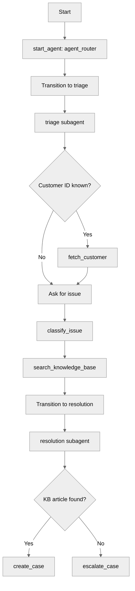

# CustomerServiceAgent

## Overview

This recipe demonstrates how to build an **Agentforce Service Agent** — an external-facing agent that runs under a dedicated agent user rather than the logged-in user. The key differentiator from Employee Agents is the `agent_type: "AgentforceServiceAgent"` and `default_agent_user` configuration, which requires an org-specific deployment pipeline.

## Agent Flow



## Key Concepts

- **Service Agent config**: `agent_type: "AgentforceServiceAgent"` and `default_agent_user` field
- **Placeholder-based deployment**: Source uses `__AGENT_USER_PLACEHOLDER__` replaced at deploy time
- **Subagent transitions**: Router → triage → resolution flow
- **Mixed action targets**: Flows (`flow://`) and Apex (`apex://`) in the same agent

## How It Works

### Service Agent Configuration

Unlike Employee Agents, Service Agents require a dedicated user to run as:

```agentscript
config:
   developer_name: "CustomerService_Agent"
   agent_label: "Customer Service Agent"
   agent_type: "AgentforceServiceAgent"
   default_agent_user: "__AGENT_USER_PLACEHOLDER__"
```

The placeholder is replaced by `npm run setup:service-agent` before deployment.

### Triage Subagent

Handles customer identification, issue classification, and knowledge base search:

```agentscript
subagent triage:
   actions:
      fetch_customer: ...
         target: "flow://FetchCustomer"

      classify_issue: ...
         target: "apex://IssueClassifier"

      search_knowledge_base: ...
         target: "flow://SearchKnowledgeBase"

   reasoning:
      actions:
         identify_customer: @actions.fetch_customer
            available when @variables.customer_id and not @variables.customer_name

         classify_customer_issue: @actions.classify_issue
            available when @variables.issue_description and not @variables.issue_type

         search_kb: @actions.search_knowledge_base
            available when @variables.issue_type and not @variables.kb_article_found
            transition to @subagent.resolution
```

### Resolution Subagent

Routes to case creation or escalation based on KB results:

```agentscript
subagent resolution:
   reasoning:
      actions:
         create_support_case: @actions.create_case
            available when @variables.kb_article_found

         escalate_to_specialist: @actions.escalate_case
            available when not @variables.kb_article_found
```

## Try It Out

### Example 1: Happy Path — KB Resolution

```text
Agent: Hello! Welcome to Customer Service. How can I help you today?

User: My account is CUST-12345. I can't reset my password.

[fetch_customer → name="Customer", tier="Premium"]
[classify_issue → type="technical", priority="high"]
[search_knowledge_base → kb_article_found=True]
[transitions to resolution]

Agent: I found a knowledge base article that may help resolve your technical issue.
       Let me create a case to track this.

[create_case → case_id="500xx...", case_number="00001234"]

Agent: I've created case 00001234 for your password reset issue.
       Here's the solution from our knowledge base: ...
```

**What to verify**: All three triage actions fire in sequence (`fetch_customer` → `classify_issue` → `search_knowledge_base`), then the agent transitions to the resolution subagent and creates a case.

### Example 2: Escalation Path — No KB Match

```text
Agent: Hello! Welcome to Customer Service. How can I help you today?

User: I need a custom enterprise pricing adjustment.

[classify_issue → type="billing", priority="high"]
[search_knowledge_base → kb_article_found=False (no match)]
[transitions to resolution]

Agent: I couldn't find a matching solution in our knowledge base.
       Let me escalate this to a specialist who can help.

[escalate_case → escalated=True, specialist_assigned="Billing Support"]

Agent: I've escalated your billing issue to our specialist team.
       They will reach out to you shortly.
```

**What to verify**: After KB search returns no relevant articles, the agent escalates via `escalate_case` instead of creating a standard case. Note that `fetch_customer` is skipped because no customer ID was provided.

### Example 3: Unknown Customer — Direct Classification

```text
Agent: Hello! Welcome to Customer Service. How can I help you today?

User: I need help with my billing. I was charged twice for last month's subscription.

[classify_issue → type="billing", priority="medium"]
[search_knowledge_base → kb_article_found=False (no match)]
[transitions to resolution]

Agent: I couldn't find a matching solution in our knowledge base.
       Let me escalate this to a specialist.

[escalate_case → escalated=True, specialist_assigned="Technical Support"]

Agent: I am escalating your billing issue to a specialist who can review
       your account and resolve the double charge. You will be contacted
       soon with an update.
```

**What to verify**: `fetch_customer` is never called because no `customer_id` was provided. The agent proceeds directly to classification and escalation in a single turn.

## Deployment

This recipe requires additional setup compared to Employee Agent recipes:

1. `npm run setup:service-agent` — creates the agent user and replaces the placeholder in all `.agent` files
2. `sf project deploy start --source-dir force-app-service` — deploys the metadata
3. `sf org assign permset -n Customer_Service_Agent_Data --on-behalf-of <agent-username>` — grants service agent data access

A pre-commit hook automatically restores the placeholder before commits.

## What's Next

- **MultiSubagentNavigation**: More complex multi-subagent routing patterns
- **OpenGateRouter**: Deterministic gate-based routing with authentication
- **ActionChaining**: Sequential action execution patterns

## Stub Flow Behavior

The included flows return hardcoded values so you can try the agent without real data:

| Flow                  | Returns                                                                        |
| --------------------- | ------------------------------------------------------------------------------ |
| `FetchCustomer`       | `name="Customer"`, `email="test@example.com"`, `tier="Premium"`                |
| `SearchKnowledgeBase` | If `issue_type="technical"`: articles + top_article. Otherwise: empty results. |
| `CreateCase`          | `case_number="00001234"`                                                       |
| `EscalateCase`        | `escalated=true`, `specialist_assigned="Technical Support"`                    |
