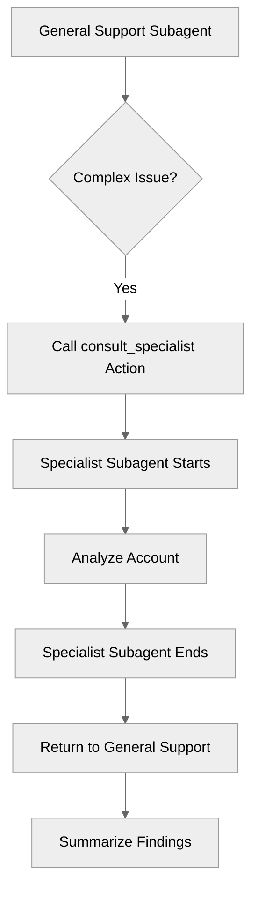

# TrueDelegation

## Overview

Learn how to use **true delegation**, where one subagent calls another subagent as if it were a tool or sub-routine.

## Agent Flow



## Key Concepts

- **Delegation vs. Transition**:
    - **Transition** (`@utils.transition to`): One-way handoff. The original subagent ends.
    - **Delegation** (`@subagent.name`): Sub-routine call. The original subagent waits, and control returns when the delegated subagent finishes.

## How It Works

### Defining the Delegation Action

In your `reasoning.actions` block, define an action that points to another subagent using the `@subagent.*` syntax.

### Flow of Control

1. **Main Subagent** calls `consult_specialist`.
2. **Main Subagent** pauses execution.
3. **Specialist Subagent** starts, runs its instructions and actions.
4. **Specialist Subagent** finishes (reaches end of instructions or explicit end).
5. **Main Subagent** resumes execution immediately after the delegation call.

## Key Code Snippets

### Delegation Action

```agentscript
actions:
   consult_specialist: @subagent.specialist
      description: "Consult the specialist for complex questions"
```

## Try It Out

### Example Interaction

```text
Agent: Hi! I can help you with account issues by consulting our specialist.

User: I have a complex billing problem.

Agent: I'll consult our specialist for this.

(Internal): Specialist subagent runs...

Agent: Analysis complete. The specialist found a discrepancy in your last invoice.
```

## What's Next

- **MultiSubagentOrchestration**: Orchestrate multiple subagents effectively.
- **ComplexStateManagement**: Manage state across subagent boundaries.
