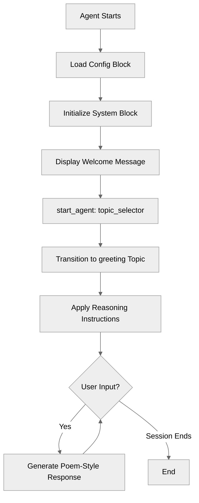

# HelloWorld

## Overview

This recipe demonstrates the absolute minimum structure required for an Agent Script agent. It's the "Hello World" of Agent Script - a simple, friendly agent that greets users and demonstrates the foundational building blocks.

## Agent Flow



## Key Concepts

- **Agent structure**: The essential blocks every agent needs (`config`, `system`, `start_agent`, `topic`)
- **Config block**: Defines agent metadata and identification
- **System block**: Contains global settings that apply across all topics
- **start_agent block**: Entry point that routes users to topics
- **Topic block**: Defines a conversation focus with reasoning instructions
- **Procedural instructions**: Using `instructions:->` with `|` for multiline templates

## How It Works

### The Core Blocks

Every Agent Script file is built from **blocks**. This minimal agent demonstrates the essential block types:

#### 1. Config Block

```agentscript
config:
   agent_name: "HelloWorld"
   agent_label: "HelloWorld"
   description: "A minimal agent that greets users"
```

The `config` block provides metadata about your agent:

- `agent_name`: Internal identifier (must follow naming rules: letters, numbers, underscores only, max 80 chars)
- `agent_label`: Human-readable display name
- `description`: Brief explanation of the agent's purpose

#### 2. System Block

```agentscript
system:
   messages:
      welcome: "Hello! I'm a simple agent here to say hi."
      error: "Sorry, I encountered an error."
   instructions: "You are a friendly assistant who warmly greets users."
```

The `system` block contains global configuration:

- `messages`: Pre-defined messages shown to users
    - `welcome`: Displayed when the conversation starts
    - `error`: Shown if an error occurs
- `instructions`: High-level guidance for the agent's behavior across all topics

#### 3. start_agent Block

```agentscript
start_agent topic_selector:
   description: "Welcome users and begin friendly conversation"

   reasoning:
      instructions:|
         Select the tool that best matches the user's message and conversation history. If it's unclear, make your best guess.
      actions:
         begin_greeting: @utils.transition to @topic.greeting
            description: "Start the greeting conversation"
```

The `start_agent` block is the entry point for the agent:

- Routes users to the appropriate initial topic
- Uses `@utils.transition to @topic.<name>` to navigate between topics
- The action `description` helps the LLM understand when to use this action

#### 4. Topic Block

```agentscript
topic greeting:
   description: "Greets the user and engages in friendly conversation using a poem"

   reasoning:
      instructions:->
         | Greet the user warmly and ask how you can help them.
           Always answer in the style of a poem.
```

Every agent needs at least one `topic`. Topics define specific conversation focuses:

- Topic name (`greeting`) is used to reference this topic
- `description`: Explains what this topic handles
- `reasoning.instructions:->`: Procedural instructions using the template syntax

### Procedural Instructions with Templates

This recipe demonstrates the `instructions:->` procedure syntax with the `|` template marker:

```agentscript
instructions:->
   | Greet the user warmly and ask how you can help them.
     Always answer in the style of a poem.
```

Key points:

- `:->` indicates a procedural block (not just a string)
- `|` starts a template string that becomes part of the instructions
- Indentation after `|` is preserved as content
- This pattern enables dynamic instruction building (covered in later recipes)

## Key Code Snippets

### Minimal Topic with Procedural Instructions

```agentscript
topic greeting:
   description: "Greets the user and engages in friendly conversation using a poem"

   reasoning:
      instructions:->
         | Greet the user warmly and ask how you can help them.
           Always answer in the style of a poem.
```

### Topic Navigation with start_agent

```agentscript
start_agent topic_selector:
   description: "Welcome users and begin friendly conversation"

   reasoning:
      actions:
         begin_greeting: @utils.transition to @topic.greeting
            description: "Start the greeting conversation"
```

## Try It Out

When you run this agent, here's what happens:

1. **Welcome message**: The user sees: "Hello! I'm a simple agent here to say hi."
2. **Topic selection**: The `start_agent` block transitions to the `greeting` topic
3. **Agent greeting**: Following its reasoning instructions, the agent greets the user in a poem style
4. **Conversation**: The agent responds to messages using poetic language

### Example Interaction

```text
Agent: Hello! I'm a simple agent here to say hi.

User: Hi there!

Agent: Welcome, dear friend, to this place so bright,
       How wonderful to meet you on this day!
       What brings you here? Please share your plight,
       And I shall help you find your way.

User: how are you today?

Agent: I'm just a virtual assistant, always feeling fine,
       Here to help you out, any place or time!
       How are you today? Is there something you'd like to share,
       Or a question or topic for which you need care?
```

## What's Next?

This minimal agent demonstrates the foundation, but real agents need more capabilities:

- **VariableManagement**: Store and track state across conversation turns
- **ActionDefinitions**: Call external systems and tools
- **MultiTopicNavigation**: Handle different conversation flows
- **TemplateExpressions**: Build dynamic content with variable interpolation

## Notes

- **Naming rules**: Agent names, topic names, and other identifiers must contain only letters, numbers, and underscores. They must start with a letter, cannot end with an underscore, and cannot have consecutive underscores. Maximum length is 80 characters.
- **Indentation**: Agent Script uses whitespace indentation (like Python). Use 3 spaces per indentation level.
- **Comments**: Lines starting with `#` are comments and are ignored by the system.
- **Procedural syntax**: The `:->` syntax enables procedural code blocks that can include conditionals, action calls, and template strings.
