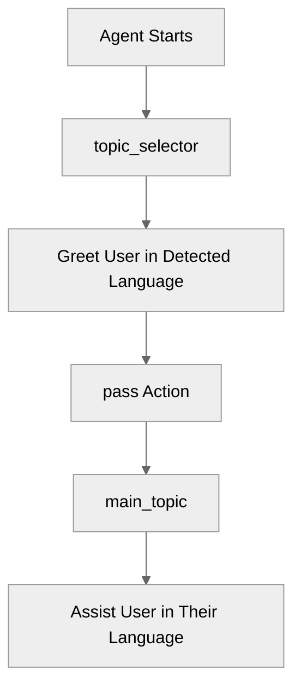

# LanguageSettings

## Overview

Learn how to configure **language settings** for your agent to support multiple locales.

## Agent Flow



## Key Concepts

- **Language Block**: Configures the primary and additional supported locales.
- **start_agent topic_selector**: Entry point that identifies language and greets the user before transitioning.
- **topic main_topic**: Main interaction topic that assists the user in their preferred language.

## How It Works

### Agent Structure

The agent uses `start_agent topic_selector` as the entry point. The topic_selector instructs the LLM to greet the user in their detected language (Spanish, French, German, or English) and then calls the `pass` action to transition to `main_topic`. The topic `main_topic` handles the main interaction and assists the user in their preferred language.

### Language Block Configuration

The `language` block in the agent file defines which languages the agent can speak and understand.

## Key Code Snippets

### Language Configuration

```agentscript
language:
  default_locale: "en_US"
  additional_locales: "es_MX,fr,de"
```

### start_agent topic_selector

```agentscript
start_agent topic_selector:
   description: "Identifies language and greets user"

   reasoning:
      instructions:->
         | Greet the user in their detected language.
           If they speak Spanish, say "Hola".
           If they speak French, say "Bonjour".
           If they speak German, say "Hallo".
           Otherwise, use English.

           Select the tool that best matches the user's message and conversation history. If it's unclear, make your best guess.

      actions:
         pass: @utils.transition to @topic.main_topic
            description: "Continue to main topic"
```

### topic main_topic

```agentscript
topic main_topic:
   description: "Main interaction topic"

   reasoning:
      instructions:->
        | Assist the user in their language.
```

## Try It Out

### Example Interaction

```text
User: Hola

Agent: Hola. Puedo ayudarte en español.
```

## What's Next

- **CustomerServiceAgent**: Build a full customer service agent using multiple languages.
