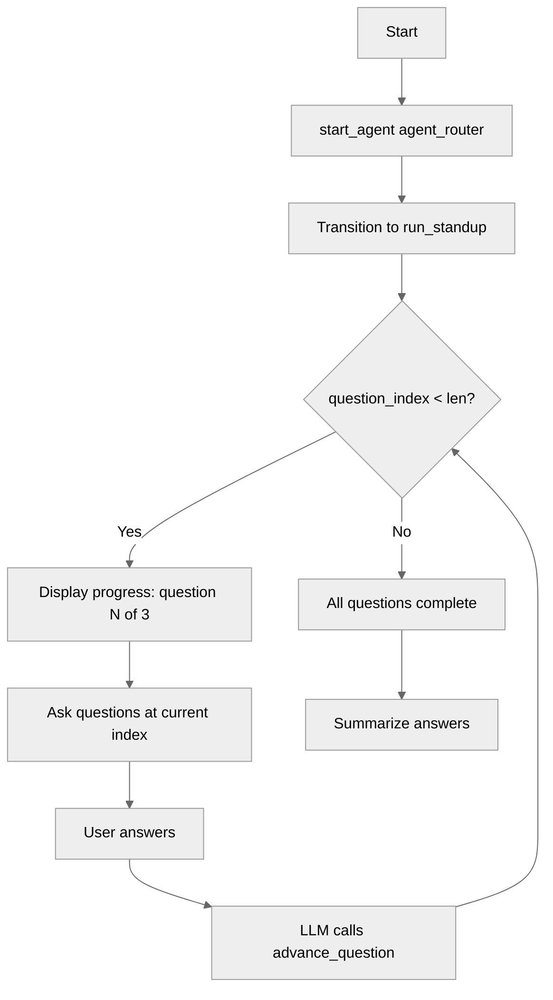

# ListVariables

## Overview

This recipe demonstrates how to use **list variables** to store a collection of values and iterate through them one at a time. The agent runs a daily standup by asking questions from a `list[string]`, tracking progress with an index variable and `len()`.

## Agent Flow



## Key Concepts

- **List declaration with defaults**: Define a `list[string]` pre-populated with values
- **Variable-based index access**: Use `@variables.list[@variables.index]` to access items dynamically
- **`len()` function**: Get the number of items in a list for progress display and loop control
- **Iteration pattern**: Increment an index variable after each turn to walk through the list

## How It Works

### Declaring a List Variable

```agentscript
variables:
   questions: mutable list[string] = ["What did you work on yesterday?", "What are you working on today?", "Do you have any blockers?"]
      description: "The standup questions to ask the user"

   question_index: mutable number = 0
      description: "Current position in the questions list"
```

A list is declared with `list[<type>]` and initialized with values in brackets. Pair it with an index variable to track your position.

### Accessing a List Item by Variable Index

```agentscript
| Ask this question: {!@variables.questions[@variables.question_index]}
```

Use `@variables.list[@variables.index]` to access the item at a dynamic position. List indexes start at 0.

### Showing Progress with `len()`

```agentscript
| Question {!@variables.question_index + 1} of {!len(@variables.questions)}:
```

`len(@variables.questions)` returns the number of items (3 in this case). Adding 1 to the zero-based index gives human-friendly numbering.

### Iterating Without a For Loop

Agent Script has no `for` loop. Instead, iterate by:

1. Checking `if @variables.question_index < len(@variables.questions)`
2. Asking the question at the current index
3. Incrementing the index via a `@utils.setVariables` action
4. When the index reaches `len()`, the condition flips and the agent summarizes

```agentscript
actions:
   advance_question: @utils.setVariables
      with question_index = @variables.question_index + 1
      description: "Move to the next question after the user answers."
```

## Try It Out

### Example Interaction

```text
Agent: Good morning! Let's run through your daily standup.
       Question 1 of 3: What did you work on yesterday?

User: I finished the API integration for the billing service.

Agent: Got it. Question 2 of 3: What are you working on today?

User: Writing tests for the billing integration and starting the dashboard UI.

Agent: Nice. Question 3 of 3: Do you have any blockers?

User: Waiting on design mockups for the dashboard.

Agent: Thanks! Here's your standup summary:
       - Yesterday: Finished billing service API integration
       - Today: Writing billing tests, starting dashboard UI
       - Blockers: Waiting on dashboard design mockups
       Have a productive day!
```

## What's Next

- **VariableManagement**: Fundamentals of scalar variables (string, number, boolean)
- **TemplateExpressions**: More on `{!...}` syntax in instructions
- **ActionChaining**: Populate lists dynamically with `set @variables.list = @outputs.result`

## Notes

- List indexes are **zero-based** — the first item is `[0]`
- Lists are global — all subagents can access and modify them
- `len()` can be used in template expressions, conditionals, and `available when` filters
- Supported list types: `list[string]`, `list[number]`, `list[boolean]`, `list[object]`
