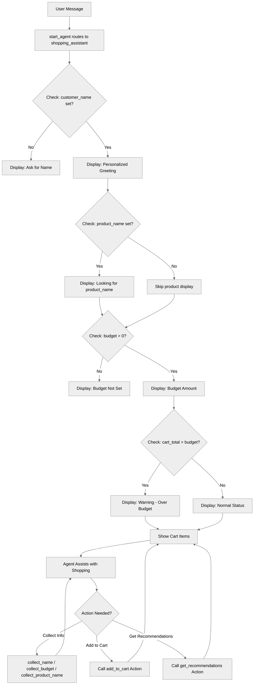

# TemplateExpressions

## Overview

This recipe demonstrates how to use **template expressions** to create dynamic, personalized content in your agent. Template expressions allow you to inject variable values, perform calculations, and use conditional logic directly within instruction templates.

## Agent Flow



## Key Concepts

- **Template syntax**: `{!expression}` for inserting dynamic values
- **Variable interpolation**: Displaying variable values in text
- **Block-level conditionals**: `if/else` statements controlling template output
- **Expressions in templates**: Calculations and comparisons
- **Personalization**: Using customer data to customize responses
- **Action integration**: Combining templates with action outputs

## How It Works

### Basic Template Syntax

Template expressions use `{!expression}` syntax within `|` template strings:

```agentscript
instructions:->
   | You're helping {!@variables.customer_name}.
     Their budget is {!@variables.budget}.
```

When the agent processes these instructions:

- `{!@variables.customer_name}` is replaced with the actual name (e.g., "Alice")
- `{!@variables.budget}` is replaced with the number (e.g., "500")

Result: "You're helping Alice. Their budget is 500."

### Block-Level Conditional Templates

Use `if/else` blocks to control which template content is included:

```agentscript
instructions:->
   if @variables.customer_name:
      | You're helping {!@variables.customer_name}.
   else:
      | You're helping a new customer. Ask for their name to personalize the experience.
```

The content shown depends on whether `customer_name` has a value.

### Combining Conditions with Templates

```agentscript
instructions:->
   if @variables.cart_total > @variables.budget and @variables.budget > 0:
      | - ⚠️ Cart total exceeds budget by {!@variables.cart_total - @variables.budget}
```

Conditions support:

- Comparisons: `>`, `<`, `==`, `!=`, `>=`, `<=`
- Logic: `and`, `or`, `not`
- Math in expressions: `+`, `-`

### Calculations in Templates

Perform math directly within template expressions:

```agentscript
| Cart total exceeds budget by {!@variables.cart_total - @variables.budget}
```

You can:

- Add: `{!@variables.price + @variables.tax}`
- Subtract: `{!@variables.balance - @variables.payment}`

## Key Code Snippets

### Personalized Greeting with Conditionals

```agentscript
reasoning:
   instructions:->
      |

      if @variables.customer_name:
         | You're helping {!@variables.customer_name}.
      else:
         | You're helping a new customer. Ask for their name to personalize the experience.
```

Shows different content based on whether you know the customer's name.

### Dynamic Status Display

```agentscript
instructions:->
   | Current shopping session:

   if @variables.product_name:
      | - Looking for: {!@variables.product_name}

   if @variables.budget > 0:
      | - Budget: {!@variables.budget}
   else:
      | - Budget: Not set

   if @variables.cart_items:
      | - Cart items: {!@variables.cart_items}
   else:
      | - Cart items: Empty

   | - Cart total: {!@variables.cart_total}
```

Displays current state with conditional handling for empty fields.

### Warning When Threshold Exceeded

```agentscript
if (@variables.cart_total > @variables.budget) and (@variables.budget > 0):
   | - ⚠️ Cart total exceeds budget by {!@variables.cart_total - @variables.budget}
```

Only shows warning when conditions are met.

### Using Customer Name for Personalization

```agentscript
if @variables.customer_name:
   | Use their name ({!@variables.customer_name}) when speaking to make it personal!
```

Reminds the agent to use personalization when the name is known.

### Actions with Variable Binding

```agentscript
actions:
   add_to_cart: @actions.add_to_cart
      with item_name=...
      with price=...
      set @variables.cart_total = @outputs.new_total

   get_recommendations: @actions.get_recommendations
      with budget=@variables.budget
      with product_name=@variables.product_name
```

Actions can use variables as inputs and store outputs back into variables.

## Complete Example from Recipe

```agentscript
topic shopping_assistant:
   description: "Helps customers shop and manages their cart"

   actions:
      add_to_cart:
         description: "Adds an item to the customer's shopping cart"
         inputs:
            item_name: string
               description: "Name of the product item to add to the cart"
            price: number
               description: "Price of the item being added to the cart"
         outputs:
            success: boolean
               description: "Indicates whether the item was added to the cart successfully"
            new_total: number
               description: "Updated cart total after adding the item"
         target: "flow://AddToCart"

      get_recommendations:
         description: "Get personalized product recommendations"
         inputs:
            budget: number
               description: "Customer's budget to tailor recommendations within their price range"
            product_name: string
               description: "The type of product to search for by name"
         outputs:
            recommendations: list[string]
               description: "List of personalized product recommendations matching budget and preferences"
         target: "flow://GetRecommendations"

   reasoning:
      instructions:->
         |

         if @variables.customer_name:
            | You're helping {!@variables.customer_name}.
         else:
            | You're helping a new customer. Ask for their name.

         | Current shopping session:

         if @variables.product_name:
            | - Looking for: {!@variables.product_name}

         if @variables.budget > 0:
            | - Budget: {!@variables.budget}
         else:
            | - Budget: Not set

         if @variables.cart_items:
            | - Cart items: {!@variables.cart_items}
         else:
            | - Cart items: Empty

         | - Cart total: {!@variables.cart_total}

         if @variables.cart_total > @variables.budget and @variables.budget > 0:
            | - ⚠️ Cart total exceeds budget by {!@variables.cart_total - @variables.budget}

         | Help the customer:
           1. Suggest products that match their product name and budget
           2. Add items to their cart using {!@actions.add_to_cart}
           3. Keep them informed of their cart total

           Don't call {!@actions.get_recommendations} unless you already have the product name and budget set.
           Never ask the customer about their preferences.

         if @variables.customer_name:
            | Use their name ({!@variables.customer_name}) when speaking to make it personal!

      actions:
         collect_name: @utils.setVariables
            description: "Set the customer's name from the conversation"
            with customer_name=...

         collect_budget: @utils.setVariables
            description: "Set the customer's shopping budget from the conversation"
            with budget=...

         collect_product_name: @utils.setVariables
            description: "Set the type of product the customer is looking for"
            with product_name=...

         add_to_cart: @actions.add_to_cart
            with item_name=...
            with price=...
            set @variables.cart_total = @outputs.new_total

         get_recommendations: @actions.get_recommendations
            with budget=@variables.budget
            with product_name=@variables.product_name
```

## Try It Out

Here's how template expressions make conversations dynamic:

### Example Interaction 1: First-Time Customer

```text
Agent: Welcome to our store! I'm your personal shopping assistant.

User: Hi, I need help finding a laptop

Agent: I'd be happy to help you find a laptop! Could I get your name to personalize your experience?

User: I'm Sarah

Agent: Great to meet you, Sarah! What's your budget for the laptop?

User: $1200

Agent: Perfect, Sarah! I've found Laptop X200, that costs $1200. Do you want to add it to the cart?

User: Yes

Agent: Great Sarah, the item has been added and now your cart total is $1200.
```

**Behind the scenes:**

- Initially `customer_name = ""` → Agent asks for name
- After update `customer_name = "Sarah"` → All responses use "Sarah"
- `budget = 1200` → Agent references "1200"

### Example Interaction 2: Exceeding Budget

```text
Agent: Hi Sarah! Your current shopping session:
       - Budget: 1000
       - Cart total: 1250
       - ⚠️ Cart total exceeds budget by 250

User: Oh, I didn't realize. What can I remove?

Agent: Let's look at your items and see what we can adjust to get within your 1000 budget, Sarah.
```

**Template expression triggered:**

The warning appears because `cart_total > budget and budget > 0` evaluates to `True`.

## Template Best Practices

### Use Conditional Blocks for Missing Data

**Good:**

```agentscript
if @variables.budget > 0:
   | Budget: {!@variables.budget}
else:
   | Budget: Not set
```

**Poor:**

```agentscript
| Budget: {!@variables.budget}
```

(Shows "0" when not set, which can be confusing)

### Keep Templates Readable

**Good:**

```agentscript
if @variables.name:
   | Welcome back, {!@variables.name}!
else:
   | Welcome! What's your name?
```

### Use Descriptive Conditions

**Good:**

```agentscript
if (@variables.cart_total > @variables.budget) and (@variables.budget > 0):
```

**Poor:**

```agentscript
if (@variables.a > @variables.b) and (@variables.b > 0):
```

## Where Templates Work

Template expressions can be used in:

✅ **Procedural reasoning instructions**

```agentscript
reasoning:
   instructions:->
      | Budget remaining: {!@variables.budget - @variables.cart_total}
```

✅ **System instructions** (with `{!expression}` syntax)

```agentscript
system:
   instructions: "Help the customer with their {!@variables.budget} budget."
```

❌ **NOT in descriptions** (currently unsupported)

```agentscript
description: "Helps {!@variables.name}"  # This won't work
```

## What's Next

Template expressions are powerful for dynamic content. To expand your agent's capabilities:

- **ReasoningInstructions**: Build complex dynamic instructions with action calls
- **ActionCallbacks**: Process action results and use them in templates
- **ContextHandling**: Use platform context variables in templates
- **MultiStepWorkflows**: Chain actions and display results dynamically

## Testing

Test template expressions with different variable states:

### Test Case 1: Empty Variables

- `customer_name = ""`
- `budget = 0`
- `cart_items = []`

Expected: Conditional blocks show "Not set" / "Empty" messages

### Test Case 2: Budget Exceeded

- `budget = 500`
- `cart_total = 650`

Expected: Warning message with "150" overage calculation

### Test Case 3: Normal Shopping

- `customer_name = "Alice"`
- `budget = 1000`
- `cart_total = 750`
- `cart_items = ["Laptop", "Mouse"]`

Expected: Personalized messages with "Alice", no warnings
