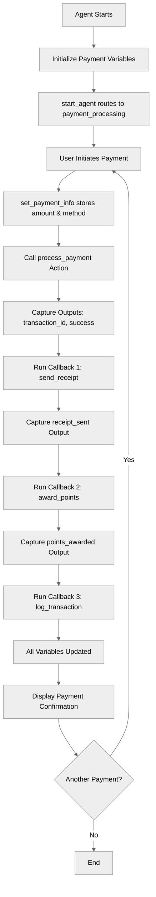

# ActionCallbacks

## Overview

Learn how to use **post-action execution** with the `run` keyword to chain actions and process results. This pattern is essential for multi-step workflows where one action's completion triggers additional actions.

## Agent Flow



## Key Concepts

- **`run` keyword**: Execute actions after primary action completes
- **Post-action processing**: Handle action results immediately
- **Action chaining**: Sequential action execution within callbacks
- **One-level depth**: Only one level of `run` nesting allowed
- **Result capture**: Store outputs from each chained action

## How It Works

### Basic Post-Action Execution

After a primary action completes, use `run` to execute follow-up actions:

```agentscript
actions:
   set_payment_info: @utils.setVariables
      with payment_amount=...
      with payment_method=...
   make_payment: @actions.process_payment
      with amount=...
      with method=@variables.payment_method
      # Capture primary action outputs
      set @variables.transaction_id = @outputs.transaction_id
      set @variables.payment_successful = @outputs.success
      # Run callback action
      run @actions.send_receipt
         with transaction_id=@variables.transaction_id
         with amount=@variables.payment_amount
         set @variables.receipt_sent = @outputs.sent
```

The `run` block executes **after** the primary action succeeds.

### Multiple Callback Actions

Chain multiple actions sequentially:

```agentscript
set_payment_info: @utils.setVariables
   with payment_amount=...
   with payment_method=...
make_payment: @actions.process_payment
   with amount=...
   with method=@variables.payment_method
   set @variables.transaction_id = @outputs.transaction_id
   set @variables.payment_successful = @outputs.success
   # Callback 1: Send receipt
   run @actions.send_receipt
      with transaction_id=@variables.transaction_id
      with amount=@variables.payment_amount
      set @variables.receipt_sent = @outputs.sent
   # Callback 2: Award loyalty points
   run @actions.award_points
      with amount=@variables.payment_amount
      set @variables.points_awarded = @outputs.points
   # Callback 3: Log for audit
   run @actions.log_transaction
      with transaction_id=@variables.transaction_id
```

Multiple `run` statements execute in sequence after the primary action.

### Complete Recipe Example

```agentscript
config:
   agent_name: "ActionCallbacks"
   agent_label: "ActionCallbacks"
   agent_type: "AgentforceEmployeeAgent"
   description: "Processes payments with post-action callbacks"

variables:
   payment_amount: mutable number = 0
      description: "Payment amount"

   payment_method: mutable string = ""
      description: "Payment method used"

   transaction_id: mutable string = ""
      description: "Transaction ID from payment"

   payment_successful: mutable boolean = False
      description: "Whether payment succeeded"

   receipt_sent: mutable boolean = False
      description: "Whether receipt was sent"

   points_awarded: mutable number = 0
      description: "Loyalty points awarded"

system:
   messages:
      welcome: "I'll help you process your payment securely."
      error: "Payment processing error. Please try again."

   instructions: "You are a payment processing assistant that helps customers process payments and provides transaction confirmations. Never ask for card details, billing information, or other payment specifics."

start_agent topic_selector:
   description: "Welcome users and begin payment processing"

   reasoning:
      instructions:|
         Select the tool that best matches the user's message and conversation history. If it's unclear, make your best guess.
      actions:
         go_to_payment_processing: @utils.transition to @topic.payment_processing
            description: "User wants to make a payment, process a transaction, or ask about payment status, receipts, or loyalty points"

topic payment_processing:
   description: "Handles payment requests — collecting payment amount and method, processing transactions, sending receipts, awarding loyalty points, and logging for audit"

   actions:
      process_payment:
         description: "Processes a payment transaction"
         inputs:
            amount: number
               description: "The payment amount to be processed"
            method: string
               description: "The mode of the payment"
         outputs:
            transaction_id: string
               description: "Unique identifier for the completed transaction"
            success: boolean
               description: "Indicates whether the payment was processed successfully"
         target: "flow://ProcessPayment"

      send_receipt:
         description: "Sends payment receipt"
         inputs:
            transaction_id: string
               description: "The transaction ID to include in the receipt"
            amount: number
               description: "The payment amount to display on the receipt"
         outputs:
            sent: boolean
               description: "Indicates whether the receipt was sent successfully"
         target: "flow://SendReceipt"

      award_points:
         description: "Awards loyalty points"
         inputs:
            amount: number
               description: "The payment amount used to calculate loyalty points"
         outputs:
            points: number
               description: "The number of loyalty points awarded to the customer"
         target: "flow://AwardLoyaltyPoints"

      log_transaction:
         description: "Logs transaction for audit"
         inputs:
            transaction_id: string
               description: "The transaction ID to be logged for audit purposes"
         outputs:
            success: boolean
               description: "Indicates whether the transaction was logged successfully"
         target: "flow://LogTransaction"

   reasoning:
      instructions:->
         if not @variables.transaction_id:
            | Store the amount and method first, then process the payment.
              - Amount: ${!@variables.payment_amount}
              - Method: {!@variables.payment_method}
         else:
            | Payment has been processed, inform the user:
              - Transaction: {!@variables.transaction_id}
              - Success: {!@variables.payment_successful}
              - Receipt sent: {!@variables.receipt_sent}
              - Points: {!@variables.points_awarded}
      actions:
         set_payment_info: @utils.setVariables
            with payment_amount=...
            with payment_method=...
         make_payment: @actions.process_payment
            with amount=...
            with method=@variables.payment_method
            set @variables.transaction_id = @outputs.transaction_id
            set @variables.payment_successful = @outputs.success
            run @actions.send_receipt
               with transaction_id=@variables.transaction_id
               with amount=@variables.payment_amount
               set @variables.receipt_sent = @outputs.sent
            run @actions.award_points
               with amount=@variables.payment_amount
               set @variables.points_awarded = @outputs.points
            run @actions.log_transaction
               with transaction_id=@variables.transaction_id
```

## Key Code Snippets

### Basic Callback Pattern

```agentscript
actions:
   primary_action: @actions.do_something
      with input=...
      set @variables.result = @outputs.data
      # Callback executes after primary action
      run @actions.handle_result
         with result_data=@variables.result
```

### Multi-Step Chain

```agentscript
create_order: @actions.create_order
   with customer_id=@variables.customer_id
   with items=...
   set @variables.order_id = @outputs.order_id
   # Step 1: Send confirmation
   run @actions.send_confirmation
      with order_id=@variables.order_id
      with email=@variables.customer_email
   # Step 2: Update inventory
   run @actions.update_inventory
      with order_id=@variables.order_id
   # Step 3: Log order
   run @actions.log_order
      with order_id=@variables.order_id
```

### Capturing Callback Outputs

```agentscript
process_payment: @actions.charge_card
   with amount=@variables.total
   set @variables.payment_id = @outputs.payment_id
   run @actions.send_receipt
      with payment_id=@variables.payment_id
      set @variables.receipt_sent = @outputs.sent
   run @actions.award_points
      with amount=@variables.total
      set @variables.points_earned = @outputs.points
```

Each `run` can capture its own outputs into variables.

## Try It Out

### Example: Payment Processing

```text
Agent: I'll help you process your payment securely.

User: Process a payment of $150 using credit card

[Agent calls set_payment_info, then process_payment]
  → set_payment_info(payment_amount=150, payment_method="credit card")
  → process_payment(amount=150, method="credit card")
  → Returns: transaction_id="TXN-456", success=true

  [Callback 1: send_receipt]
  → send_receipt(transaction_id="TXN-456", amount=150)
  → Returns: sent=true

  [Callback 2: award_points]
  → award_points(amount=150)
  → Returns: points=150

  [Callback 3: log_transaction]
  → log_transaction(transaction_id="TXN-456")

Agent: Payment processed successfully!
       - Transaction ID: TXN-456
       - Receipt sent: Yes
       - Loyalty points awarded: 1500
```

### Behind the Scenes

1. `set_payment_info` stores `payment_amount` and `payment_method` from user input
2. Primary action `process_payment` executes with `amount` and `method=@variables.payment_method`
3. Outputs captured: `transaction_id`, `success`
4. Callback 1 `send_receipt` runs with transaction data
5. Callback 2 `award_points` runs with amount
6. Callback 3 `log_transaction` runs for audit
7. All variables updated for agent to use in response

## Best Practices

✅ **Capture outputs immediately** - Save action results before chaining

✅ **One level only** - Don't nest run inside run

✅ **Clear dependencies** - Document what each callback expects

✅ **Use variables for data passing** - Store outputs in variables for callbacks

❌ **Don't nest deeply**

```agentscript
# NOT SUPPORTED:
run @actions.a
   run @actions.b  # Only one level allowed for now
```

✅ **Use sequential runs instead**

```agentscript
# Correct approach:
run @actions.step_a
   set @variables.result_a = @outputs.data
run @actions.step_b
   with input=@variables.result_a
run @actions.step_c
```

## When to Use Callbacks

### Use callbacks when:

- Need to perform follow-up actions after primary action
- Want to chain related operations (payment → receipt → points)
- Need to capture and pass data between actions
- Building audit trails or logs

### Don't use callbacks when:

- Actions are independent (use separate reasoning actions)
- Need deep nesting (refactor into separate actions)

## What's Next

- **MultiStepWorkflows**: Build complex workflows with callbacks
- **ErrorHandling**: Add validation between actions
- **AfterReasoning**: Run actions outside of reasoning block
- **ActionDefinitions**: Learn how to define the actions being called

## Testing

Test callback execution:

### Test Case 1: Happy Path

- Process payment with valid inputs
- Verify all callbacks execute in sequence
- Check all variables populated

### Test Case 2: Primary Action Failure

- Simulate payment failure
- Verify callbacks don't execute
- Check error handling

### Test Case 3: Data Flow

- Verify outputs from primary action
- Check data passed to callbacks correctly
- Validate final variable state
