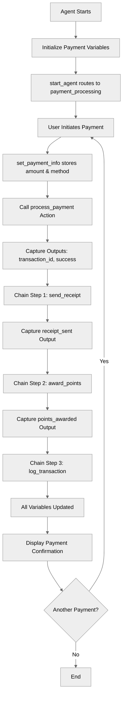

# ActionChaining

## Overview

Learn how to use **action chaining** with the `run` keyword to execute multiple actions in a guaranteed sequence. This pattern is essential for multi-step workflows where one action's completion triggers additional actions.

## Agent Flow



## Key Concepts

- **`run` keyword**: Execute actions after a primary action completes
- **Action chaining**: Sequential action execution using `run` blocks
- **Post-action processing**: Handle action results immediately after completion
- **One-level depth**: Only one level of `run` nesting allowed
- **Result capture**: Store outputs from each chained action

## How It Works

### Basic Action Chaining

After a primary action completes, use `run` to execute follow-up actions:

```agentscript
actions:
   set_payment_info: @utils.setVariables
      with payment_amount=...
      with payment_method=...
   make_payment: @actions.process_payment
      with amount=...
      with method=@variables.payment_method
      # Capture primary action outputs
      set @variables.transaction_id = @outputs.transaction_id
      set @variables.payment_successful = @outputs.success
      # Chain a follow-up action
      run @actions.send_receipt
         with transaction_id=@variables.transaction_id
         with amount=@variables.payment_amount
         set @variables.receipt_sent = @outputs.sent
```

The `run` block executes **after** the primary action succeeds.

### Chaining Multiple Actions

Chain multiple actions sequentially:

```agentscript
set_payment_info: @utils.setVariables
   with payment_amount=...
   with payment_method=...
make_payment: @actions.process_payment
   with amount=...
   with method=@variables.payment_method
   set @variables.transaction_id = @outputs.transaction_id
   set @variables.payment_successful = @outputs.success
   # Step 1: Send receipt
   run @actions.send_receipt
      with transaction_id=@variables.transaction_id
      with amount=@variables.payment_amount
      set @variables.receipt_sent = @outputs.sent
   # Step 2: Award loyalty points
   run @actions.award_points
      with amount=@variables.payment_amount
      set @variables.points_awarded = @outputs.points
   # Step 3: Log for audit
   run @actions.log_transaction
      with transaction_id=@variables.transaction_id
```

Multiple `run` statements execute in sequence after the primary action.

## Key Code Snippets

### Basic Chaining Pattern

```agentscript
actions:
   primary_action: @actions.do_something
      with input=...
      set @variables.result = @outputs.data
      # Chained action executes after primary action
      run @actions.handle_result
         with result_data=@variables.result
```

### Multi-Step Chain

```agentscript
create_order: @actions.create_order
   with customer_id=@variables.customer_id
   with items=...
   set @variables.order_id = @outputs.order_id
   # Step 1: Send confirmation
   run @actions.send_confirmation
      with order_id=@variables.order_id
      with email=@variables.customer_email
   # Step 2: Update inventory
   run @actions.update_inventory
      with order_id=@variables.order_id
   # Step 3: Log order
   run @actions.log_order
      with order_id=@variables.order_id
```

### Capturing Chained Action Outputs

```agentscript
process_payment: @actions.charge_card
   with amount=@variables.total
   set @variables.payment_id = @outputs.payment_id
   run @actions.send_receipt
      with payment_id=@variables.payment_id
      set @variables.receipt_sent = @outputs.sent
   run @actions.award_points
      with amount=@variables.total
      set @variables.points_earned = @outputs.points
```

Each `run` can capture its own outputs into variables.

## Try It Out

### Example: Payment Processing

```text
Agent: I'll help you process your payment securely.

User: Process a payment of $150 using credit card

Agent: Payment processed successfully!
       - Transaction ID: TXN-456
       - Receipt sent: Yes
       - Loyalty points awarded: 1500
```

### Behind the Scenes

1. `set_payment_info` stores `payment_amount` and `payment_method` from user input
2. Primary action `process_payment` executes with `amount` and `method=@variables.payment_method`
3. Outputs captured: `transaction_id`, `success`
4. Chained step 1: `send_receipt` runs with transaction data
5. Chained step 2: `award_points` runs with amount
6. Chained step 3: `log_transaction` runs for audit
7. All variables updated for agent to use in response

## What's Next

- **MultiStepWorkflows**: Build complex workflows with chained actions
- **ErrorHandling**: Add validation between actions
- **AfterReasoning**: Run actions outside of reasoning block
- **ActionDefinitions**: Learn how to define the actions being called

## Testing

### Test Case 1: Happy Path

- Process payment with valid inputs
- Verify all chained actions execute in sequence
- Check all variables populated

### Test Case 2: Primary Action Failure

- Simulate payment failure
- Verify chained actions don't execute
- Check error handling

### Test Case 3: Data Flow

- Verify outputs from primary action
- Check data passed to chained actions correctly
- Validate final variable state
