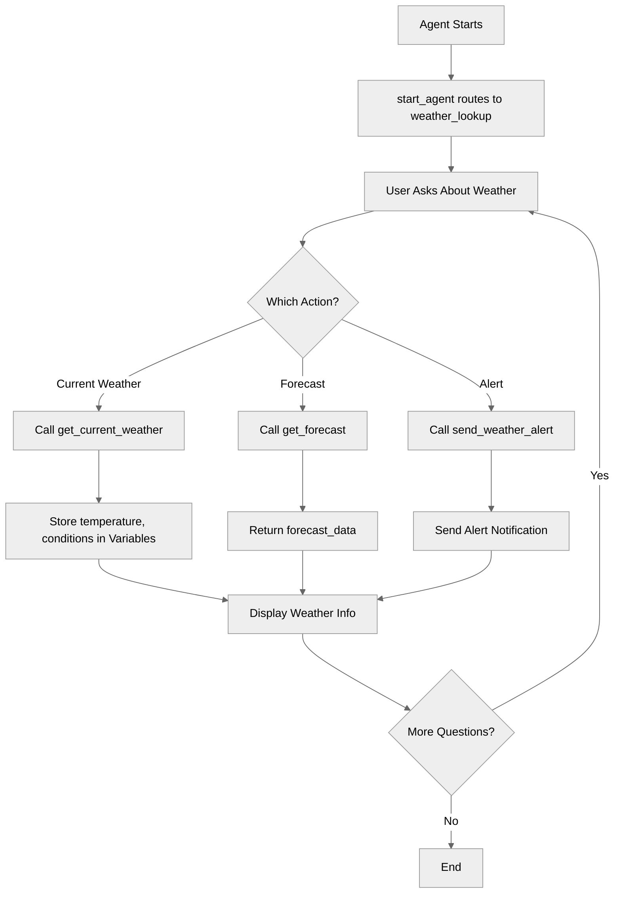

# ActionDefinitions

## Overview

This recipe demonstrates how to define and use **actions** - the way Agent Script agents call external systems, APIs, and services. Actions are essential for agents that need to fetch data, perform operations, or integrate with external platforms.

## Agent Flow



## Key Concepts

- **Actions block**: Where external capabilities are defined within a topic
- **Action structure**: description, inputs, outputs, target
- **Action targets**: `flow://` for Flows, `apex://` for Apex classes
- **Input binding**: Specifying action parameters with `with`
- **Output capture**: Storing action results with `set`
- **LLM slot-filling**: Using `...` for LLM-extracted parameters
- **Reasoning actions**: Making actions available during conversation

## How It Works

### Action Definition Anatomy

Every action has four key components:

```agentscript
get_current_weather:
   description: "Retrieves current weather conditions for a specified location"
   inputs:
      city_name: string
         description: "The name of the city to get weather for"
      units: string
         description: "Temperature units to use (fahrenheit, celsius, or kelvin)"
   outputs:
      temperature: number
         description: "Current temperature value in the specified units"
      weather_condition: string
         description: "Description of current weather (e.g., sunny, cloudy, rainy)"
      humidity: number
         description: "Current humidity percentage (0-100)"
      wind_speed: number
         description: "Current wind speed in miles per hour"
   target: "flow://GetCurrentWeather"
```

1. **Description**: Explains what the action does (helps the LLM decide when to use it)
2. **Inputs**: Parameters the action needs to execute, each with type and description
3. **Outputs**: Data the action returns, each with type and description
4. **Target**: Where the action executes (the external system)

### Action Targets

The `target` specifies where the action runs:

#### Salesforce Flow

```agentscript
target: "flow://GetCurrentWeather"
```

- Calls a Salesforce Flow
- Flow name follows `flow://`
- Most common integration method

#### Apex Class

```agentscript
target: "apex://WeatherAlertService"
```

- Calls a Salesforce Apex class
- Class name follows `apex://`
- Use for custom server-side logic

### Defining Actions in Topics

Actions are defined in the `actions:` block within a topic:

```agentscript
topic weather_lookup:
   description: "Looks up and reports weather information"

   actions:
      get_current_weather:
         description: "Retrieves current weather conditions for a specified location"
         inputs:
            city_name: string
               description: "The name of the city to get weather for"
            units: string
               description: "Temperature units to use (fahrenheit, celsius, or kelvin)"
         outputs:
            temperature: number
               description: "Current temperature value in the specified units"
            weather_condition: string
               description: "Description of current weather (e.g., sunny, cloudy, rainy)"
            humidity: number
               description: "Current humidity percentage (0-100)"
            wind_speed: number
               description: "Current wind speed in miles per hour"
         target: "flow://GetCurrentWeather"
```

### Making Actions Available in Reasoning

Define actions, then make them available in `reasoning.actions:`:

```agentscript
reasoning:
   instructions:->
      | Help users get weather information for their requested locations and send weather alerts.

   actions:
      get_current_weather: @actions.get_current_weather
         with city_name=...
         with units="fahrenheit"
         set @variables.current_temperature = @outputs.temperature
         set @variables.conditions = @outputs.weather_condition
```

This tells the agent:

- This action can be called during the conversation
- The LLM can choose when to call it
- Here's how to bind the inputs

### Input Binding Patterns

There are three ways to provide action inputs:

#### 1. LLM Slot-Filling (`...`)

```agentscript
with city_name=...
```

- The LLM extracts this from conversation
- Most flexible - agent figures out the value
- Use when users will provide the information

#### 2. Fixed Values

```agentscript
with units="fahrenheit"
```

- Hard-coded value
- Same every time the action runs
- Use for constants or defaults

#### 3. Variable Binding

```agentscript
with city_name=@variables.user_location
```

- Pulls value from a variable
- Use when you've stored the value earlier
- Ensures consistency

### Capturing Outputs

After an action runs, capture its outputs with `set`:

```agentscript
actions:
   get_current_weather: @actions.get_current_weather
      with city_name=...
      with units="fahrenheit"
      set @variables.current_temperature = @outputs.temperature
      set @variables.conditions = @outputs.weather_condition
```

- `@outputs.field_name` - access returned data
- `set @variables.name = value` - store for later use

## Key Code Snippets

### Complete Action Definition

```agentscript
actions:
   get_current_weather:
      description: "Retrieves current weather conditions for a specified location"
      inputs:
         city_name: string
            description: "The name of the city to get weather for"
         units: string
            description: "Temperature units to use (fahrenheit, celsius, or kelvin)"
      outputs:
         temperature: number
            description: "Current temperature value in the specified units"
         weather_condition: string
            description: "Description of current weather (e.g., sunny, cloudy, rainy)"
         humidity: number
            description: "Current humidity percentage (0-100)"
         wind_speed: number
            description: "Current wind speed in miles per hour"
      target: "flow://GetCurrentWeather"
```

### Action with List Output

```agentscript
get_forecast:
   description: "Retrieves 5-day weather forecast for a location"
   inputs:
      city_name: string
         description: "The name of the city to get forecast for"
      days: number
         description: "Number of days to include in the forecast (1-10)"
   outputs:
      forecast_data: list[object]
         description: "List of daily forecast objects containing temperature, conditions, and precipitation data"
         complex_data_type_name: "lightning__textType"
   target: "flow://GetWeatherForecast"
```

### Action with Apex Target

```agentscript
send_weather_alert:
   description: "Sends a weather alert notification to the user"
   inputs:
      message: string
         description: "The alert message content to send to the user"
      severity: string
         description: "Severity level of the alert (low, medium, high, or critical)"
   outputs:
      alertMessage: string
         description: "The formatted weather alert message that was sent"
   target: "apex://WeatherAlertService"
```

### Making Actions Available to LLM

```agentscript
reasoning:
   instructions:->
      | Help users get weather information for their requested locations and send weather alerts.

        Current data:

      if @variables.location:
         | - Location: {!@variables.location}
      else:
         | - Location: None specified

      if @variables.current_temperature > 0:
         | - Temperature: {!@variables.current_temperature}
      else:
         | - Temperature: Not fetched

      if @variables.conditions:
         | - Conditions: {!@variables.conditions}
      else:
         | - Conditions: Not fetched

      | When a user asks about weather:
        1. Identify the location they're asking about
        2. Use {!@actions.get_current_weather} to fetch current conditions
        3. Store the results in variables
        4. Report the weather clearly to the user

      | If the user asks to send a weather alert, use {!@actions.send_alert} to send the alert

   actions:
      get_current_weather: @actions.get_current_weather
         with city_name=...
         with units="fahrenheit"
         set @variables.current_temperature = @outputs.temperature
         set @variables.conditions = @outputs.weather_condition

      get_forecast: @actions.get_forecast
         with city_name=...
         with days=5

      send_alert: @actions.send_weather_alert
         with message=...
         with severity=...
```

## Try It Out

Here's how a conversation with this agent flows:

### Example Interaction

```text
Agent: Hi! I can help you check the weather. What location would you like to know about?

User: What's the weather like in San Francisco?

[Agent calls get_current_weather action with city_name="San Francisco"]

Agent: In San Francisco, it's currently 65°F with partly cloudy conditions. The humidity is 72% and winds are at 8 mph. Would you like to see the 5-day forecast?

User: Yes, show me the forecast

[Agent calls get_forecast action]

Agent: Here's the 5-day forecast for San Francisco:
       - Monday: Partly cloudy, high of 67°F
       - Tuesday: Sunny, high of 70°F
       - Wednesday: Cloudy, high of 64°F
       - Thursday: Rain, high of 61°F
       - Friday: Partly cloudy, high of 66°F

User: Send a weather alert

[Agent calls send_weather_alert action]

Agent: A weather alert has been sent for San Francisco: Sunny conditions with a temperature of 72.5°F. Stay hydrated and wear sun protection if outdoors!
```

### Behind the Scenes

When user says "San Francisco":

1. Agent recognizes this is a weather request
2. LLM chooses to call `get_current_weather`
3. LLM extracts `city_name = "San Francisco"` (slot-filling)
4. Action executes: Flow is called with inputs
5. Outputs are returned: `temperature=65`, `weather_condition="partly cloudy"`, etc.
6. Values are stored: `@variables.current_temperature = 65`
7. Agent uses stored data to respond naturally

## Action Design Best Practices

### Inputs

- Keep inputs minimal - only what's needed
- Use clear, descriptive parameter names
- Choose appropriate types (string, number, boolean)
- Add detailed descriptions to help LLM understand

### Outputs

- Return only useful data
- Use structured types (`object`, `list[object]`) for complex data
- Match output types to how you'll use the data
- Add descriptions explaining what each output contains

### Descriptions

**Good descriptions:**

- "Retrieves current weather conditions for a specified location"
- "Sends a weather alert notification to the user"
- "Searches for products matching the query"

**Poor descriptions:**

- "Gets weather" (too vague)
- "This action calls the weather API endpoint and returns..." (too technical)
- "" (missing!)

## What's Next

Actions are powerful, but this recipe shows basics. To learn more:

- **ActionCallbacks**: Chain actions with `run` for multi-step processes
- **AdvancedInputBindings**: Master all input binding patterns
- **ActionDescriptionOverrides**: Adapt descriptions by context
- **DynamicActionRouting**: Control action availability with `available when`

## Testing

To test this agent, you'll need to create the referenced Salesforce Flows:

**GetCurrentWeather Flow:**

- Input: `city_name` (Text), `units` (Text)
- Output: `temperature` (Number), `weather_condition` (Text), `humidity` (Number), `wind_speed` (Number)
- Logic: Call a weather API (OpenWeather, WeatherAPI, etc.)

**GetWeatherForecast Flow:**

- Input: `city_name` (Text), `days` (Number)
- Output: `forecast_data` (Collection)
- Logic: Call forecast API endpoint

**WeatherAlertService Apex:**

- Method: `sendAlert(String message, String severity)`
- Logic: Send notification (email, SMS, platform event)
