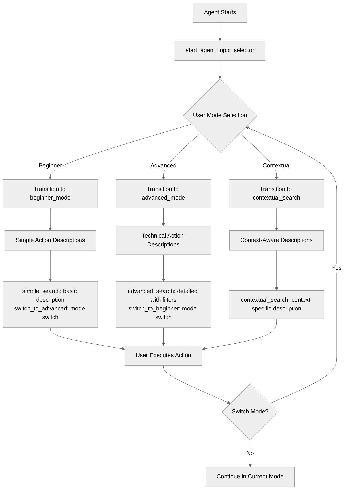

# ActionDescriptionOverrides

## Overview

Master **context-specific action descriptions** to improve LLM action selection. Learn how to define different action descriptions for different topics based on user expertise, context, and conversation state for more accurate tool calling.

## Agent Flow



## Key Concepts

- **Topic-level action definitions**: Each topic can define actions with different descriptions
- **Context-aware descriptions**: Adapt descriptions to user level and search context
- **Expertise-based descriptions**: Different detail levels for beginners vs advanced users
- **Mode switches**: Each topic exposes transitions (e.g., `switch_to_advanced`, `switch_to_beginner`) to change modes
- **Improved LLM selection**: Better descriptions = better tool choices

## How It Works

### Base Action Definition in Topic

Each topic defines its own version of actions with appropriate descriptions:

```agentscript
topic beginner_mode:
   description: "Simplified interface for beginners"

   actions:
      perform_search:
         description: "Search the knowledge base"
         inputs:
            query: string
               description: "Search query text to find relevant knowledge base articles"
            filters: string
               description: "Filter criteria object to refine search results (e.g., type, date range, tags)"
         outputs:
            results: list[object]
               description: "List of search result objects containing matching knowledge base articles"
               complex_data_type_name: "lightning__textType"
         target: "flow://PerformSearch"
```

### Different Descriptions Per Topic

The same underlying action can have different descriptions in different topics:

```agentscript
# Beginner mode - simple descriptions
topic beginner_mode:
   actions:
      perform_search:
         description: "Search the knowledge base"
         ...

# Advanced mode - detailed technical descriptions
topic advanced_mode:
   actions:
      perform_search:
         description: "Execute knowledge base query with advanced filters (supports: type, date range, tags, custom fields). Returns paginated results with relevance scoring."
         inputs:
            query: string
               description: "Search query text with support for advanced syntax and operators"
            filters: string
               description: "Advanced filter criteria object with type, date range, tags, and custom field filters"
         ...
```

### Context-Aware Search Topic

The `contextual_search` topic uses context-specific descriptions for the same `perform_search` action. The reasoning layer exposes a single `contextual_search` action that invokes `perform_search`:

```agentscript
topic contextual_search:
   reasoning:
      actions:
         contextual_search: @actions.perform_search
            with query=...
            with filters=...
```

## Key Code Snippets

### Topic Selector (Entry Point)

```agentscript
start_agent topic_selector:
   description: "Welcome users and determine their expertise level"

   reasoning:
      instructions:|
         Select the tool that best matches the user's message and conversation history. If it's unclear, make your best guess.
      actions:
         beginner_mode: @utils.transition to @topic.beginner_mode
            description: "Use simplified interface for beginners. Choose this for general questions or when no specific search context (like Accounts or Cases) is mentioned."

         advanced_mode: @utils.transition to @topic.advanced_mode
            description: "Use full technical interface for advanced users. Choose this when the user uses technical terms, asks for specific filters, or complex operations."

         contextual_mode: @utils.transition to @topic.contextual_search
            description: "Use context-aware search. Choose this ONLY when the user explicitly searches for specific business objects like Accounts, Contacts, or Cases."
```

### Beginner Mode with Simple Descriptions

```agentscript
topic beginner_mode:
   description: "Simplified interface for beginners"

   actions:
      perform_search:
         description: "Search the knowledge base"
         inputs:
            query: string
               description: "Search query text to find relevant knowledge base articles"
            filters: string
               description: "Filter criteria object to refine search results (e.g., type, date range, tags)"
         outputs:
            results: list[object]
               description: "List of search result objects containing matching knowledge base articles"
               complex_data_type_name: "lightning__textType"
         target: "flow://PerformSearch"

   reasoning:
      instructions:->
         | Beginner Mode - Simplified Interface

           I'll help you with basic tasks using simple language.

      actions:
         simple_search: @actions.perform_search
            with query=...
            with filters=...

         switch_to_advanced: @utils.transition to @topic.advanced_mode
```

### Advanced Mode with Technical Descriptions

```agentscript
topic advanced_mode:
   description: "Full-featured interface for advanced users"

   actions:
      perform_search:
         description: "Execute knowledge base query with advanced filters (supports: type, date range, tags, custom fields). Returns paginated results with relevance scoring."
         inputs:
            query: string
               description: "Search query text with support for advanced syntax and operators"
            filters: string
               description: "Advanced filter criteria object with type, date range, tags, and custom field filters"
         outputs:
            results: list[object]
               description: "Paginated list of search result objects with relevance scores"
               complex_data_type_name: "lightning__textType"
         target: "flow://PerformSearch"

   reasoning:
      instructions:->
         | Advanced Mode - Full Technical Interface
         |
         | All features available with detailed technical descriptions.

      actions:
         advanced_search: @actions.perform_search
            with query=...
            with filters=...

         switch_to_beginner: @utils.transition to @topic.beginner_mode
```

### Context-Aware Search Actions

```agentscript
topic contextual_search:
   description: "Search with context-specific descriptions"

   actions:
      perform_search:
         description: "Search the knowledge base"
         inputs:
            query: string
               description: "Search query text adapted to the current search context"
            filters: string
               description: "Context-specific filter criteria object"
         outputs:
            results: list[object]
               description: "List of context-relevant search result objects"
               complex_data_type_name: "lightning__textType"
         target: "flow://PerformSearch"

   reasoning:
      instructions:->
         | Context-Aware Search Interface

           Search descriptions adapt based on what you're looking for.

      actions:
         # When searching for accounts
         contextual_search: @actions.perform_search
            with query=...
            with filters=...
```

## Try It Out

### Example: Beginner Mode

```text
User: Find information about pricing

Agent sees action:
  simple_search: "Search the knowledge base"

LLM thinks: "User wants to find information, use simple_search"

Agent: [Calls perform_search with query="pricing"]
       Here's what I found about pricing...
```

### Example: Advanced Mode

```text
User: I am an advanced user. Query the knowledge base for articles tagged "API" from last 30 days.

Agent sees action:
  advanced_search: "Execute knowledge base query with advanced filters (supports: type, date range, tags, custom fields). Returns paginated results."

LLM thinks: "User wants advanced query with filters, use advanced_search"

Agent: [Calls perform_search with query="API" and complex filters]
       Found 15 API articles from the last 30 days...
```

### Example: Context-Aware

```text
User: I want to search for Accounts

[Topic selector: user chose contextual_mode]
Agent transitions to contextual_search topic

Agent sees action:
  contextual_search: "Search the knowledge base" (with context-specific descriptions)

LLM thinks: "User wants to search for context-specific business objects, use contextual_search"

Agent: [Calls perform_search with query="Accounts"]
       Here's what I found...
```

## Why Different Descriptions?

### Better LLM Understanding

- Clearer descriptions = better tool selection
- Context-specific language matches user intent
- Reduces wrong tool calls

### Expertise Adaptation

- Beginners get simple explanations
- Experts get technical details
- Appropriate for skill level

### Context Clarity

- Actions described for current context
- Reduces ambiguity
- Guides LLM to right tool

## Best Practices

✅ **Match user expertise** - Beginners need simple, experts need detailed

✅ **Be specific** - Describe what action does in this context

✅ **Use clear language** - Avoid jargon unless in advanced mode

✅ **Document parameters** - Explain what inputs are available

❌ **Don't use same description** - If context matters, customize it

❌ **Don't be vague** - Specific descriptions help LLM choose correctly

## Description Guidelines

### Beginner Descriptions

- Use plain language
- Focus on outcome
- Hide technical details
- Example: "Search the knowledge base"

### Advanced Descriptions

- Use technical terms
- Explain parameters
- Include capabilities
- Example: "Execute query with advanced filters (type, date range, tags). Returns paginated results with relevance scoring."

### Context-Specific Descriptions

- Mention the context
- Explain what it searches
- Be concrete
- Example: "Search query text adapted to the current search context"

## What's Next

- **ActionCallbacks**: Combine with action callbacks for richer behavior
- **SystemInstructionOverrides**: Use with persona changes
- **AdvancedReasoningPatterns**: Build sophisticated selection logic

## Testing

Test description effectiveness:

### Test Case 1: Beginner Mode

- Use beginner-friendly descriptions
- Test LLM selects correct action
- Verify simple language works

### Test Case 2: Advanced Mode

- Use technical descriptions
- Test with complex requests
- Verify detailed descriptions help

### Test Case 3: Contextual Mode

- Ask to search for Accounts, Contacts, or Cases
- Verify topic selector routes to contextual_search
- Check contextual_search action is used

### Test Case 4: Ambiguous Request

- Give ambiguous input (e.g., "help me find something")
- Verify agent starts with beginner interface per instructions
- Check correct action chosen
