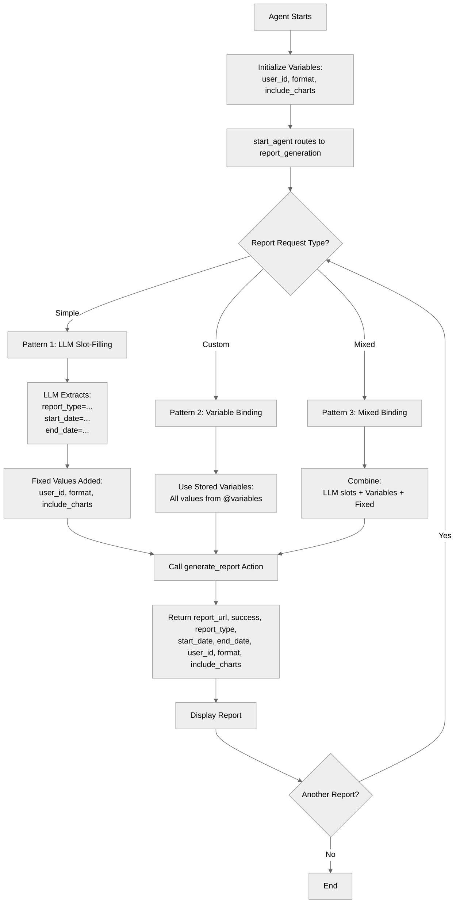

# AdvancedInputBindings

## Overview

Master **all action input binding patterns** in Agent Script. Learn when to let the LLM fill slots, when to bind variables, when to use fixed values, and how to combine all patterns for sophisticated action calls.

## Agent Flow



## Key Concepts

- **LLM slot-filling (`...`)**: Let AI extract values from conversation
- **Fixed values**: Hardcoded inputs that never change
- **Variable binding**: Pass existing variable values with `@variables.name`
- **Mixed binding**: Combine LLM, fixed, and variable inputs
- **Pattern selection**: Choose the right binding for each input

## How It Works

### Pattern 1: LLM Slot-Filling with `...`

Let the LLM extract values from the user's natural language:

```agentscript
actions:
   create_simple_report: @actions.generate_report
      description: "Generate a new report where the user provides all details (type, dates, etc.) explicitly."
      with report_type=...
      with start_date=...
      with end_date=...
      with user_id=@variables.user_id
      with format="pdf"
      with include_charts=True
      with options=...
```

**User**: "Generate a sales report for January 2025"
**LLM extracts**:

- report_type: "sales"
- start_date: "2025-01-01"
- end_date: "2025-01-31"

### Pattern 2: Variable Binding

Use stored variable values for all inputs:

```agentscript
actions:
   create_custom_report: @actions.generate_report
      description: "Generate a report using ONLY the previously stored variable values for type, dates, and settings."
      available when @variables.report_type != ""
      with report_type=@variables.report_type
      with start_date=@variables.start_date
      with end_date=@variables.end_date
      with user_id=@variables.user_id
      with format=@variables.format
      with include_charts=@variables.include_charts
      with options=...
```

All inputs come from previously stored variables.

### Pattern 3: Mixed Binding

Combine LLM extraction, variables, and fixed values:

```agentscript
actions:
   create_mixed_report: @actions.generate_report
      description: "Generate a report with a NEW report type provided by the user, but reusing the START and END DATES from stored variables. Use this when user says 'with those dates'."
      available when @variables.start_date != ""
      with report_type=...                    # LLM extracts from conversation
      with start_date=@variables.start_date   # From stored variable
      with end_date=@variables.end_date       # From stored variable
      with user_id=@variables.user_id         # From stored variable
      with format="pdf"                       # Fixed value
      with include_charts=True                # Fixed value
      with options=...                        # LLM extracts
```

## Key Code Snippets

### Complete Topic with All Patterns

```agentscript
topic report_generation:
   description: "Generates reports with various input binding patterns"

   actions:
      generate_report:
         description: "Generates a custom report"
         inputs:
            report_type: string
               description: "Type of report to generate (e.g., sales, analytics, performance, financial)"
            start_date: object
               description: "Report start date in ISO format (YYYY-MM-DD) defining the beginning of the data range"
               complex_data_type_name: "lightning__dateType"
            end_date: object
               description: "Report end date in ISO format (YYYY-MM-DD) defining the end of the data range"
               complex_data_type_name: "lightning__dateType"
            user_id: string
               description: "The unique identifier of the user generating the report (for access control and audit)"
            format: string
               description: "Output format for the report (pdf, csv, excel, or html)"
            include_charts: boolean
               description: "Whether to include visual charts and graphs in the report output"
            options: string
               description: "Additional report configuration options such as filters, groupings, and custom parameters"
         outputs:
            report_url: string
               description: "URL where the generated report can be accessed or downloaded"
            success: boolean
               description: "Indicates whether the report was generated successfully"
            report_type: string
               description: "The report type used"
            start_date: object
               description: "The start date used"
               complex_data_type_name: "lightning__dateType"
            end_date: object
               description: "The end date used"
               complex_data_type_name: "lightning__dateType"
            user_id: string
               description: "The user ID used"
            format: string
               description: "The format used"
            include_charts: boolean
               description: "Whether charts were included"
         target: "flow://GenerateReport"

   reasoning:
      instructions:->
         | Generate reports with custom parameters.

           Help user specify:
           - Report type
           - Date range
           - Output format

      actions:
         # Pattern 1: LLM slot-filling (...)
         # LLM extracts values from conversation
         create_simple_report: @actions.generate_report
            description: "Generate a new report where the user provides all details (type, dates, etc.) explicitly."
            with report_type=...
            with start_date=...
            with end_date=...
            # Fixed values
            with user_id=@variables.user_id
            with format="pdf"
            with include_charts=True
            with options=...

            # Capture values into variables for future use
            set @variables.report_type = @outputs.report_type
            set @variables.start_date = @outputs.start_date
            set @variables.end_date = @outputs.end_date
            set @variables.user_id = @outputs.user_id
            set @variables.format = @outputs.format
            set @variables.include_charts = @outputs.include_charts

         # Pattern 2: Variable binding
         # Use stored variable values
         create_custom_report: @actions.generate_report
            description: "Generate a report using ONLY the previously stored variable values for type, dates, and settings."
            available when @variables.report_type != ""
            with report_type=@variables.report_type
            with start_date=@variables.start_date
            with end_date=@variables.end_date
            with user_id=@variables.user_id
            with format=@variables.format
            with include_charts=@variables.include_charts
            with options=...

         # Pattern 3: Mixed binding
         # Combine fixed, variable, and LLM-filled
         create_mixed_report: @actions.generate_report
            description: "Generate a report with a NEW report type provided by the user, but reusing the START and END DATES from stored variables. Use this when user says 'with those dates'."
            available when @variables.start_date != ""
            with report_type=...
            with start_date=@variables.start_date
            with end_date=@variables.end_date
            with user_id=@variables.user_id
            with format="pdf"
            with include_charts=True
            with options=...
```

### Variables Supporting the Patterns

```agentscript
variables:
   report_type: mutable string = ""
      description: "Type of report to generate"

   start_date: mutable string = ""
      description: "Report start date"

   end_date: mutable string = ""
      description: "Report end date"

   user_id: mutable string = "USER123"
      description: "Current user ID (preset)"

   include_charts: mutable boolean = True
      description: "Whether to include charts"

   format: mutable string = "pdf"
      description: "Output format"
```

## Try It Out

### Example 1: LLM Slot-Filling

```text
User: Generate a sales report for Q1 2025

[Agent uses create_simple_report action]
LLM extracts:
  - report_type: "sales"
  - start_date: "2025-01-01"
  - end_date: "2025-03-31"

Fixed values applied:
  - user_id: "USER123" (from @variables)
  - format: "pdf"
  - include_charts: True

Agent: Your Q1 2025 sales report has been generated as a PDF with charts.
       Download: [report_url]
```

### Example 2: Variable Binding

```text
[Variables already set from previous conversation]
- report_type = "analytics"
- start_date = "2025-01-01"
- end_date = "2025-01-31"
- format = "excel"
- include_charts = False

User: Generate my custom report with saved settings

[Agent uses create_custom_report action]
All values from @variables

Agent: Your analytics report for January 2025 has been generated as Excel.
       Download: [report_url]
```

### Example 3: Mixed Binding

```text
[Variables set: start_date="2025-01-01", end_date="2025-01-31"]

User: Create a performance report with those dates

[Agent uses create_mixed_report action]
- report_type: "performance" (LLM extracted)
- start_date: "2025-01-01" (from @variables)
- end_date: "2025-01-31" (from @variables)
- format: "pdf" (fixed)

Agent: Your performance report for January 2025 is ready.
```

## When to Use Each Pattern

### Use LLM Slot-Filling (`...`) when:

- Value comes from user's natural language
- Value is unknown until user provides it
- Examples: dates, names, descriptions, search queries

### Use Fixed Values when:

- Value never changes
- System-level constants
- Default settings
- Examples: version numbers, default formats, system IDs

### Use Variable Binding when:

- Value already captured in previous turn
- Data from earlier actions
- User preferences stored earlier
- Examples: customer_id, user_id, session data

### Use Mixed Binding when:

- Action needs combination of all three
- Some inputs from user, some from state, some fixed
- Complex actions with many parameters

## Best Practices

### Clear Input Strategy

✅ **Good:**

```agentscript
create_report: @actions.generate_report
   with report_type=...                   # User provides
   with user_id=@variables.user_id        # From state
   with format="pdf"                      # Fixed default
```

❌ **Poor:**

```agentscript
create_report: @actions.generate_report
   with report_type=...
   with user_id=...        # Should be from variable!
```

### Don't Use `...` for Known Values

❌ **Problem:**

```agentscript
update_order: @actions.update_order
   with order_id=...  # LLM shouldn't guess this!
```

✅ **Solution:**

```agentscript
update_order: @actions.update_order
   with order_id=@variables.order_id
```

### Don't Hardcode User Input

❌ **Problem:**

```agentscript
create_ticket: @actions.create_ticket
   with title="Support Request"  # Should be from user!
```

✅ **Solution:**

```agentscript
create_ticket: @actions.create_ticket
   with title=...
```

## What's Next

- **ActionDefinitions**: Define actions that use these patterns
- **ActionCallbacks**: Chain actions with `run` keyword
- **ComplexStateManagement**: Work with complex variable types
- **VariableManagement**: Store data for binding

## Testing

Test all binding patterns:

### Test LLM Slot-Filling

- Provide values in natural language
- Verify LLM extracts correctly
- Test with missing values

### Test Fixed Values

- Verify constants never change
- Check default values applied correctly

### Test Variable Binding

- Set variables in previous turns
- Verify bound correctly in actions
- Test with empty/unset variables

### Test Mixed Binding

- Combine all three patterns
- Verify each type works correctly
- Test pattern selection by LLM
