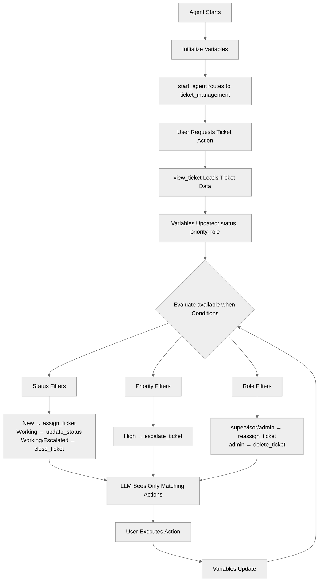

# AvailableWhenFiltering

## Overview

Learn how to use the **`available when`** clause to control which actions are visible to the reasoning engine based on runtime context. This pattern makes agents safer and more predictable by filtering out irrelevant actions so the LLM only sees what it should act on at any given moment.

## Agent Flow



## Key Concepts

- **`available when` clause**: Controls whether an action is visible to the LLM during reasoning
- **Status-based filtering**: Show different actions depending on ticket lifecycle stage (New, Working, Escalated, Closed)
- **Role-based filtering**: Restrict sensitive actions to supervisors or admins
- **Priority-based filtering**: Enable escalation only for high-priority items
- **Always-available actions**: Actions without `available when` are always visible

## How It Works

### The `available when` Clause

The `available when` clause sits on a reasoning action and accepts a boolean expression. When the expression evaluates to `False`, the action is completely hidden from the LLM — it cannot be selected or called.

```agentscript
actions:
   assign_ticket: @actions.assign_ticket
      available when @variables.ticket_status == "New"
      with ticket_id = @variables.ticket_id
      with agent = ...
```

When `ticket_status` is `"New"`, the LLM sees `assign_ticket` as an available tool. When status changes to `"Working"`, the action disappears entirely.

### Status-Based Filtering

Different ticket lifecycle stages expose different actions. This prevents impossible operations — you cannot close a ticket that isn't being worked on, and you cannot assign a ticket that's already in progress.

```agentscript
actions:
   assign_ticket: @actions.assign_ticket
      available when @variables.ticket_status == "New"

   update_status: @actions.update_status
      available when @variables.ticket_status == "Working"

   close_ticket: @actions.close_ticket
      available when @variables.ticket_status == "Working" or @variables.ticket_status == "Escalated"
```

### Role-Based Filtering

Sensitive operations are gated by user role. A regular agent never sees the delete or reassign options, so the LLM cannot accidentally invoke them.

```agentscript
actions:
   reassign_ticket: @actions.reassign_ticket
      available when @variables.user_role == "supervisor" or @variables.user_role == "admin"

   delete_ticket: @actions.delete_ticket
      available when @variables.user_role == "admin"
```

### Priority-Based Filtering

Escalation is only offered when the ticket priority warrants it, keeping the action set focused for routine tickets.

```agentscript
actions:
   escalate_ticket: @actions.escalate_ticket
      available when @variables.ticket_priority == "High"
```

### Always-Available Actions

Actions without `available when` are always visible. Use this for universal operations like viewing details or adding comments.

```agentscript
actions:
   view_ticket: @actions.view_ticket
      with ticket_number = ...
      set @variables.ticket_id = @outputs.case_id
      set @variables.ticket_status = @outputs.ticket_status
      set @variables.ticket_priority = @outputs.ticket_priority

   add_comment: @actions.add_comment
      with ticket_id = @variables.ticket_id
      with comment = ...
```

## Key Code Snippets

### Complete Reasoning Block with Filtered Actions

```agentscript
reasoning:
   instructions: ->
      | Ticket Management

      if @variables.ticket_number:
         | Ticket: {!@variables.ticket_number}
      else:
         | Ticket: None
      if @variables.ticket_status:
         | Status: {!@variables.ticket_status}
      else:
         | Status: N/A
      if @variables.ticket_priority:
         | Priority: {!@variables.ticket_priority}
      else:
         | Priority: N/A

      | Your role: {!@variables.user_role}

      | Available actions depend on:
        - Ticket status
        - Priority level
        - Your role/permissions
        - Current assignment

   actions:
      view_ticket: @actions.view_ticket
         with ticket_number = ...
         set @variables.ticket_id = @outputs.case_id
         set @variables.ticket_number = @outputs.case_number
         set @variables.ticket_status = @outputs.ticket_status
         set @variables.ticket_priority = @outputs.ticket_priority

      add_comment: @actions.add_comment
         with ticket_id = @variables.ticket_id
         with comment = ...

      assign_ticket: @actions.assign_ticket
         available when @variables.ticket_status == "New"
         with ticket_id = @variables.ticket_id
         with agent = ...

      update_status: @actions.update_status
         available when @variables.ticket_status == "Working"
         with ticket_id = @variables.ticket_id
         with new_status = ...

      close_ticket: @actions.close_ticket
         available when @variables.ticket_status == "Working" or @variables.ticket_status == "Escalated"
         with ticket_id = @variables.ticket_id

      escalate_ticket: @actions.escalate_ticket
         available when @variables.ticket_priority == "High"
         with ticket_id = @variables.ticket_id
         with reason = ...

      reassign_ticket: @actions.reassign_ticket
         available when @variables.user_role == "supervisor" or @variables.user_role == "admin"
         with ticket_id = @variables.ticket_id
         with new_agent = ...

      delete_ticket: @actions.delete_ticket
         available when @variables.user_role == "admin"
         with ticket_id = @variables.ticket_id
```

### Variables That Drive Filtering

```agentscript
variables:
   ticket_id: mutable string = ""
      description: "Current support ticket/case ID"
   ticket_number: mutable string = ""
      description: "Current support ticket number"
   ticket_status: mutable string = ""
      description: "Status: New, Working, Escalated, Closed"
   ticket_priority: mutable string = ""
      description: "Priority: Low, Medium, High"
   user_role: mutable string = "agent"
      description: "User role: agent, supervisor, admin"
```

### Condition Syntax Reference

```agentscript
# Single condition
available when @variables.status == "new"

# OR conditions
available when @variables.status == "assigned" or @variables.status == "in_progress"

# AND conditions
available when @variables.is_admin and @variables.status == "resolved"

# NOT conditions
available when @variables.role != "guest"
```

## Try It Out

These interactions were verified against a live org using `sf agent preview start --use-live-actions --authoring-bundle AvailableWhenFiltering`.

Import the test data first (`sf data import tree --plan data/data-plan.json`), then query to get the assigned case numbers:

```bash
sf data query -q "SELECT CaseNumber, Subject, Status, Priority FROM Case WHERE Subject IN ('Issue with product','Printer not working','Server outage affecting customers','VPN connection dropping intermittently','Billing inquiry','Shipping delay') ORDER BY CaseNumber"
```

The test data in `data/service-case.json` covers these combinations:

| Subject                                | Status    | Priority | Tests                                                   |
| -------------------------------------- | --------- | -------- | ------------------------------------------------------- |
| Issue with product                     | New       | Medium   | Assign (allowed)                                        |
| Printer not working                    | New       | Low      | Escalate (blocked), Delete (blocked), Comment (allowed) |
| Server outage affecting customers      | New       | High     | Escalate (allowed)                                      |
| VPN connection dropping intermittently | Working   | High     | Assign (blocked)                                        |
| Billing inquiry                        | Closed    | Low      | All mutations blocked                                   |
| Shipping delay                         | Escalated | High     | Close (allowed)                                         |

Replace `<NEW_MEDIUM>`, `<NEW_LOW>`, etc. below with the case numbers from your query.

### Assign a New Ticket (Status = New)

```text
User: Look up ticket <NEW_MEDIUM> and assign it to Sarah

Agent: Ticket <NEW_MEDIUM> is currently in "New" status with medium priority.
       I have assigned it to Sarah as requested.
       Would you like to add a comment or update the ticket status?
```

`assign_ticket` is visible because `ticket_status == "New"` satisfies its `available when` condition.

### Assign a Working Ticket (Status = Working, Blocked)

```text
User: Look up ticket <WORKING_HIGH> and assign it to Sarah

Agent: The ticket <WORKING_HIGH> is currently in "Working" status.
       Assignment is only available when the ticket is in "New" status.
       I can help you by updating the ticket status, adding a comment,
       escalating, or closing the ticket.
```

`assign_ticket` is hidden because `ticket_status` is `"Working"`, not `"New"`. The agent explains why and suggests available alternatives.

### Escalate a Low Priority Ticket (Priority = Low, Blocked)

```text
User: Look up ticket <NEW_LOW> and escalate it

Agent: Ticket <NEW_LOW> is currently in "New" status with "Low" priority.
       Escalation is only available for tickets with "High" priority.
       You can assign the ticket to an agent, add a comment, or update
       its status if needed.
```

`escalate_ticket` is hidden because `ticket_priority` is `"Low"`, not `"High"`.

### Escalate a High Priority Ticket (Priority = High)

```text
User: Look up ticket <NEW_HIGH> and escalate it because the server is down

Agent: Ticket <NEW_HIGH> has been escalated due to the server being down.
       Would you like to assign this ticket to a specific agent or add
       a comment for further details?
```

`escalate_ticket` is visible because `ticket_priority == "High"`.

### Delete a Ticket as Agent (Role = agent, Blocked)

```text
User: Look up ticket <NEW_LOW> and delete it

Agent: Deleting tickets is not an available action for your role.
       You can assign, comment on, or update this ticket instead.
```

`delete_ticket` is hidden because `user_role` is `"agent"`, not `"admin"`.

### Add a Comment (Always Available)

```text
User: Look up ticket <NEW_LOW> and add a comment: checking on this issue

Agent: I have added the comment "checking on this issue" to the ticket.
       Would you like to assign this ticket or take any other action?
```

`add_comment` has no `available when` clause so it is always visible regardless of status, priority, or role.

## What's Next

- **SafetyAndGuardrails**: Combine `available when` with confirmation patterns for destructive operations
- **ErrorHandling**: Add validation logic alongside action filtering
- **ActionDefinitions**: Learn how to define the actions that `available when` filters
