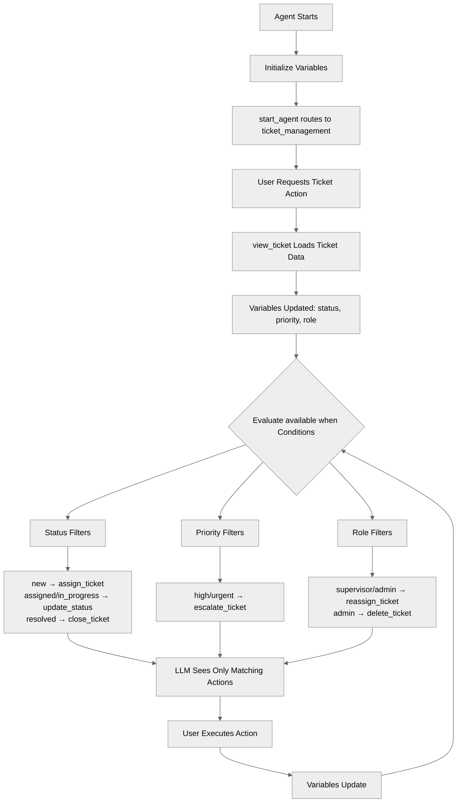

# AvailableWhenFiltering

## Overview

Learn how to use the **`available when`** clause to control which actions are visible to the reasoning engine based on runtime context. This pattern makes agents safer and more predictable by filtering out irrelevant actions so the LLM only sees what it should act on at any given moment.

## Agent Flow



## Key Concepts

- **`available when` clause**: Controls whether an action is visible to the LLM during reasoning
- **Status-based filtering**: Show different actions depending on ticket lifecycle stage
- **Role-based filtering**: Restrict sensitive actions to supervisors or admins
- **Priority-based filtering**: Enable escalation only for high-priority items
- **Always-available actions**: Actions without `available when` are always visible

## How It Works

### The `available when` Clause

The `available when` clause sits on a reasoning action and accepts a boolean expression. When the expression evaluates to `False`, the action is completely hidden from the LLM — it cannot be selected or called.

```agentscript
actions:
   assign_ticket: @actions.assign_ticket
      available when @variables.ticket_status == "new"
      with ticket_id = @variables.ticket_id
      with name = ...
```

When `ticket_status` is `"new"`, the LLM sees `assign_ticket` as an available tool. When status changes to `"assigned"`, the action disappears entirely.

### Status-Based Filtering

Different ticket lifecycle stages expose different actions. This prevents impossible operations — you cannot close a ticket that hasn't been resolved, and you cannot assign a ticket that's already assigned.

```agentscript
actions:
   assign_ticket: @actions.assign_ticket
      available when @variables.ticket_status == "new"

   update_status: @actions.update_status
      available when @variables.ticket_status == "assigned" or @variables.ticket_status == "in_progress"

   close_ticket: @actions.close_ticket
      available when @variables.ticket_status == "resolved"
```

### Role-Based Filtering

Sensitive operations are gated by user role. A regular agent never sees the delete or reassign options, so the LLM cannot accidentally invoke them.

```agentscript
actions:
   reassign_ticket: @actions.reassign_ticket
      available when @variables.user_role == "supervisor" or @variables.user_role == "admin"

   delete_ticket: @actions.delete_ticket
      available when @variables.user_role == "admin"
```

### Priority-Based Filtering

Escalation is only offered when the ticket priority warrants it, keeping the action set focused for routine tickets.

```agentscript
actions:
   escalate_ticket: @actions.escalate_ticket
      available when @variables.ticket_priority == "high" or @variables.ticket_priority == "urgent"
```

### Always-Available Actions

Actions without `available when` are always visible. Use this for universal operations like viewing details or adding comments.

```agentscript
actions:
   view_ticket: @actions.view_ticket
      with ticket_number = ...
      set @variables.ticket_id = @outputs.ticket_info.data.Id

   add_comment: @actions.add_comment
      with ticket_id = @variables.ticket_id
      with comment = ...
```

## Key Code Snippets

### Complete Reasoning Block with Filtered Actions

```agentscript
reasoning:
   instructions: ->
      | Ticket Management

      if @variables.ticket_number:
         | Ticket: {!@variables.ticket_number}
      else:
         | Ticket: None
      if @variables.ticket_status:
         | Status: {!@variables.ticket_status}
      else:
         | Status: N/A
      if @variables.ticket_priority:
         | Priority: {!@variables.ticket_priority}
      else:
         | Priority: N/A

      | Your role: {!@variables.user_role}

      | Available actions depend on:
        - Ticket status
        - Priority level
        - Your role/permissions
        - Current assignment

   actions:
      view_ticket: @actions.view_ticket
         with ticket_number = ...
         set @variables.ticket_id = @outputs.ticket_info.data.Id

      add_comment: @actions.add_comment
         with ticket_id = @variables.ticket_id
         with comment = ...

      assign_ticket: @actions.assign_ticket
         available when @variables.ticket_status == "new"
         with ticket_id = @variables.ticket_id
         with name = ...

      update_status: @actions.update_status
         available when @variables.ticket_status == "assigned" or @variables.ticket_status == "in_progress"
         with ticket_id = @variables.ticket_id
         with new_status = ...

      close_ticket: @actions.close_ticket
         available when @variables.ticket_status == "resolved"
         with ticket_id = @variables.ticket_id

      escalate_ticket: @actions.escalate_ticket
         available when @variables.ticket_priority == "high" or @variables.ticket_priority == "urgent"
         with ticket_id = @variables.ticket_id
         with reason = ...

      reassign_ticket: @actions.reassign_ticket
         available when @variables.user_role == "supervisor" or @variables.user_role == "admin"
         with ticket_id = @variables.ticket_id
         with new_agent = ...

      delete_ticket: @actions.delete_ticket
         available when @variables.user_role == "admin"
         with ticket_id = @variables.ticket_id
```

### Variables That Drive Filtering

```agentscript
variables:
   ticket_id: mutable string = ""
      description: "Current support ticket/case ID"
   ticket_number: mutable string = ""
      description: "Current support ticket number"
   ticket_status: mutable string = ""
      description: "Status: new, assigned, in_progress, resolved, closed"
   ticket_priority: mutable string = ""
      description: "Priority: low, medium, high, urgent"
   user_role: mutable string = "agent"
      description: "User role: agent, supervisor, admin"
```

### Condition Syntax Reference

```agentscript
# Single condition
available when @variables.status == "new"

# OR conditions
available when @variables.status == "assigned" or @variables.status == "in_progress"

# AND conditions
available when @variables.is_admin and @variables.status == "resolved"

# NOT conditions
available when @variables.role != "guest"
```

## Try It Out

### Example Interaction: View and Assign a New Ticket

This interaction was verified against a live org using `sf agent preview` with `--use-live-actions`.

```text
Agent: Welcome to support! I'll help you manage tickets efficiently.

User: Look up ticket 00001028

Agent: Ticket 00001028 details:
       Subject: Issue with product
       Status: New
       Priority: Medium

       Would you like to view more details, add a comment, or take another action on this ticket?

User: Assign this ticket to Sarah

Agent: To assign ticket 00001028, please confirm: is "Sarah" the correct assignee's
       full name or username in your system?

User: Yes, assign to Sarah

Agent: Ticket 00001028 will be assigned to Sarah. The assignment is being processed.
       Would you like to update the ticket status, add a comment, or perform another action?
```

**Behind the Scenes:**

1. The agent routes to the `ticket_management` topic via `start_agent`
2. `view_ticket` action fires, calling the `ViewTicket` flow with `ticket_number = "00001028"`
3. The ticket's Case ID is captured into `@variables.ticket_id`
4. The `assign_ticket` action is visible because `ticket_status == "new"` satisfies its `available when` condition
5. After assignment, the agent confirms and offers the next set of available actions

### Example Interaction: Role-Based Filtering

```text
Agent: Ticket #67890 is resolved.
       Status: resolved | Priority: low

User: Delete this ticket

Agent: The delete action is only available to administrators.
       As an agent, you can close this resolved ticket instead.

User: Close it then

Agent: Ticket #67890 has been closed successfully.
```

## What's Next

- **SafetyAndGuardrails**: Combine `available when` with confirmation patterns for destructive operations
- **ErrorHandling**: Add validation logic alongside action filtering
- **ActionDefinitions**: Learn how to define the actions that `available when` filters

## Testing

These test cases can be run using `sf agent preview start --use-live-actions --authoring-bundle AvailableWhenFiltering` and `sf agent preview send`.

### Test Case 1: View Ticket (Happy Path)

- Send: "Look up ticket 00001028" (use a real Case number from your org)
- Verify: agent calls `view_ticket` flow and returns ticket details (subject, status, priority)
- Verify: agent offers available follow-up actions

### Test Case 2: Assign New Ticket (Status-Based Filtering)

- Prerequisite: ticket status is "new"
- Send: "Assign this ticket to Sarah"
- Verify: `assign_ticket` action is called successfully
- Verify: agent confirms the assignment

### Test Case 3: Assign Already-Assigned Ticket (Negative Case)

- Prerequisite: `ticket_status` is "assigned" (after Test Case 2)
- Send: "Assign this ticket to someone else"
- Verify: `assign_ticket` is NOT available (filtered out by `available when`)
- Verify: agent explains the action is unavailable and suggests alternatives like `update_status`

### Test Case 4: Role Filtering

- Default `user_role = "agent"`
- Send: "Delete this ticket"
- Verify: `delete_ticket` is NOT available (requires `user_role == "admin"`)
- Verify: agent explains the restriction

### Test Case 5: Priority-Based Escalation

- Prerequisite: `ticket_priority` is "low" or "medium"
- Send: "Escalate this ticket"
- Verify: `escalate_ticket` is NOT available (requires "high" or "urgent")
- When priority is "high" or "urgent": verify `escalate_ticket` becomes available

### Test Case 6: Add Comment (Always Available)

- Send: "Add a comment: checking on this issue"
- Verify: `add_comment` action works regardless of ticket status, priority, or role
- Verify: agent confirms the comment was added

### Test Case 7: Non-Existent Ticket (Graceful Handling)

- Send: "Lookup ticket #67890" (a ticket number that doesn't exist in the org)
- Verify: agent does NOT crash with "unexpected error"
- Verify: agent responds that the ticket was not found and asks the user to confirm the number
