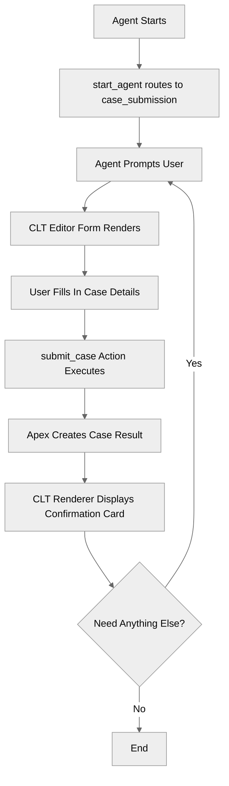

# CustomLightningTypes

> **Known Platform Bug**: The CLT output renderer card does **not** render sometimes in the Agentforce **Builder preview panel**. The data pipeline is fully functional — the `result` array is correctly populated with `copilotActionOutput/Submit_Case` and the case data — but the Builder preview UI does not instantiate the renderer LWC. The CLT output card **does render correctly** in the actual deployed Agentforce experience. The CLT input editor works in both the Builder preview and the deployed experience. This appears to be a Salesforce platform limitation specific to the Builder preview for output renderers.

> **Setup Requirement**: To test this recipe in the deployed experience like Salesforce app, the user's Permission Set must include **Agent access to the CustomLightningTypes agent**. Without this, the agent will not be available in the Agentforce chat experience.

## Overview

This recipe demonstrates how to use **Custom Lightning Types (CLTs)** to replace the default agent input and output UI with custom LWC components. CLTs let you render structured forms for collecting user input and display rich confirmation cards for action results, all wired through Lightning Type Bundles and AgentScript action definitions.

## Agent Flow



## Key Concepts

- **Custom Lightning Types (CLTs)**: Mechanism for overriding default Agentforce UI with custom LWC components
- **CLT Editor**: An LWC component that renders a custom input form when an action input has `is_user_input: True` and a `complex_data_type_name` pointing to a Lightning Type
- **CLT Renderer**: An LWC component that renders a custom output display when an action output has `is_displayable: True` and a `complex_data_type_name` pointing to a Lightning Type
- **Lightning Type Bundles**: JSON configuration files (`schema.json`, `editor.json`, `renderer.json`) that wire Apex data shapes to LWC components
- **`complex_data_type_name`**: The AgentScript property that connects an action input/output to a Lightning Type bundle
- **`is_user_input`**: Marks an action input for CLT editor rendering
- **`is_displayable` + `filter_from_agent`**: Marks an action output for CLT renderer rendering

## How It Works

### The CLT Wiring Chain

Custom Lightning Types work through a three-layer connection:

1. **AgentScript action** declares `complex_data_type_name` on inputs/outputs
2. **Lightning Type Bundle** maps that type name to an Apex class and an LWC component
3. **LWC component** renders the custom UI

```text
AgentScript action                    Lightning Type Bundle             LWC Component
─────────────────                    ──────────────────────            ──────────────
complex_data_type_name:              caseInput/                        caseInputEditor/
  "c__caseInput"      ──────────►      schema.json                      js-meta.xml:
  is_user_input: True                    → @apexClassType/                 target: lightning__AgentforceInput
                                           c__CaseSubmissionService$        targetType: c__caseInput
                                           CaseInput
                                       editor.json
                                         → c/caseInputEditor

complex_data_type_name:              caseResult/                       caseResultRenderer/
  "c__caseResult"     ──────────►      schema.json                      js-meta.xml:
  is_displayable: True                   → @apexClassType/                 target: lightning__AgentforceOutput
                                           c__CaseSubmissionService$        sourceType: c__caseResult
                                           CaseResult
                                       renderer.json
                                         → c/caseResultRenderer
```

### CLT Input: The Editor

To render a custom input form, three things must align:

1. The **AgentScript action input** uses `complex_data_type_name: "c__caseInput"` and `is_user_input: True`
2. The **Lightning Type Bundle** `caseInput/schema.json` points to the Apex class, and `caseInput/lightningDesktopGenAi/editor.json` points to the LWC
3. The **LWC** `caseInputEditor` targets `lightning__AgentforceInput` with `targetType: c__caseInput`

The editor component receives a `value` property (existing data) and dispatches a `valuechange` event when the user modifies the form.

### CLT Output: The Renderer

To render a custom output card, three things must align:

1. The **AgentScript action output** uses `complex_data_type_name: "c__caseResult"`, `is_displayable: True`, and `filter_from_agent: False`
2. The **Lightning Type Bundle** `caseResult/schema.json` points to the Apex class, and `caseResult/lightningDesktopGenAi/renderer.json` points to the LWC
3. The **LWC** `caseResultRenderer` targets `lightning__AgentforceOutput` with `sourceType: c__caseResult`

The renderer component receives the action output data through its `value` property and displays it.

### AgentScript CLT-Specific Patterns

The instruction wording is important for CLT inputs. The phrase `action's user_input tool` tells the platform to render the CLT editor:

```agentscript
instructions:->
   if not @variables.case_submitted:
      | The user wants to submit a support case.
        Call {!@actions.submit_case} action's user_input tool to collect the case details from the user.
        Once the form is submitted, confirm the case was created and share the case number.
```

### Apex Data Shapes

The CLT data shapes are defined as **inner classes** of `CaseSubmissionService`. The Lightning Type `schema.json` references them using `$` syntax (e.g., `c__CaseSubmissionService$CaseInput`). This keeps the data shapes co-located with the service that uses them.

```apex
public with sharing class CaseSubmissionService {
    // Inner class referenced by caseInput/schema.json
    public class CaseInput {
        @InvocableVariable(
            label='Subject'
            description='Case subject'
            required=true
        )
        public String subject;
        @InvocableVariable(label='Priority' description='Case priority')
        public String priority;
        @InvocableVariable(label='Description' description='Case description')
        public String description;
    }

    // Request wrapper — field names match AgentScript action input names
    public class SubmitCaseRequest {
        @InvocableVariable(required=true)
        public CaseInput case_data;
    }
}
```

## Key Code Snippets

### Action Definition with CLT Input and Output

```agentscript
actions:
   submit_case:
      description: "Submits a support case with structured input and returns case details"
      inputs:
         case_data: object
            description: "Case details including subject, priority, and description"
            label: "case_data"
            is_required: True
            is_user_input: True
            complex_data_type_name: "c__caseInput"
      outputs:
         case_result: object
            description: "The created case details for display"
            label: "case_result"
            complex_data_type_name: "c__caseResult"
            filter_from_agent: False
            is_displayable: True
         case_number: string
            description: "The case number assigned to the new case"
      target: "apex://CaseSubmissionService"
```

### Lightning Type Schema (Input)

```json
{
    "title": "Case Input",
    "description": "Support case submission data",
    "lightning:type": "@apexClassType/c__CaseSubmissionService$CaseInput"
}
```

### Editor LWC valuechange Event

```javascript
handleInputChange(event) {
    event.stopPropagation();
    const { name, value } = event.target;
    this[name] = value;

    this.dispatchEvent(
        new CustomEvent('valuechange', {
            detail: {
                value: {
                    subject: this.subject,
                    priority: this.priority,
                    description: this.description
                }
            }
        })
    );
}
```

### Renderer LWC Meta XML

```xml
<targets>
    <target>lightning__AgentforceOutput</target>
</targets>
<targetConfigs>
    <targetConfig targets="lightning__AgentforceOutput">
        <sourceType name="c__caseResult"/>
    </targetConfig>
</targetConfigs>
```

## Try It Out

### Example Interaction

```text
Agent: Hi! I can help you submit a support case. Let me know when you are ready.

User: I need to submit a support case.

[CLT Editor form renders with Subject, Priority, and Description fields]

User: [Fills in the form]
  Subject: "Dashboard not loading after update"
  Priority: High
  Description: "After the latest platform update, the analytics dashboard shows a blank page."

[User submits the form]

Agent: Submitting your case...

[CLT Renderer card displays:]
  ┌─────────────────────────────────────────────┐
  │ Case Submitted Successfully                  │
  │                                               │
  │ Your case has been created with number: CS-742891 │
  │                                               │
  │ Subject: Dashboard not loading after update   │
  │ Priority: [High]                                │
  │ Status: New                                   │
  │ Created: March 24, 2026                       │
  │ Estimated Response: Within 4 hours            │
  └─────────────────────────────────────────────┘

Agent: Your case CS-742891 has been created. Our team will respond within 4 hours. Is there anything else I can help with?
```

### Behind the Scenes

When the user says "I need to submit a support case":

1. The agent's reasoning identifies the user intent and invokes the `submit_case` action's user input tool
2. The platform sees `is_user_input: True` and `complex_data_type_name: "c__caseInput"` on the input
3. It looks up the `caseInput` Lightning Type Bundle, finds the editor override pointing to `c/caseInputEditor`
4. The `caseInputEditor` LWC renders the structured form
5. When the user submits, the LWC dispatches `valuechange` with the form data
6. The Apex `CaseSubmissionService.submitCase()` executes with the collected input
7. The platform sees `is_displayable: True` and `complex_data_type_name: "c__caseResult"` on the output
8. It looks up the `caseResult` Lightning Type Bundle, finds the renderer override pointing to `c/caseResultRenderer`
9. The `caseResultRenderer` LWC renders the confirmation card with the case details

## What's Next

- **ActionDefinitions**: Learn the basics of defining actions and calling external systems
- **ActionCallbacks**: Chain multiple actions together with `run` for multi-step workflows
- **AdvancedInputBindings**: Master all input binding patterns including variable binding and fixed values
- **PromptTemplateActions**: Use prompt templates to generate dynamic responses
