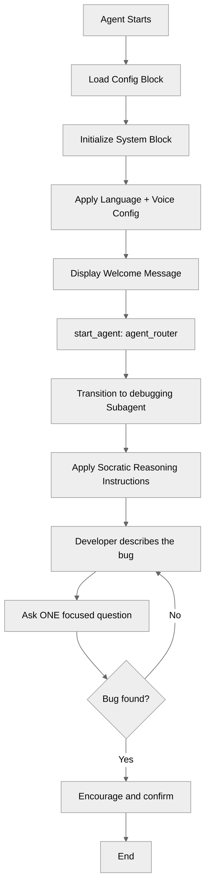

# VoiceAgent

## Overview

This recipe demonstrates how to make an agent **voice-capable** directly in the script - both by writing its instructions for a spoken medium and by declaring the voice wiring (connection, voice model, persona, and language) in the `.agent` file itself. The agent is a Socratic "rubber duck" debugging buddy: instead of handing developers a fix, it helps them find the bug themselves by asking one question at a time, spoken aloud over a voice connection. The persona is expressed entirely through system and reasoning instructions - no variables, actions, or flows required - so the recipe stays focused on what changes when an agent _speaks_.

## Agent Flow



## Key Concepts

- **Persona-driven behavior**: Behavior comes from instructions alone - no actions or state
- **System vs. reasoning instructions**: The global persona lives in `system.instructions`; the turn-by-turn behavior lives in the subagent's `reasoning.instructions`
- **Behavioral constraints**: Instructing the agent to _withhold_ the answer and ask questions instead - a genuine instruction-design discipline
- **Channel adaptation**: How an agent's instructions change when replies are spoken aloud vs. read in a chat window
- **ASR-noise repair**: Instructing the agent to expect and reinterpret speech-to-text mistranscriptions of technical vocabulary
- **Voice configuration in script**: Declaring a `connection telephony` and `modality voice` block so the voice wiring, voice model, and persona travel with the recipe
- **Voice model selection**: Choosing a voice model (`model.id`) - here the lower-latency English `eleven_flash_v2` - instead of the language's default
- **Two `language` blocks**: One top-level (text modality + linter) and one nested in `modality voice` (voice modality + persona resolution)

## How It Works

### The Persona, in Two Places

The rubber-duck personality is established in two complementary spots.

First, globally, in the `system` block - this applies to every subagent:

```agentscript
system:
   instructions: "You are a friendly rubber-duck debugging buddy for software developers, speaking with them out loud over voice. You help them find bugs themselves by asking thoughtful, Socratic questions rather than handing over fixes."
```

Then, specifically, in the `debugging` subagent's reasoning instructions - this governs what the agent does on each turn. The interesting part is that the instructions tell the agent what **not** to do (don't hand over the fix), which is what makes it a rubber duck rather than a generic Q&A bot.

### The Behavioral Constraint

Most "useful" agents are told to _answer_. This one is deliberately told to _hold back_ and lead with questions - help the developer discover the bug on their own instead of handing over the fix. This is the whole lesson: **the value of the agent comes from the instructions, not from any code.**

### Making the Agent Speak

An agent that talks differs from a text agent on **two** levels: _how it speaks_ (instructions) and _that it speaks at all_ (voice configuration in the script).

**1. Instructions tuned for the ear.** Replies that are read aloud follow different rules than replies in a chat window:

| Concern         | Text                    | Spoken                               |
| --------------- | ----------------------- | ------------------------------------ |
| Response length | A few sentences is fine | Short - easy to follow by ear        |
| Formatting      | Prose is fine           | No code or markdown read aloud       |
| Symbols/IDs     | Can reference `i++`     | Say them in words: "index plus plus" |

The spoken instructions also add one thing a text agent never needs: **repairing speech-to-text noise.** When a developer talks, their words reach the agent as an imperfect transcription, and technical vocabulary is the first thing to get mangled - "Agent Script" becomes "agent for script", "returns undefined" becomes "returns on the even", "async" becomes "a sink". The agent reasons over that garbled _text_, not your audio, so the instructions tell it to expect the noise and quietly repair obvious mishears in a debugging context:

```agentscript
| Their words reach you as speech-to-text, so technical vocabulary is
  often garbled - "agent for script" means "Agent Script", "returns on
  the even" means "returns undefined", "a sink" means "async". Read every
  message charitably in a software-debugging context and quietly repair
  obvious mishears.
```

**2. Voice configuration in the script.** The recipe carries three blocks a text agent doesn't:

```agentscript
# Pin a voice-supported default language for the TEXT modality (also required by
# the linter whenever a modality voice block is present)
language:
   default_locale: "en_US"

# Wire the agent to a telephony (voice) connection
connection telephony:
   adaptive_response_allowed: True

# Choose the voice model + persona and set how the agent listens
modality voice:
   language:
      default_locale: "en_US"
   outbound:
      persona_id: "74752e92d40e"
      model:
         id: "eleven_flash_v2"
   inbound:
      filler_words_detection: True
```

- **`language` (top-level)** pins a voice-supported locale for the text modality (the language the LLM replies in). It's also required whenever a `modality voice` block is present - without it the linter flags `voice-language-missing-language-block`, the agent inherits the org's default, and if that isn't voice-supported Agent Builder warns and falls back to English (US). (For multi-locale config, see the **LanguageSettings** recipe.)
- **`connection telephony`** declares that the agent is wired to a voice connection - this is what makes it a voice agent, not just a text agent with terse instructions.
- **`modality voice`** configures the spoken modality:
    - **`language`** (nested) sets the voice modality's locale, and is **required for persona/model resolution**. A `persona_id` isn't a global voice - it belongs to a specific (model, locale) pair in the [voice catalog](https://developer.salesforce.com/docs/ai/agentforce/guide/ascript-voice-catalog.html), so the modality needs a locale to resolve it against. Omit this nested block and the `persona_id` is ignored - the voice falls back to the locale's default persona. It's a separate setting from the top-level `language`, so you need both.
    - **`outbound.persona_id`** picks the voice from the catalog; **`outbound.model.id`** picks the voice model - here `eleven_flash_v2`, a lower-latency English Flash model. Other models: `eleven_v3` (default, most languages), `eleven_flash_v2_5` (non-English), and `kotoba` (Japanese). Omit `model` to use the language's default. Agent Builder's **Voice Settings** write the `persona_id` back into the script when you pick a voice.
    - **`inbound.filler_words_detection`** helps the agent handle "um"/"uh" fillers in the incoming speech-to-text stream.

> [!NOTE]
> The older flat `modality voice` format (`voice_id` with `outbound_speed`/`outbound_stability`/`outbound_similarity`) still works, but it cannot select a voice model - use the `outbound.model.id` structure above to choose one.

> [!IMPORTANT]
> Because this recipe declares a telephony connection, it must be deployed to a **voice-provisioned org** (one where that connection is available). See Notes.

## Key Code Snippets

### The Subagent's Reasoning

```agentscript
subagent debugging:
   description: "Guides the developer to find their own bug through spoken Socratic questioning"

   reasoning:
      instructions:->
         | You are the developer's rubber duck, talking with them out loud.
           Help them discover the bug on their own instead of handing over the fix.

         | Their words reach you as speech-to-text, so technical vocabulary is
           often garbled - "agent for script" means "Agent Script", "returns on
           the even" means "returns undefined", "a sink" means "async". Read every
           message charitably in a software-debugging context and quietly repair
           obvious mishears.

         | Keep replies short and easy to follow by ear: speak in full sentences,
           never read code or markdown aloud, and say symbols in words (for example
           "index plus plus" for "i++"). Guide with simple questions like "What did
           you expect to happen?" or "What did you change last?", and stay warm and
           playful.
```

### The Voice Configuration

The top-level `language` block goes after `system` and before `start_agent`; the `connection telephony` and `modality voice` blocks sit after the subagents. Together they are what make it an actual voice agent:

```agentscript
language:
   default_locale: "en_US"

connection telephony:
   adaptive_response_allowed: True

modality voice:
   language:
      default_locale: "en_US"
   outbound:
      persona_id: "74752e92d40e"
      model:
         id: "eleven_flash_v2"
   inbound:
      filler_words_detection: True
```

## Try It Out

Deploy the recipe to a voice-provisioned org, then open **Agentforce Studio** and start a conversation. Describe a bug and notice that the agent asks you a question rather than solving it.

### Example Interaction

Each turn is short enough to listen to, asks a single question, and speaks any symbols out loud.

```text
Agent: Quack! Tell me about the bug you're chasing.

User: My loop skips the last item in the array.

Agent: What condition are you using to stop the loop?

User: I go while index is less than length minus one.

Agent: Quack - say that comparison out loud again. Should the last valid index really be length minus one, or just less than length?

User: ...ah. It should be less than length. Off by one.
```

## What's Next

- **HelloWorld**: The minimal agent this recipe is modeled on - start there for the bare structure
- **SystemInstructionOverrides**: Customize the persona per subagent for finer control
- **LanguageSettings**: Configure multiple locales for a multi-language voice or text agent
- **VariableManagement**: Track debugging state (e.g., which questions have been asked) across turns

## Notes

> [!WARNING]
> **This recipe needs a voice-provisioned org.** Its `connection telephony` block references a telephony connection that only exists in an org where **Agentforce Voice** is provisioned. Deploy it to such an org (for example, a voice-enabled demo org). A plain free Developer Edition org has the underlying voice permission-set licenses but does not surface the full **Agentforce Voice Setup** experience.

- **The `persona_id` is model- and catalog-specific.** The `modality voice` block's `outbound.persona_id` (here `74752e92d40e`) is a voice hash from the [voice catalog](https://developer.salesforce.com/docs/ai/agentforce/guide/ascript-voice-catalog.html), and the same voice has a **different** hash per model - so a `persona_id` only resolves against the `model.id` it was listed under. Pick from the catalog page for your chosen model. If you deploy to a different org and the voice isn't available, pick one in **Voice Settings** and let the script round-trip.
- **You need both `language` blocks.** The top-level `language` sets the text modality (and satisfies the linter); the `language` nested inside `modality voice` sets the voice modality and is what makes `persona_id`/`model` resolution work - drop it and the voice silently reverts to the locale's default persona (no deploy error). Both pin `default_locale: "en_US"`. Voice mode only supports certain locales, so if the agent's default language isn't one of them, Agent Builder warns and falls back to English (US). (See the **LanguageSettings** recipe for multi-locale config.)
- **Don't confuse dictation with the voice connection.** The microphone/waveform icon in the Live Test input box is speech-to-text _dictation_ (it types for you) and appears for every agent, voice-enabled or not. The `connection telephony` + `modality voice` blocks are what actually make the agent _speak its replies aloud_.
- **Full telephony setup is out of scope here.** The script declares the connection, but standing up the underlying voice channel (browser **voice preview**, or full **telephony** via Amazon Connect / a partner provider with a Contact Center and phone number) is org configuration. See Salesforce's [Agentforce Voice / Service Cloud Voice setup documentation](https://help.salesforce.com/s/articleView?id=service.voice_agentforce.htm) for the current, org-specific steps.
- **Naming rules**: Agent and subagent names use letters, numbers, and underscores only, must start with a letter, and cannot end with or contain consecutive underscores.
- **Indentation**: Agent Script uses 3 spaces per level.
