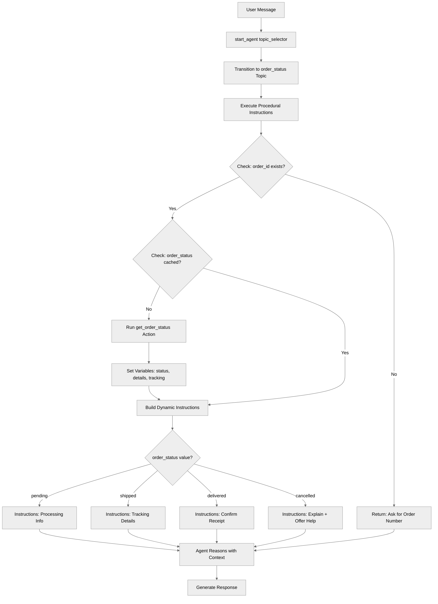

# ReasoningInstructions

## Overview

This recipe demonstrates **procedural reasoning instructions** - a powerful way to build dynamic, context-aware agents. Using the `instructions:->` syntax, you can execute code that runs actions, checks conditions, and builds instructions programmatically before each reasoning turn.

## Agent Flow



## Key Concepts

- **Procedural instructions**: Using `instructions:->` instead of static text
- **Pre-reasoning execution**: Code runs before the agent starts thinking
- **Dynamic instruction building**: Creating instructions based on current state
- **Template strings**: Using `|` to append to instruction text
- **Action calls in procedures**: Running actions to fetch data within instructions
- **Conditional instruction branches**: Different guidance for different scenarios

## How It Works

### Procedural Instructions Syntax

Use `instructions:->` to create a procedure that runs before reasoning:

```agentscript
reasoning:
   instructions:->
      # Code can check conditions
      if not @variables.order_id:
         | Ask the customer for their order number so you can look up the status.

      # Code can call actions
      if @variables.order_id and not @variables.order_status:
         run @actions.get_order_status
            with order_id=@variables.order_id
            set @variables.order_status = @outputs.status
            set @variables.order_details = @outputs.details
            set @variables.tracking_number = @outputs.tracking_number

      # Build dynamic instructions with | based on state
      if @variables.order_status:
         | The customer's order {!@variables.order_id} has status: {!@variables.order_status}
```

### Building Instructions with `|`

The `|` character appends text to the instruction string:

```agentscript
instructions:->
   | You are helping with order {!@variables.order_id}.

   if @variables.order_status == "shipped":
      | The order has shipped. Provide tracking details.

   | Always be helpful and proactive.
```

Result is a single instruction string built from all the `|` lines that are reached.

### Calling Actions to Fetch Data

Fetch data you need to build accurate instructions:

```agentscript
instructions:->
   if @variables.order_id and not @variables.order_status:
      run @actions.get_order_status
         with order_id=@variables.order_id
         set @variables.order_status = @outputs.status
         set @variables.tracking_number = @outputs.tracking_number

   | Order {!@variables.order_id} status: {!@variables.order_status}
```

### Conditional Instruction Branches

Provide different guidance based on state:

```agentscript
instructions:->
   if @variables.order_status == "pending":
      | The order is being processed. Let the customer know:
        Order is confirmed and being prepared
        They'll receive tracking info within 24 hours

   if @variables.order_status == "shipped":
      | The order has been shipped! Provide:
        Tracking number: {!@variables.tracking_number}
        Estimated delivery date from order details
        Remind them to check delivery address

   if @variables.order_status == "delivered":
      | The order was delivered.
        Confirm they received it
        Ask if everything was satisfactory

   if @variables.order_status == "cancelled":
      | This order was cancelled.
        Explain the cancellation
        Check if refund was processed
        Ask if they'd like to place a new order
```

## Key Code Snippets

### Complete Topic from Recipe

```agentscript
topic order_status:
   description: "Looks up and explains order status"

   actions:
      get_order_status:
         description: "Retrieves current status for an order"
         inputs:
            order_id: string
               description: "The unique order identifier to check the status for"
         outputs:
            status: string
               description: "Current order status (pending, shipped, delivered, cancelled)"
            details: object
               description: "Detailed order information including items, dates, and customer information"
               complex_data_type_name: "lightning__recordInfoType"
            tracking_number: string
               description: "Shipping tracking number if the order has been shipped"
         target: "flow://GetOrderStatus"

   reasoning:
      instructions:->
         if not @variables.order_id:
            | Ask the customer for their order number so you can look up the status.

         if @variables.order_id and not @variables.order_status:
            run @actions.get_order_status
               with order_id=@variables.order_id
               set @variables.order_status = @outputs.status
               set @variables.order_details = @outputs.details
               set @variables.tracking_number = @outputs.tracking_number

         if @variables.order_status:
            | The customer's order {!@variables.order_id} has status: {!@variables.order_status}

         if @variables.order_id and not @variables.order_status:
            | No order was found for order ID {!@variables.order_id}.
              Ask the customer to verify the order number and try again.

         if @variables.order_status == "pending":
            | The order is being processed. Let the customer know:
              Order is confirmed and being prepared
              They'll receive tracking info within 24 hours
              Estimated processing time is 1-2 business days

         if @variables.order_status == "shipped":
            | The order has been shipped! Provide:
              Tracking number: {!@variables.tracking_number}
              Estimated delivery date from order details
              Remind them to check delivery address

         if @variables.order_status == "delivered":
            | The order was delivered.
              Confirm they received it
              Ask if everything was satisfactory
              If there are issues, offer to help with returns or support

         if @variables.order_status == "cancelled":
            | This order was cancelled.
              Explain the cancellation
              Check if refund was processed
              Ask if they'd like to place a new order

         | Be proactive and helpful. Anticipate what the customer might need next.

      actions:
         get_order_status: @actions.get_order_status
            with order_id=...
            set @variables.order_status = @outputs.status
            set @variables.order_details = @outputs.details
            set @variables.tracking_number = @outputs.tracking_number
```

### Early Return Pattern

```agentscript
instructions:->
   if not @variables.order_id:
      | Ask the customer for their order number.
      # Procedure effectively ends here for this branch

   # This only shows if order_id exists
   | Order found: {!@variables.order_status}
```

## Try It Out

### Example: First Interaction (No Order ID)

```text
User: I want to check my order

[Procedure runs:]
if not @variables.order_id:
   | Ask the customer for their order number.

Agent: I'd be happy to help you check your order! Could you please provide your order number?
```

### Example: Order ID Provided, Fetch Status

```text
User: My order number is O-0000

[Procedure runs:]
run @actions.get_order_status
   with order_id="O-0000"
   → Returns: status="shipped", tracking_number="1Z999..."

if @variables.order_status == "shipped":
   | The order has been shipped! Provide tracking {!@variables.tracking_number}

Agent: Great news! Your order O-0001 has shipped. Your tracking number is 1Z999...
       You can track your package at the carrier's website. It should arrive in 2-3 business days.
```

### Example: Delivered Order

```text
User: Has O-0001 order arrived?

[Procedure runs - status updated to "delivered"]

if @variables.order_status == "delivered":
   | The order was delivered. Confirm they received it.

Agent: Yes! According to our records, order O-0001 was delivered yesterday.
       Did you receive the package? Is everything satisfactory?
```

## When to Use Procedural Instructions

### Use Procedural (`->`) When

- You need to **fetch data** before reasoning
- Instructions should **change based on state**
- You need **different guidance** for different scenarios
- The agent needs to **check conditions** before acting
- You want to **call actions** to get fresh data

### Use Static (`|`) When

- Instructions are **always the same**
- No **data fetching** required
- **Simple, focused** topics with one job

## Best Practices

### Avoid Redundant Action Calls

**Good:**

```agentscript
instructions:->
   # Only calls if we don't have the data
   if @variables.order_id and not @variables.order_status:
      run @actions.get_order_status
         with order_id=@variables.order_id
         set @variables.order_status = @outputs.status
```

**Poor:**

```agentscript
instructions:->
   # Calls action EVERY turn - wasteful
   run @actions.get_order_status
      with order_id=@variables.order_id
```

### Structure Your Procedures

```agentscript
instructions:->
   # 1. Validate prerequisites
   if not @variables.required_field:
      | Ask for required information.

   # 2. Fetch data if needed
   if @variables.needs_data:
      run @actions.get_data

   # 3. Build status-specific instructions
   if @variables.status == "A":
      | Instructions for status A.

   # 4. General guidance
   | Always be helpful.
```

## What's Next

- **AfterReasoning**: Use `after_reasoning` lifecycle event
- **AdvancedReasoningPatterns**: Build complex multi-source reasoning
- **ContextHandling**: Work with platform context data

## Testing

Test different execution paths:

### Test Case 1: No Order ID

- `order_id = ""`
- Expected: "Ask for order number" instructions

### Test Case 2: Order ID Provided, First Fetch

- `order_id = "ORD-123"`, `order_status = ""`
- Expected: Action called, variables set, status-specific instructions

### Test Case 3: Subsequent Turn, Status Cached

- `order_id = "ORD-123"`, `order_status = "shipped"`
- Expected: No action call (data cached), shipped instructions

### Test Case 4: Different Statuses

- Test each status: pending, shipped, delivered, cancelled
- Verify appropriate instructions for each
