# AdvancedReasoningPatterns

## Overview

Master **advanced reasoning techniques** that combine multiple data sources loading, dynamic instructions, and complex logic. Learn to build sophisticated agents that synthesize information from multiple sources and provide intelligent insights.

## Agent Flow

```mermaid
%%{init: {'theme':'neutral'}}%%
graph TD
    A[Agent Starts] --> B[User Provides user_id]
    B --> C{user_profile Loaded?}
    C -->|No| D[Sequential Data Fetch]
    D --> E[fetch_user_profile]
    E --> F[fetch_account_data]
    F --> G[fetch_order_history]
    G --> H[fetch_support_history]
    H --> I[Compute Insights]
    I --> J[calculate_customer_value → CLV, loyalty_tier]
    J --> K[assess_churn_risk → risk_score, risk_factors]
    K --> L[generate_recommendations]
    L --> M[Build Dynamic Instructions]
    C -->|Yes| M
    M --> N{Churn Risk Level?}
    N -->|Low < 0.3| P[Display: ✅ Low Risk]
    N -->|Moderate| Q[Display: ⚠️ Moderate Risk]
    N -->|High >= 0.7| R[Display: 🚨 High Risk]
    P --> S[User Interaction]
    Q --> S
    R --> S
```



## Key Concepts

- **Multi-source data loading**: Fetch data from multiple systems in reasoning
- **Sequential action chains**: Load dependent data in order
- **Computed insights**: Derive intelligence from raw data
- **Dynamic instruction building**: Create instructions from loaded data
- **Conditional display**: Different UI based on data values
- **@utils.setVariables**: Set variables via LLM slot-filling

## How It Works

### Pre-Loading Multiple Data Sources

Chain actions in `reasoning` to load all data and build dynamic instructions:

```agentscript
reasoning:
   instructions: ->
      # [Parts omitted for brevity]

      # Fetch customer data if we have user_id
      if @variables.user_id!="":
         run @actions.fetch_user_profile
            with user_id=@variables.user_id
            set @variables.user_profile = @outputs.profile
         # Chain additional data fetches
         run @actions.fetch_account_data
            with user_id=@variables.user_id
            set @variables.account_data = @outputs.account
         run @actions.fetch_order_history
            with user_id=@variables.user_id
            with limit=10
            set @variables.recent_orders = @outputs.orders
```

### Computing Insights from Data

Chain computed metrics after loading raw data:

```agentscript
reasoning:
   instructions: ->
      # [Parts omitted for brevity]

      # Compute insights
      run @actions.calculate_customer_value
         with user_id=@variables.user_id
         with orders=@variables.recent_orders
         set @variables.customer_lifetime_value = @outputs.clv
         set @variables.loyalty_status = @outputs.loyalty_tier

      run @actions.assess_churn_risk
         with account=@variables.account_data
         with orders=@variables.recent_orders
         with support_tickets=@variables.support_history
         set @variables.churn_risk_score = @outputs.risk_score

      run @actions.generate_recommendations
         with profile=@variables.user_profile
         with clv=@variables.customer_lifetime_value
         with churn_risk=@variables.churn_risk_score
         set @variables.recommended_actions = @outputs.recommendations
```

### Building Dynamic Instructions

Create instructions based on loaded data:

```agentscript
reasoning:
   instructions: ->
      # [Parts omitted for brevity]

      | Customer Intelligence Dashboard

      if @variables.user_id!="" and @variables.user_profile:
         | Customer Profile:
      if @variables.user_profile:
         | Name: {!@variables.user_profile.name}
            - Loyalty Status: {!@variables.loyalty_status}
            - Lifetime Value: ${!@variables.customer_lifetime_value}
      else:
         | Name: "N/A"

         | Account Health:
      if @variables.churn_risk_score < 0.3:
         | ✅ Low churn risk ({!@variables.churn_risk_score}%)
      if @variables.churn_risk_score >= 0.3 and @variables.churn_risk_score < 0.7:
         | ⚠️ Moderate churn risk ({!@variables.churn_risk_score}%)
      if @variables.churn_risk_score >= 0.7:
         | 🚨 High churn risk ({!@variables.churn_risk_score}%)
```

## Key Code Snippets

### Complete Topic with Multi-Source Loading

```agentscript
topic intelligent_insights:
   description: "Provides intelligent insights by synthesizing multiple data sources including your profile, account data, order history, and support tickets. Let me know your customer ID to load your complete customer intelligence dashboard."

   reasoning:
      # Build dynamic instructions based on loaded data
      instructions: ->
         # Ask for user_id if we don't have it
         if @variables.user_id=="":
            | Ask the user for customer ID to view personalized insights. Do not proceed until you have the customer ID.
              Use {!@actions.set_user_id} to update the user_id variable and set context.

         # Fetch customer data if we have user_id
         if @variables.user_id!="":
            run @actions.fetch_user_profile
               with user_id=@variables.user_id
               set @variables.user_profile = @outputs.profile
            # Chain additional data fetches
            run @actions.fetch_account_data
               with user_id=@variables.user_id
               set @variables.account_data = @outputs.account
            run @actions.fetch_order_history
               with user_id=@variables.user_id
               with limit=10
               set @variables.recent_orders = @outputs.orders
            run @actions.fetch_support_history
               with user_id=@variables.user_id
               set @variables.support_history = @outputs.tickets
            # Compute insights
            run @actions.calculate_customer_value
               with user_id=@variables.user_id
               with orders=@variables.recent_orders
               set @variables.customer_lifetime_value = @outputs.clv
               set @variables.loyalty_status = @outputs.loyalty_tier
            run @actions.assess_churn_risk
               with account=@variables.account_data
               with orders=@variables.recent_orders
               with support_tickets=@variables.support_history
               set @variables.churn_risk_score = @outputs.risk_score
            run @actions.generate_recommendations
               with profile=@variables.user_profile
               with clv=@variables.customer_lifetime_value
               with churn_risk=@variables.churn_risk_score
               set @variables.recommended_actions = @outputs.recommendations

            | Customer Intelligence Dashboard

         if @variables.user_id!="" and @variables.user_profile:
            | Customer Profile:
         if @variables.user_profile:
            | Name: {!@variables.user_profile.name}
              - Loyalty Status: {!@variables.loyalty_status}
              - Lifetime Value: ${!@variables.customer_lifetime_value}
         else:
            | Name: "N/A"

            | Account Health:
         if @variables.churn_risk_score < 0.3:
            | ✅ Low churn risk ({!@variables.churn_risk_score}%)
         if @variables.churn_risk_score >= 0.3 and @variables.churn_risk_score < 0.7:
            | ⚠️ Moderate churn risk ({!@variables.churn_risk_score}%)
         if @variables.churn_risk_score >= 0.7:
            | 🚨 High churn risk ({!@variables.churn_risk_score}%)

         | Recent Activity:
         if @variables.recent_orders:
            | Orders (last 30 days):
              {!@variables.recent_orders}
         if @variables.support_history:
            | Support Tickets:
              {!@variables.support_history}

         if @variables.recommended_actions:
            | Recommended Actions:
              {!@variables.recommended_actions}

         | What would you like to know more about?

      actions:
         # Load all data sources during reasoning
         set_user_id: @utils.setVariables
            description: "Set the user ID to load customer data"
            with user_id=...
         fetch_user_profile: @actions.fetch_user_profile
         fetch_account_data: @actions.fetch_account_data
         fetch_order_history: @actions.fetch_order_history
         fetch_support_history: @actions.fetch_support_history
         calculate_customer_value: @actions.calculate_customer_value
         assess_churn_risk: @actions.assess_churn_risk
         generate_recommendations: @actions.generate_recommendations

   actions:
      fetch_user_profile:
         description: "Fetch complete user profile"
         inputs:
            user_id: string
               description: "The unique identifier of the user whose profile to fetch"
         outputs:
            profile: object
               description: "User profile object containing name, contact information, and account details"
               complex_data_type_name: "lightning__recordInfoType"
         target: "flow://FetchUserProfile"

      fetch_account_data:
         description: "Fetch account details"
         inputs:
            user_id: string
               description: "The unique identifier of the user whose account data to retrieve"
         outputs:
            account: object
               description: "Account object with account status, balance, and membership information"
               complex_data_type_name: "lightning__recordInfoType"
         target: "flow://FetchAccountData"

      fetch_order_history:
         description: "Fetch recent orders"
         inputs:
            user_id: string
               description: "The unique identifier of the user whose order history to fetch"
            limit: number
               description: "Maximum number of recent orders to return (e.g., 10 for last 10 orders)"
         outputs:
            orders: list[object]
               description: "List of order objects containing order ID, date, amount, and items for each order"
               complex_data_type_name: "lightning__recordInfoType"
         target: "flow://FetchOrderHistory"

      fetch_support_history:
         description: "Fetch support ticket history"
         inputs:
            user_id: string
               description: "The unique identifier of the user whose support history to retrieve"
         outputs:
            tickets: list[object]
               description: "List of support ticket objects with ticket ID, status, issue type, and resolution details"
               complex_data_type_name: "lightning__recordInfoType"
         target: "flow://FetchSupportHistory"

      calculate_customer_value:
         description: "Calculate customer lifetime value"
         inputs:
            user_id: string
               description: "The unique identifier of the customer to calculate value for"
            orders: list[object]
               description: "List of customer's order history objects used for CLV calculation"
               complex_data_type_name: "lightning__recordInfoType"
         outputs:
            clv: number
               description: "Calculated customer lifetime value as a monetary amount"
            loyalty_tier: string
               description: "Customer's loyalty tier based on CLV (e.g., Bronze, Silver, Gold, Platinum)"
         target: "flow://CalculateCustomerValue"

      assess_churn_risk:
         description: "Assess customer churn risk"
         inputs:
            account: object
               description: "Customer account object with status and activity information"
               complex_data_type_name: "lightning__recordInfoType"
            orders: list[object]
               description: "List of customer orders used to analyze purchase patterns and frequency"
               complex_data_type_name: "lightning__recordInfoType"
            support_tickets: list[object]
               description: "List of support tickets used to identify potential dissatisfaction indicators"
               complex_data_type_name: "lightning__recordInfoType"
         outputs:
            risk_score: number
               description: "Churn risk score as a decimal between 0.0 (low risk) and 1.0 (high risk)"
            risk_factors: list[object]
               description: "List of identified factors contributing to churn risk (e.g., decreased purchase frequency, unresolved tickets)"
               complex_data_type_name: "lightning__textType"
         target: "flow://AssessChurnRisk"

      generate_recommendations:
         description: "Generate personalized recommendations"
         inputs:
            profile: object
               description: "Customer profile object with preferences and demographic information"
               complex_data_type_name: "lightning__recordInfoType"
            clv: number
               description: "Customer lifetime value used to tailor recommendations appropriately"
            churn_risk: number
               description: "Churn risk score (0.0-1.0) used to prioritize retention-focused recommendations"
         outputs:
            recommendations: list[object]
               description: "List of personalized action recommendations for engaging and retaining the customer"
               complex_data_type_name: "lightning__textType"
         target: "flow://GenerateRecommendations"
```

### Using @utils.setVariables

Allow LLM to set variables via slot-filling:

```agentscript
actions:
   set_user_id: @utils.setVariables
      description: "Set the user ID to load customer data"
      with user_id=...
```

This lets the LLM extract the user_id from conversation and store it.

## Try It Out

### Example: Customer Intelligence

```text
User: Show insights for my customer USER-12345

[LLM calls set_user_id with user_id="USER-12345"]

[reasoning triggers data loading:]
  - fetch_user_profile → profile data
  - fetch_account_data → account info
  - fetch_order_history → 10 recent orders
  - fetch_support_history → support tickets
  - calculate_customer_value → CLV = $5,200, tier = Silver
  - assess_churn_risk → risk = 0.65
  - generate_recommendations → 3 actions

Agent: Customer Intelligence Dashboard

       Customer Profile:
       - Name: Jane Smith
       - Loyalty Status: Silver
       - Lifetime Value: $5,200

       Account Health:
       ⚠️ Moderate churn risk (65%)

       Recent Activity:
       - Orders (last 30 days): 8
       - Support Tickets: 2

       Recommended Actions:
       1. Offer loyalty upgrade incentive
       2. Follow up on recent support tickets
       3. Send personalized product recommendations

       What would you like to know more about?
```

## Best Practices

✅ **Chain related fetches** - Load dependent data in sequence

✅ **Compute insights** - Derive intelligence from raw data

✅ **Build rich instructions** - Use all available data

✅ **Conditional display** - Adapt based on data values

❌ **Don't show raw data dumps** - Present meaningful insights

❌ **Don't ignore data quality** - Validate data before using it

## What's Next

- **AfterReasoning**: Master lifecycle events
- **ComplexStateManagement**: Handle rich data structures
- **MultiStepWorkflows**: Chain complex data operations
- **CustomerServiceAgent**: See a complete real-world example

## Testing

Test data synthesis:

### Test Case 1: Complete Data

- Provide user_id
- Verify all data sources loaded
- Check insights computed
- Confirm instructions built correctly

### Test Case 2: Missing Data

- Provide user_id with no orders
- Verify graceful handling
- Check default values used

### Test Case 3: High-Value Customer

- CLV > $10,000
- Verify premium treatment indicators
- Check appropriate recommendations

### Test Case 4: High Churn Risk

- Risk score > 0.7
- Verify high risk alert shown
- Check retention actions recommended
