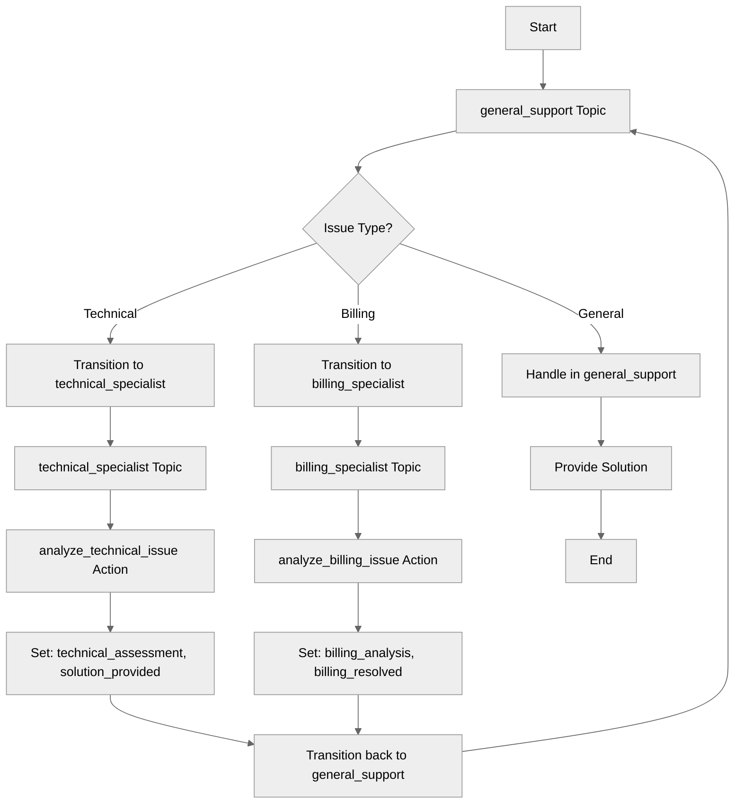

# BidirectionalNavigation

## Overview

Learn how to use **bidirectional topic transitions for specialist consultation**. This pattern allows a main topic to route to specialist topics for domain-specific processing, with the specialist returning control after completing their task using explicit transitions.

## Agent Flow



## Key Concepts

- **Specialist topics**: Topics with domain expertise
- **Consultation pattern**: Route to specialist, then return
- **Natural language routing**: Route based on user intent and topic descriptions
- **State transfer**: Variables shared across all topics
- **Return control**: Specialist transitions back to main topic

## How It Works

### Main Topic Routes to Specialists

The general support topic routes to specialists based on issue type:

```agentscript
topic general_support:
   description: "General customer support entry point"

   reasoning:
      instructions:->
         | I'm here to help! I can assist with:
           - Technical issues (I'll consult our tech specialist)
           - Billing questions (I'll consult our billing specialist)
           - General inquiries

           What can I help you with today?

      actions:
         consult_technical: @utils.transition to @topic.technical_specialist

         consult_billing: @utils.transition to @topic.billing_specialist
```

### Specialist Topic Processes and Returns

The specialist handles their domain, then returns control:

```agentscript
topic technical_specialist:
   description: "Technical support specialist - handles complex technical issues"

   actions:
      analyze_technical_issue:
         description: "Perform technical analysis"
         inputs:
            issue_description: string
               description: "Detailed description of the technical issue to analyze"
         outputs:
            assessment: string
               description: "Technical assessment and diagnosis of the issue"
            can_resolve: boolean
               description: "Indicates whether the issue can be resolved"
         target: "flow://AnalyzeTechnicalIssue"

   reasoning:
      instructions:->
         | Technical Specialist here! Let me analyze your issue.

           Issue: {!@variables.issue_description}

      actions:
         analyze_technical: @actions.analyze_technical_issue
            with issue_description=@variables.issue_description
            set @variables.technical_assessment = @outputs.assessment
            set @variables.solution_provided = @outputs.can_resolve
            # Return control to general support
            transition to @topic.general_support
```

### Billing Specialist

```agentscript
topic billing_specialist:
   description: "Billing specialist - handles billing and payment issues"

   actions:
      analyze_billing_issue:
         description: "Analyze billing inquiry"
         inputs:
            issue_description: string
               description: "Description of the billing issue or inquiry"
            customer_id: string
               description: "The unique identifier of the customer"
         outputs:
            analysis: string
               description: "Analysis of the billing issue"
            resolved: boolean
               description: "Indicates whether the billing issue was resolved"
         target: "flow://AnalyzeBillingIssue"

   reasoning:
      instructions:->
         | Billing Specialist here! Let me review your account.

           Customer ID: {!@variables.customer_id}
           Issue: {!@variables.issue_description}

      actions:
         analyze_billing: @actions.analyze_billing_issue
            with issue_description=@variables.issue_description
            with customer_id=@variables.customer_id
            set @variables.billing_analysis = @outputs.analysis
            set @variables.billing_resolved = @outputs.resolved
            # Return control to general support
            transition to @topic.general_support
```

## Key Code Snippets

### Variables for Tracking Issue State

```agentscript
variables:
   issue_type: mutable string = ""
   issue_description: mutable string = ""
   customer_id: mutable string = ""

   # Technical specialist results
   technical_assessment: mutable string = ""
   solution_provided: mutable boolean = False

   # Billing specialist results
   billing_analysis: mutable string = ""
   billing_resolved: mutable boolean = False
```

### Routing Based on Issue Type

```agentscript
actions:
   consult_technical: @utils.transition to @topic.technical_specialist

   consult_billing: @utils.transition to @topic.billing_specialist
```

### Specialist Returns with Results

```agentscript
actions:
   analyze_technical: @actions.analyze_technical_issue
      with issue_description=@variables.issue_description
      set @variables.technical_assessment = @outputs.assessment
      set @variables.solution_provided = @outputs.can_resolve
      transition to @topic.general_support
```

## Try It Out

### Example: Technical Issue Consultation

```text
Agent: [general_support topic]
       Welcome to Customer Support! How can I help you today?

User: My app keeps crashing when I try to upload files

Agent: [Sets issue_type = "technical", issue_description = "..."]
       Let me connect you with our technical specialist...

[Transitions to technical_specialist topic]

Agent: [technical_specialist topic]

       [Runs analyze_technical_issue action]

       [Transitions back to general_support topic]

       Our technical specialist recommends trying to reboot your system as a first step.

       If the issue persists after rebooting, please let me know so we can investigate further.
```

### Example: Billing Consultation

```text
User: I was charged twice for my subscription

Agent: [Sets issue_type = "billing"]
       Let me connect you with our billing specialist...

[Transitions to billing_specialist topic]

Agent: [billing_specialist topic]

       [Runs analyze_billing_issue action]

       [Transitions back to general_support topic]

       Your billing issue has been reviewed.

       If you were indeed charged twice, a refund process has been initiated.

       If you need further details or confirmation, please let me know.
```

## Pattern Comparison

### Specialist Consultation (This Pattern)

- Route to specialist based on issue type
- Specialist processes and returns
- Use for: domain-specific expertise

### Direct Transition

- Move to new topic permanently
- No automatic return
- Use for: workflow stages (browse → book → confirm)

## Best Practices

✅ **Clear specialist roles** - Each handles specific domain

✅ **Return with results** - Store assessment in variables

✅ **Natural routing** - Use clear topic descriptions for routing

✅ **Share state** - Variables persist across topics

❌ **Don't over-specialize** - Keep simple tasks in main topic

❌ **Don't circular route** - Avoid specialist → specialist

## What's Next

- **MultiTopicOrchestration**: Build complex multi-service workflows
- **DynamicActionRouting**: More conditional action patterns
- **CustomerServiceAgent**: See a complete service agent example

## Testing

### Test Case 1: Technical Route

- Set issue_type = "technical"
- Verify transition to technical_specialist
- Confirm return to general_support

### Test Case 2: Billing Route

- Set issue_type = "billing"
- Verify transition to billing_specialist
- Confirm return to general_support

### Test Case 3: State Transfer

- Set issue_description in general_support
- Verify specialist has access
- Confirm results returned in variables
