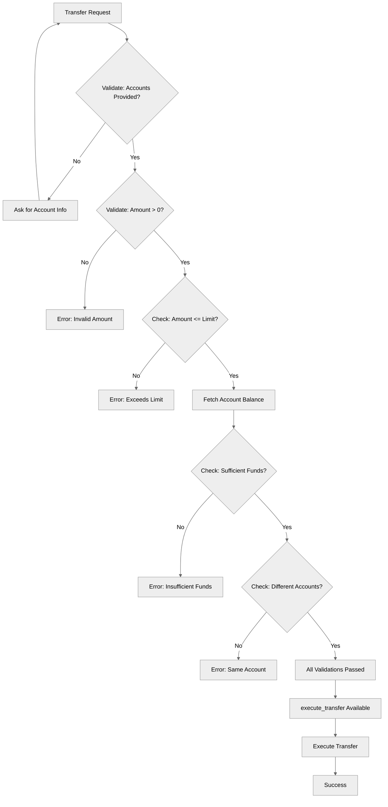

# ErrorHandling

## Overview

This recipe demonstrates **comprehensive error handling and validation** patterns for building safe, reliable agents. Learn how to validate inputs, prevent dangerous operations, handle edge cases, and use conditional action availability for safety.

## Agent Flow



## Key Concepts

- **Input validation**: Checking data before processing
- **Business rule enforcement**: Enforcing limits and constraints
- **Guard clauses**: Preventing operations when preconditions aren't met
- **Error state tracking**: Using variables to track validation status
- **Conditional action availability**: Using `available when` for safety
- **Clear error messaging**: Guiding users when problems occur

## How It Works

### Validation-First Approach

Before performing critical operations, validate everything in procedural instructions:

```agentscript
instructions:->
   # Step 1: Check required information
   if not @variables.source_account:
      set @variables.validation_information = "Missing source account"
      set @variables.validation_passed = False
      | You need the source account number before proceeding.
        Ask the customer for the source account number.

   # Step 2: Check amount is valid
   if @variables.transfer_amount <= 0:
      set @variables.validation_information = "Invalid transfer amount"
      set @variables.validation_passed = False
      | The transfer amount must be greater than zero. Ask the customer
        how much they want to transfer.
        Do NOT proceed with the transfer yet.
```

### Enforcing Business Rules

```agentscript
instructions:->
   if @variables.transfer_amount > @variables.transfer_limit:
      set @variables.validation_information = "Amount exceeds transfer limit"
      set @variables.validation_passed = False
      | ⚠️ STOP: The requested amount (${!@variables.transfer_amount}) exceeds
        the maximum transfer limit of ${!@variables.transfer_limit}.
        Inform the customer and ask if they'd like to:
        1. Transfer the maximum allowed amount (${!@variables.transfer_limit})
        2. Split into multiple transfers
        3. Contact support for higher limits
        Do NOT proceed with the transfer.
```

### Fetching and Validating External Data

```agentscript
instructions:->
   # Fetch balance if needed
   if @variables.source_account and not @variables.source_balance:
      run @actions.get_account_balance
         with account_number = @variables.source_account
         set @variables.source_balance = @outputs.balance

   # Validate sufficient funds
   if @variables.source_balance < @variables.transfer_amount:
      set @variables.validation_information = "Insufficient funds"
      set @variables.validation_passed = False
      | ⚠️ STOP: Insufficient funds in the source account.
        - Available balance: ${!@variables.source_balance}
        - Requested transfer: ${!@variables.transfer_amount}
        - Shortfall: ${!@variables.transfer_amount-@variables.source_balance}
        Ask if they'd like to transfer a smaller amount.
        Do NOT proceed with the transfer.
```

### Preventing Logic Errors

```agentscript
instructions:->
   if @variables.source_account == @variables.destination_account:
      set @variables.validation_information = "Source and destination are the same"
      set @variables.validation_passed = False
      | ⚠️ STOP: You cannot transfer to the same account.
        The source and destination accounts are identical.
        Ask for the correct destination account.
        Do NOT proceed with the transfer.
```

### Conditional Action Availability

Only make dangerous actions available when safe:

```agentscript
actions:
   execute_transfer: @actions.execute_transfer
      available when @variables.validation_passed
      with from_account=@variables.source_account
      with to_account=@variables.destination_account
      with amount=@variables.transfer_amount
```

The action won't be available to the LLM unless `validation_passed = True`.

## Key Code Snippets

### Complete Validation Flow

```agentscript
reasoning:
   # Procedural instructions with error handling logic
   instructions:->
      | Always ensure to request the following data from the user, and to store it using {!@actions.store_details}
         - source account number
         - destination account number
         - amount to transfer

         Only after you have all the data, you can proceed with the next steps.

      if not @variables.source_account:
          set @variables.validation_information = "Missing source account"
          set @variables.validation_passed = False
          | You need the source account number before proceeding.
            Ask the customer for the source account number.
      else:
          set @variables.validation_passed = True
      if @variables.source_account and not @variables.destination_account:
         set @variables.validation_information = "Missing destination account"
         set @variables.validation_passed = False
         | You need the destination account number before proceeding.
            Ask the customer for the destination account number.
      else:
         set @variables.validation_passed = True
      if not @variables.source_account or not @variables.destination_account:
          | Do NOT proceed with the transfer yet.
      if @variables.transfer_amount <= 0:
          set @variables.validation_information = "Invalid transfer amount"
          set @variables.validation_passed = False
          | The transfer amount must be greater than zero. Ask the customer
            how much they want to transfer.
            Do NOT proceed with the transfer yet.
      else:
         set @variables.validation_passed = True
      if @variables.transfer_amount > @variables.transfer_limit:
         set @variables.validation_information = "Amount exceeds transfer limit"
         set @variables.validation_passed = False
         | ⚠️ STOP: The requested amount (${!@variables.transfer_amount}) exceeds
           the maximum transfer limit of ${!@variables.transfer_limit}.
           Inform the customer and ask if they'd like to:
           1. Transfer the maximum allowed amount (${!@variables.transfer_limit})
           2. Split into multiple transfers
           3. Contact support for higher limits
           Do NOT proceed with the transfer.
      else:
         set @variables.validation_passed = True
      if @variables.source_account and not @variables.source_balance:
         run @actions.get_account_balance
            with account_number = @variables.source_account
            set @variables.source_balance = @outputs.balance
      else:
         set @variables.validation_passed = True
      if @variables.source_balance < @variables.transfer_amount:
         set @variables.validation_information = "Insufficient funds"
         set @variables.validation_passed = False
         | ⚠️ STOP: Insufficient funds in the source account.
           - Available balance: ${!@variables.source_balance}
           - Requested transfer: ${!@variables.transfer_amount}
           - Shortfall: ${!@variables.transfer_amount-@variables.source_balance}
           Ask if they'd like to transfer a smaller amount.
           Do NOT proceed with the transfer.
      else:
         set @variables.validation_passed = True
      if @variables.source_account == @variables.destination_account:
         set @variables.validation_information = "Source and destination are the same"
         set @variables.validation_passed = False
         | ⚠️ STOP: You cannot transfer to the same account.
           The source and destination accounts are identical.
           Ask for the correct destination account.
           Do NOT proceed with the transfer.
      else:
         set @variables.validation_passed = True

      | In case the validation fails, return {!@variables.validation_information} to the user and do NOT proceed with the transfer.
        If {!@variables.validation_passed}, execute the transfer using {!@actions.execute_transfer}.

   actions:
      get_account_balance: @actions.get_account_balance
         with account_number=...
         set @variables.source_balance = @outputs.balance

      store_details: @utils.setVariables
         with source_account = ...
         with destination_account = ...
         with transfer_amount = ...

      # Only make this available if validation passed
      execute_transfer: @actions.execute_transfer
         available when @variables.validation_passed
         with from_account=@variables.source_account
         with to_account=@variables.destination_account
         with amount=@variables.transfer_amount
```

### Variables for Validation State

```agentscript
variables:
   source_account: mutable string = ""
      description: "Account to transfer from"

   destination_account: mutable string = ""
      description: "Account to transfer to"

   transfer_amount: mutable number = 0
      description: "Amount to transfer"

   source_balance: mutable number = 0
      description: "Balance of source account"

   transfer_limit: mutable number = 10000
      description: "Maximum allowed transfer amount"

   validation_passed: mutable boolean = False
      description: "Whether all validations passed"

   validation_information: mutable string = ""
      description: "Human readable validation information"
```

## Try It Out

### Example 1: Missing Information

```text
User: I want to transfer $500

Agent: I need the source account number before proceeding.
       Could you please provide the source and destination account numbers?

[validation_passed = False, execute_transfer NOT available]
```

### Example 2: Exceeds Limit

```text
User: Transfer $15,000 from 1234567890 to 0987654321

[Validation: 15000 > 10000 limit]

Agent: ⚠️ STOP: The requested amount ($15,000) exceeds
       the maximum transfer limit of $10,000.
       Inform the customer and ask if they'd like to:
       1. Transfer the maximum allowed amount ($10,000)
       2. Split into multiple transfers
       3. Contact support for higher limits
       Do NOT proceed with the transfer.

[validation_passed = False]
```

### Example 3: Insufficient Funds

```text
User: Transfer $5,000 from 0987654321 to 1234567890

[Fetches balance: $200]
[Validation: 200 < 5000]

Agent: ⚠️ STOP: Insufficient funds in the source account.
       - Available balance: $200
       - Requested transfer: $5,000
       - Shortfall: $4,800
       Ask if they'd like to transfer a smaller amount.
       Do NOT proceed with the transfer.

[validation_passed = False]
```

### Example 4: All Validations Pass

```text
User: Transfer $500 from 1234567890 to 0987654321

[All validations pass]

Agent: Transferring $500 from 1234567890 to 0987654321...
       Transfer completed successfully!
       Transaction ID: TXN-789456

[execute_transfer executed automatically]
```

## Best Practices

### Clear Error Messages

**Good:**

```agentscript
| ⚠️ STOP: Insufficient funds.
  - Available: ${!@variables.source_balance}
  - Requested: ${!@variables.transfer_amount}
  - Short by: ${!@variables.transfer_amount - @variables.source_balance}
  Would you like to transfer ${!@variables.source_balance} instead?
```

**Poor:**

```agentscript
| Error: Invalid transfer
```

### Explicit Stop Instructions

**Good:**

```agentscript
| Do NOT proceed with the transfer.
```

**Poor:**

```agentscript
| There's a problem.
```

### Visual Indicators

Use emojis for quick recognition:

- ⚠️ for warnings/errors
- ✓ for successful checks
- 🛑 for critical stops

## What's Next

- **SafetyAndGuardrails**: More advanced safety patterns
- **MultiStepWorkflows**: Handle errors across action chains
- **CustomerServiceAgent**: See validation in a complete agent

## Testing

### Test Case 1: Happy Path

- All fields valid, within limits, sufficient funds
- Expected: validation_passed = True, action available

### Test Case 2: Missing Source Account

- source_account = ""
- Expected: Error message, validation_passed = False

### Test Case 3: Amount Exceeds Limit

- amount = 15000, limit = 10000
- Expected: Exceeds limit error, options provided

### Test Case 4: Insufficient Funds

- amount = 5000, balance = 3500
- Expected: Insufficient funds error, suggest lower amount

### Test Case 5: Same Account

- source = 12345, destination = 12345
- Expected: Same account error

### Test Case 6: Action Availability

- validation_passed = False
- Expected: execute_transfer NOT shown to LLM
