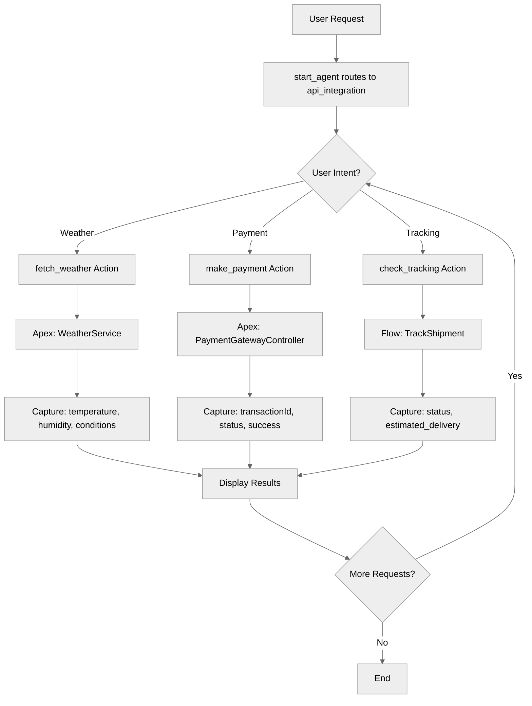

# ExternalAPIIntegration

## Overview

Learn how to integrate **external APIs and systems** using Flow and Apex targets. This recipe demonstrates patterns for calling weather APIs, payment gateways, and shipping trackers.

## Agent Flow



## Key Concepts

- **Flow targets (`flow://`)**: Call external APIs via Salesforce Flows
- **Apex targets (`apex://`)**: Call external APIs via Apex classes
- **API response handling**: Capture outputs from external calls
- **Error tracking**: Monitor API success/failure status
- **Multiple integrations**: Different services, different targets

## How It Works

### Apex-Based Integration (Weather)

```agentscript
actions:
   get_weather:
      description: "Fetch weather data from external API via Apex"
      inputs:
         cityName: string
      outputs:
         temperature: object
            complex_data_type_name: "lightning__integerType"
         conditions: string
         humidity: object
            complex_data_type_name: "lightning__integerType"
         success: boolean
         error_message: string
      target: "apex://WeatherService"
```

### Apex-Based Integration (Payment)

```agentscript
actions:
   process_payment:
      description: "Process payment via external payment gateway using Apex"
      inputs:
         amount: number
         paymentToken: string
         currencyName: string
      outputs:
         transactionId: string
         status: string
         success: boolean
         errorMessage: string
      target: "apex://PaymentGatewayController"
```

### Flow-Based Integration (Shipping)

```agentscript
actions:
   track_shipment:
      description: "Track shipment via external shipping API"
      inputs:
         tracking_number: string
         carrier: string
      outputs:
         status: string
         estimated_delivery: string
         success: boolean
      target: "flow://TrackShipment"
```

### Using Actions in Reasoning

```agentscript
reasoning:
   instructions:->
      | Identify the action based on the users request. You can get weather, process payment or help with shipment.

      | If an action needs user input, prompt the user requesting the needed info before you perform the action.
        For example for fetching weather you will need city name before you can proceed.
        For making payment you need amount and payment token and for tracking shipping you need a tracking number.

      | When reporting weather, use the data in {!@variables.temperature}, {!@variables.humidity}, and {!@variables.conditions}.
        When a payment is processed, confirm with the {!@variables.transaction_id}.
        When tracking a shipment, provide the status from {!@variables.shipment_status}.

        If an API error occurs (checked via {!@variables.api_error_message}), apologize and show the error.

   actions:
      fetch_weather: @actions.get_weather
         with cityName= ...
         set @variables.temperature = @outputs.temperature
         set @variables.humidity = @outputs.humidity
         set @variables.conditions = @outputs.conditions
         set @variables.api_response_status = @outputs.success
         set @variables.api_error_message = @outputs.error_message

      make_payment: @actions.process_payment
         with amount=...
         with paymentToken=...
         with currencyName="USD"
         set @variables.transaction_id = @outputs.transactionId
         set @variables.api_response_status = @outputs.success
         set @variables.api_error_message = @outputs.errorMessage

      check_tracking: @actions.track_shipment
         with tracking_number=...
         with carrier="USPS"
         set @variables.shipment_status = @outputs.status
         set @variables.api_response_status = @outputs.success
```

## Key Code Snippets

### Variables for API State

```agentscript
variables:
   # API request tracking
   api_request_id: mutable string = ""
      description: "The ID of the current API request."
   api_response_status: mutable boolean = False
      description: "The status of the API response (e.g., true for success, false for failure)."
   api_error_message: mutable string = ""
      description: "Error message returned by the API, if any."

   # Weather API example
   temperature: mutable number = 0
      description: "The current temperature fetched from the weather API."
   humidity: mutable number = 0
      description: "The current humidity percentage fetched from the weather API."
   conditions: mutable string = ""
      description: "The current weather conditions (e.g., Sunny, Cloudy)."

   # Payment API example
   transaction_id: mutable string = ""
      description: "The unique transaction ID returned after a payment."

   # Shipping API example
   shipment_status: mutable string = ""
      description: "The status object of the shipment tracking."
```

### Complete Action Definitions

```agentscript
actions:
   get_weather:
      description: "Fetch weather data from external API via Apex"
      inputs:
         cityName: string
      outputs:
         temperature: object
            complex_data_type_name: "lightning__integerType"
         conditions: string
         humidity: object
            complex_data_type_name: "lightning__integerType"
         success: boolean
         error_message: string
      target: "apex://WeatherService"

   process_payment:
      description: "Process payment via external payment gateway using Apex"
      inputs:
         amount: number
         paymentToken: string
         currencyName: string
      outputs:
         transactionId: string
         status: string
         success: boolean
         errorMessage: string
      target: "apex://PaymentGatewayController"

   track_shipment:
      description: "Track shipment via external shipping API"
      inputs:
         tracking_number: string
         carrier: string
      outputs:
         status: string
         estimated_delivery: string
         success: boolean
      target: "flow://TrackShipment"
```

## Try It Out

### Example: Weather Lookup

```text
Agent: I can integrate with external APIs for weather, payments, and shipping!

User: What's the weather in San Francisco?

[Agent calls get_weather via Apex]
  - WeatherService.getWeather("San Francisco")
  - Returns: temperature=65, conditions="Partly Cloudy", humidity=72

Agent: Weather in San Francisco:
       🌤️ Partly Cloudy
       Temperature: 65°F
       Humidity: 72%
```

### Example: Payment Processing

```text
User: Process a payment of $50

Agent: I'll need a payment token to process this. Do you have one?

User: Yes, the token is PAY-TOKEN-123

[Agent calls process_payment via Apex]
  - PaymentGatewayController.process(50, "PAY-TOKEN-123", "USD")
  - Returns: transactionId="TXN-789", status="approved", success=true

Agent: ✅ Payment processed successfully!

       Transaction ID: TXN-789
       Amount: $50.00
       Status: Approved
```

### Example: Shipment Tracking

```text
User: Track my shipment 1Z999AA10123456784

[Agent calls track_shipment via Flow]
  - TrackShipment flow with tracking_number and carrier="USPS"
  - Returns: status="In Transit", estimated_delivery="2025-01-22"

Agent: 📦 Shipment Status:

       Tracking: 1Z999AA10123456784
       Status: In Transit
       Estimated Delivery: January 22, 2025
```

## Integration Patterns

### Pattern 1: Simple API Call

```agentscript
fetch_data: @actions.api_call
   with param=...
   set @variables.result = @outputs.data
```

### Pattern 2: With Error Capture

```agentscript
fetch_data: @actions.api_call
   with param=...
   set @variables.result = @outputs.data
   set @variables.success = @outputs.success
   set @variables.error = @outputs.error_message
```

### Pattern 3: Fixed Default Parameters

```agentscript
make_payment: @actions.process_payment
   with amount=...
   with paymentToken=...
   with currencyName="USD"  # Fixed default
```

## Best Practices

✅ **Always capture success status** - Check if API call succeeded

✅ **Store error messages** - For user feedback

✅ **Use appropriate targets** - Flow for simple, Apex for complex

✅ **Prompt for required inputs** - Don't call APIs without needed data

❌ **Don't assume success** - Always verify response

❌ **Don't expose raw errors** - Show user-friendly messages

## What's Next

- **ErrorHandling**: Build robust error handling
- **MultiStepWorkflows**: Chain multiple API calls
- **ActionCallbacks**: Process API results

## Testing

### Test Case 1: Successful API Call

- Provide valid inputs
- Verify API called correctly
- Check outputs captured

### Test Case 2: API Error

- Trigger API failure
- Verify error captured
- Check graceful handling

### Test Case 3: Missing Input

- Don't provide required input
- Verify agent prompts for it
