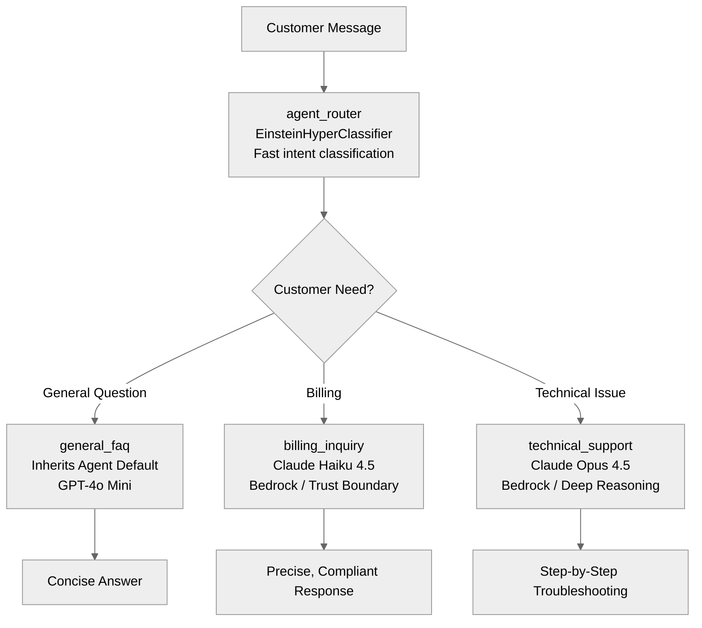

# ModelConfig

## Overview

This recipe demonstrates how to use `model_config` in Agent Script to assign different AI models to different subagents within the same agent. Rather than applying one model to every task, you can match model selection to the specific requirements of each subagent — optimizing for cost on high-volume simple queries, compliance on subagents that handle sensitive data, and reasoning capability on subagents that need to solve complex problems.

## Agent Flow



## Key Concepts

- **`model_config` block**: An optional block placed at the agent level (as a sibling to `system`) or inside any `subagent` block to override the model used for that scope.
- **Model hierarchy**: Subagent `model_config` > Agent `model_config` > Org default (set in Setup). A subagent-level override always wins.
- **Agent-level default**: Setting `model_config` at the agent level establishes a fallback for all subagents without touching the org-wide setting.
- **Inheritance**: Subagents without their own `model_config` automatically inherit the agent-level default. You only need to set `model_config` where you are intentionally overriding.
- **EinsteinHyperClassifier**: A Salesforce-owned model purpose-built for fast, accurate subagent classification in `start_agent`.
- **Salesforce Trust Boundary**: Bedrock-hosted Anthropic models keep all LLM traffic within the Salesforce VPC — relevant when subagents handle sensitive or regulated data.

## How It Works

### Setting an Agent-Level Default

The `model_config` block at the agent level sits as a sibling to `system` and sets a model default for the entire agent. Any subagent without its own `model_config` inherits this model instead of the org default.

In this recipe, GPT-4o Mini is the agent default — cost-efficient and well-suited for the high-volume general FAQ traffic that makes up most interactions.

```agentscript
system:
   messages:
      welcome: "Hello! I'm here to help..."
      error: "I encountered an issue."
   instructions: "You are a professional customer service agent."

model_config:
   model: "model://sfdc_ai__DefaultGPT4OmniMini"
```

### The Agent Router and EinsteinHyperClassifier

Agentforce ServiceAgent templates use the Salesforce-owned **EinsteinHyperClassifier** model for subagent classification in the agent router. This is set explicitly via `model_config` on `start_agent`.

EinsteinHyperClassifier advantages:

- Significantly faster subagent classification than general-purpose LLMs
- Increased accuracy, particularly for specialized classification and negative instructions

EinsteinHyperClassifier limitations:

- Cannot use `before_reasoning` or `after_reasoning`
- Can only use `@utils.transition` — no other tools

The Salesforce docs recommend keeping EinsteinHyperClassifier for the agent router or specifying a different model if your routing logic requires it.

```agentscript
start_agent agent_router:
   description: "Determine the customer's need and route to the appropriate subagent"

   model_config:
      model: "model://sfdc_ai__DefaultEinsteinHyperClassifier"

   reasoning:
      instructions:|
         Select the tool that best matches the user's message and conversation history. If it's unclear, make your best guess.
      actions:
         general_faq: @utils.transition to @subagent.general_faq
            description: "Answer common questions about products, policies, hours, and general information"
         ...
```

### Inheriting the Default (No Override Needed)

The `general_faq` subagent has no `model_config` block. It inherits the agent-level default (GPT-4o Mini) automatically. There is no need to repeat the model name just to confirm the default.

```agentscript
subagent general_faq:
   description: "Answers common questions about products, policies, and general information"

   reasoning:
      instructions:->
         | Answer the customer's question clearly and concisely.
         ...
```

### Overriding for Compliance: Billing Subagent

The `billing_inquiry` subagent handles sensitive financial information — payment methods, invoices, account balances. For subagents dealing with this kind of data, you may want to ensure LLM traffic stays within the Salesforce Trust Boundary (the Salesforce VPC). All Bedrock-hosted Anthropic models (`sfdc_ai__DefaultBedrock*`) satisfy this requirement. Claude Haiku 4.5 on Bedrock is lightweight and fast — compliant without a performance penalty.

```agentscript
subagent billing_inquiry:
   description: "Handles billing questions, payment details, and account financial information"

   model_config:
      model: "model://sfdc_ai__DefaultBedrockAnthropicClaude45Haiku"

   reasoning:
      instructions:->
         | Help the customer with their billing question.
         ...
```

### Overriding for Capability: Technical Support Subagent

The `technical_support` subagent handles complex, multi-step troubleshooting. These interactions benefit from a model with stronger reasoning: identifying root causes, evaluating multiple failure modes, and generating structured diagnostic steps. Claude Opus 4.5 on Bedrock is the most capable model in the Salesforce-managed Anthropic lineup.

```agentscript
subagent technical_support:
   description: "Troubleshoots product issues and technical problems requiring detailed investigation"

   model_config:
      model: "model://sfdc_ai__DefaultBedrockAnthropicClaude45Opus"

   reasoning:
      instructions:->
         | Help the customer troubleshoot their technical issue thoroughly.
         ...
```

### The Precedence Hierarchy in Practice

| Scope | Model | Why |
| ----- | ----- | --- |
| Org default | Set in Setup (Salesforce Default or AWS-Hosted) | Baseline for all agents in the org |
| Agent level | `sfdc_ai__DefaultGPT4OmniMini` | Cost-efficient default for most traffic |
| `agent_router` | `sfdc_ai__DefaultEinsteinHyperClassifier` | Fast, accurate intent classification |
| `general_faq` | Inherits agent default | No override needed — low complexity, high volume |
| `billing_inquiry` | `sfdc_ai__DefaultBedrockAnthropicClaude45Haiku` | Trust Boundary compliance for sensitive financial data |
| `technical_support` | `sfdc_ai__DefaultBedrockAnthropicClaude45Opus` | Deep reasoning for complex troubleshooting |

## Key Code Snippets

### Agent-Level Default

```agentscript
model_config:
   model: "model://sfdc_ai__DefaultGPT4OmniMini"
```

### Agent Router with EinsteinHyperClassifier

```agentscript
start_agent agent_router:
   model_config:
      model: "model://sfdc_ai__DefaultEinsteinHyperClassifier"
```

### Subagent Override for Compliance

```agentscript
subagent billing_inquiry:
   model_config:
      model: "model://sfdc_ai__DefaultBedrockAnthropicClaude45Haiku"
```

### Subagent Override for Capability

```agentscript
subagent technical_support:
   model_config:
      model: "model://sfdc_ai__DefaultBedrockAnthropicClaude45Opus"
```

## Try It Out

Activate the agent and test each routing path to observe how different subagents respond.

### Example Interaction — General FAQ (Inherited Default)

```text
Agent: Hello! I'm here to help with your account, orders, and support requests. What can I help you with today?

User: What is your return policy?

Agent: Our return policy allows returns within 30 days of purchase with a receipt.
Items must be in original condition. Refunds are issued to the original payment method
within 5–7 business days.
```

**Behind the Scenes:** EinsteinHyperClassifier routes to `general_faq`, which inherits the agent-level default (GPT-4o Mini).

### Example Interaction — Billing (Trust Boundary Override)

```text
User: I was charged twice for my last order.

Agent: I'm sorry to hear that. Let me look into this for you.
I can see two charges dated May 10th for $49.99. This appears to be a duplicate.
I'll flag this for our billing team to process a refund. You should see the credit
within 3–5 business days.
```

**Behind the Scenes:** Routes to `billing_inquiry`, which overrides to Claude Haiku 4.5 on Bedrock — keeping all traffic involving financial data within the Salesforce Trust Boundary.

### Example Interaction — Technical Support (Capability Override)

```text
User: My integration keeps failing with a 401 error after I rotate my API keys.

Agent: A 401 after a key rotation usually means the new key hasn't propagated yet,
or the old key is still referenced somewhere. Let's work through it:

1. Have you updated the key in all the places it's referenced — environment variables,
   config files, and any connected apps?
2. Did you wait a few minutes after rotating before retrying?

What does the full error response body say?
```

**Behind the Scenes:** Routes to `technical_support`, which overrides to Claude Opus 4.5 on Bedrock for multi-step diagnosis and reasoning.

## Testing

There are no stub flows or data dependencies in this recipe — any message will get a response. The focus is verifying that each message routes to the correct subagent.

### Test 1: General FAQ — Inherits Agent Default

Verifies the router sends low-complexity questions to `general_faq`, which inherits the agent-level default (GPT-4o Mini).

```text
User: What is your return policy?

Agent: Our return policy allows you to return most items within a specified
       period after purchase, as long as they are in their original condition
       and packaging.
```

**Expected routing**: `agent_router` → `general_faq`

### Test 2: Billing — Trust Boundary Override

Verifies the router sends financial questions to `billing_inquiry`, which overrides to Claude Haiku 4.5 on Bedrock.

```text
User: I was charged twice for my last order

Agent: I understand how frustrating a duplicate charge can be. To investigate,
       could you provide your order number and the approximate date of the charges?
```

**Expected routing**: `agent_router` → `billing_inquiry`

### Test 3: Technical Support — Capability Override

Verifies the router sends complex technical questions to `technical_support`, which overrides to Claude Opus 4.5 on Bedrock.

```text
User: My API integration keeps failing with a 401 error after I rotate my API keys

Agent: A 401 after a key rotation usually means the new key hasn't propagated yet,
       or the old key is still referenced somewhere. Let's work through it step by step.
```

**Expected routing**: `agent_router` → `technical_support`

### Test 4: Ambiguous Input — Router Judgment

Verifies the router makes a reasonable routing decision when intent is unclear.

```text
User: I have a problem with my account

Agent: I'd be happy to help. Could you tell me more — is this related to a charge
       or payment, a technical issue, or something else?
```

**Expected routing**: `agent_router` → `billing_inquiry` or `technical_support` depending on LLM judgment. Either is acceptable. The key verification is that the router does not get stuck or error.

### How to Verify Routing

In the **Agent Tracer**, after each message, look for the **Subagent Transition** event. The `to_agent` field shows which subagent handled the response.

## What's Next

- **multiSubagentNavigation**: Explore how to manage state and transitions across multiple subagents.
- **safetyAndGuardrails**: Learn how to add guardrails and safety instructions at the subagent level.
- **openGateRouter**: See a pattern for routing with authentication gates before reaching subagents.

## Notes

- **`model://` prefix is required**: All model values use the `model://` URI prefix (e.g., `"model://sfdc_ai__DefaultGPT4OmniMini"`).
- **Agent-level `model_config` is a top-level block**: It sits as a sibling to `system`, not nested inside `config`.
- **Org-level model selection is separate from `model_config`**: The org default is set in Setup → Einstein Audit, Analytics, and Monitoring. `model_config` in Agent Script overrides it at the agent or subagent level.
- **Salesforce Default is a managed mix**: When no `model_config` is set at the org level, Salesforce selects the best model automatically. Override only when you have a specific reason.
- **The reasoning engine is limited**: The Atlas reasoning engine is constrained to Salesforce-managed models. However, custom actions using prompt templates, Apex, or the Models API can reference any Salesforce-managed or BYO model.
- **Beta models** are disabled by default — enable them in sandbox only. See the [supported models list](https://developer.salesforce.com/docs/ai/agentforce/guide/supported-models.html).
- **Test after any model change**: Model behavior varies even with identical instructions. Always validate subagent responses after switching models.
