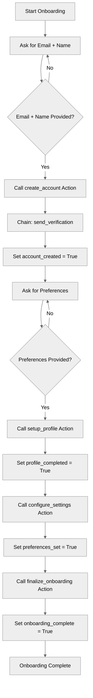

# MultiStepWorkflows

## Overview

This recipe demonstrates how to orchestrate **multi-step workflows** where actions are chained together in sequence. Learn how to build onboarding processes with multiple steps, pass data between actions, and track progress through boolean state flags.

## Agent Flow



## Key Concepts

- **Action chaining**: Using `run` to execute follow-up actions automatically
- **available when**: Conditionally expose actions based on workflow step
- **Step-by-step workflows**: Guided multi-step processes with clear progression
- **Progress tracking**: Boolean flags and `step` variable to track completion of each step
- **Data flow**: Outputs from one action feed into subsequent actions
- **Procedural instructions**: Step-by-step rules that guide the LLM through the workflow

## How It Works

### Workflow State Variables

Track progress with boolean flags and store data needed across steps:

```agentscript
variables:
    customer_email: mutable string = ""
        description: "Customer's email address"
    customer_id: mutable string = ""
        description: "Generated customer ID from account creation"
    account_created: mutable boolean = False
        description: "Whether account has been created"
    profile_completed: mutable boolean = False
        description: "Whether profile setup is complete"
    preferences_set: mutable boolean = False
        description: "Whether preferences have been configured"
    onboarding_complete: mutable boolean = False
        description: "Whether entire onboarding is done"
    verification_token: mutable string = ""
        description: "Email verification token"
    step: mutable number = 1
        description: "The current step in the onboarding process"
```

### Step-by-Step Instructions

Use procedural instructions to guide the workflow through each step:

```agentscript
reasoning:
    instructions: ->
        | Onboard the customer step by step following the below ## Rules. You are currently on {!@variables.step} of Step 4.
        | ## Rules:
             a. Onboarding is a strictly 4 step process and you should go from Step 1 to Step 4 to complete. You are on step {!@variables.step} of 4 now. Display the step as you progress.
             b. NEVER ask the customer to set password. We will set the password in the background.
        if @variables.step == 1:
            | Ask for name and email to create account.
        if @variables.step == 2 and @variables.account_created == True:
            | Collect the customer's profile preferences by asking about: (1) Notification Preferences (e.g., email, SMS, push), (2) Preferred Language, and (3) Timezone. Once all preferences are gathered, format them as a JSON string (e.g., {"notifications": "email", "language": "en", "timezone": "PST"}) and pass it to the `preferences` input of setup_profile action.
        if @variables.step == 3 and @variables.profile_completed == True:
            | Collect the customer's privacy settings by asking about: (1) Data Sharing preferences, (2) Marketing Communications opt-in/out, and (3) Profile Visibility. Once all settings are gathered, format them as a JSON string (e.g., {"dataSharing": false, "marketing": true, "visibility": "private"}) and pass it to the `settings` input of configure_settings action.
        if @variables.step == 4 and @variables.preferences_set == True:
            | Run the {!@actions.finalize_onboarding} action to inform customer onboarding is complete.
```

### Action with Chained Follow-up

The `run` keyword chains a follow-up action immediately after the primary action completes:

```agentscript
actions:
    create_account: @actions.create_account
        available when @variables.step == 1
        with email = ...
        with name = ...
        set @variables.customer_id = @outputs.customer_id
        set @variables.account_created = @outputs.success
        set @variables.customer_email = @outputs.customer_email
        set @variables.step = 2
        run @actions.send_verification
            with customer_id = @variables.customer_id
            with email = @variables.customer_email
            set @variables.verification_token = @outputs.token

    setup_profile: @actions.setup_profile
        available when @variables.step == 2
        with customer_id = @variables.customer_id
        with preferences = ...
        set @variables.profile_completed = @outputs.success
        set @variables.step = 3

    configure_settings: @actions.configure_settings
        available when @variables.step == 3
        with customer_id = @variables.customer_id
        with settings = ...
        set @variables.preferences_set = @outputs.success
        set @variables.step = 4

    finalize_onboarding: @actions.finalize_onboarding
        available when @variables.step == 4
        with customer_id = @variables.customer_id
        set @variables.onboarding_complete = @outputs.success
```

## Key Code Snippets

### Action Definitions

```agentscript
actions:
    create_account:
        description: "Creates a new customer account"
        inputs:
            email: string
                description: "Customer's email address for account registration and verification"
            name: string
                description: "Customer's full name for the account"
        outputs:
            customer_id: string
                description: "Unique identifier assigned to the newly created customer account"
            success: boolean
                description: "Indicates whether the account was created successfully"
            customer_email: string
                description: "Customer email"
        target: "flow://CreateCustomerAccount"

    send_verification:
        description: "Sends email verification"
        inputs:
            customer_id: string
                description: "The unique identifier of the customer to send verification email to"
            email: string
                description: "The email address where the verification link will be sent"
        outputs:
            token: string
                description: "Verification token generated for email confirmation"
            sent: boolean
                description: "Indicates whether the verification email was sent successfully"
        target: "flow://SendVerificationEmail"

    setup_profile:
        description: "Creates customer profile with preferences"
        inputs:
            customer_id: string
                description: "The unique identifier of the customer whose profile to set up"
            preferences: string
                description: "Customer preferences as JSON object"
        outputs:
            profile_id: string
                description: "Unique identifier for the newly created customer profile"
            success: boolean
                description: "Indicates whether the profile was set up successfully"
        target: "flow://SetupCustomerProfile"

    configure_settings:
        description: "Sets default account privacy settings"
        inputs:
            customer_id: string
                description: "The unique identifier of the customer whose settings to configure"
            settings: string
                description: "Account privacy settings as JSON object"
        outputs:
            success: boolean
                description: "Indicates whether the privacy settings were configured successfully"
        target: "flow://ConfigureAccountSettings"

    finalize_onboarding:
        description: "Marks onboarding as complete and sends welcome email"
        inputs:
            customer_id: string
                description: "The unique identifier of the customer to finalize onboarding for"
        outputs:
            success: boolean
                description: "Indicates whether onboarding was finalized successfully"
            welcome_sent: boolean
                description: "Indicates whether the welcome email was sent to the customer"
        target: "flow://FinalizeOnboarding"
```

### Reasoning Actions

```agentscript
actions:
    create_account: @actions.create_account
        available when @variables.step == 1
        with email = ...
        with name = ...
        set @variables.customer_id = @outputs.customer_id
        set @variables.account_created = @outputs.success
        set @variables.customer_email = @outputs.customer_email
        set @variables.step = 2
        run @actions.send_verification
            with customer_id = @variables.customer_id
            with email = @variables.customer_email
            set @variables.verification_token = @outputs.token

    setup_profile: @actions.setup_profile
        available when @variables.step == 2
        with customer_id = @variables.customer_id
        with preferences = ...
        set @variables.profile_completed = @outputs.success
        set @variables.step = 3

    configure_settings: @actions.configure_settings
        available when @variables.step == 3
        with customer_id = @variables.customer_id
        with settings = ...
        set @variables.preferences_set = @outputs.success
        set @variables.step = 4

    finalize_onboarding: @actions.finalize_onboarding
        available when @variables.step == 4
        with customer_id = @variables.customer_id
        set @variables.onboarding_complete = @outputs.success
```

## Try It Out

### Example Interaction

```text
Agent: Welcome! Let's get you onboarded step by step to our platform. I'll guide you
       through the process. Please provide your email and name to begin the onboarding
       process.

User: john.smith@gmail.com, John Smith

Agent: Step 1 of 4: Account Creation

       Your account is being created with the following details:
       Name: John Smith
       Email: john.smith@gmail.com

       Step 1 is complete!

       Step 2 of 4: Please share any preferences you have (for example, communication
       preferences, interests, or anything you'd like us to know to personalize your
       experience).

User: communication preferences - keep everything private
      No other preference

Agent: Step 2 of 4: Preferences Set

       Your communication preference has been noted: everything will be kept private.

       Step 3 of 4: Your privacy settings are now configured to "all private" for
       maximum confidentiality.

       Step 4 of 4: Onboarding is complete! A welcome message has been sent to your
       email.

       You are all set. If you have any questions or need further assistance, feel
       free to ask!
```

### Behind the Scenes

1. **Step 1**: Agent calls `create_account` with email and name, then chains `send_verification`
2. **Step 2**: Agent calls `setup_profile` with collected preferences
3. **Step 3**: Agent calls `configure_settings` with privacy settings
4. **Step 4**: Agent calls `finalize_onboarding` to complete the process

## Workflow Patterns

### Linear Workflow

Steps execute in a fixed order:

```text
Step 1 → Step 2 → Step 3 → Step 4 → Complete
```

### Action Chaining with `run`

Execute a follow-up action immediately after the primary action:

```agentscript
primary: @actions.primary_action
   with input = ...
   set @variables.result = @outputs.value
   run @actions.follow_up
      with data = @variables.result
```

**Note**: Only one level of nesting is allowed for chained actions.

## Best Practices

- **Track State Clearly**: Use descriptive boolean flags like `account_created` and `profile_completed`
- **Provide Progress Feedback**: Show users which step they're on (e.g., "Step 2 of 4")
- **Validate Before Each Step**: Ensure required data is collected before calling actions
- **Handle Partial Completion**: Allow users to resume where they left off

## What's Next

- **ActionCallbacks**: Learn more about the `run` keyword for chaining actions
- **MultiTopicOrchestration**: Split complex workflows across multiple topics
- **ErrorHandling**: Handle step failures gracefully

## Testing

### Test Case 1: Complete Happy Path

- Execute all 4 steps in sequence
- Verify state updates correctly at each step
- Confirm final completion message

### Test Case 2: Resume from Step 2

- Set `step=2`, `account_created=True`, and `customer_id="..."`
- Start conversation
- Agent should continue at step 2

### Test Case 3: Data Flow Verification

- Verify `customer_id` from step 1 is used in steps 2-4
- Confirm all state persists across the conversation
