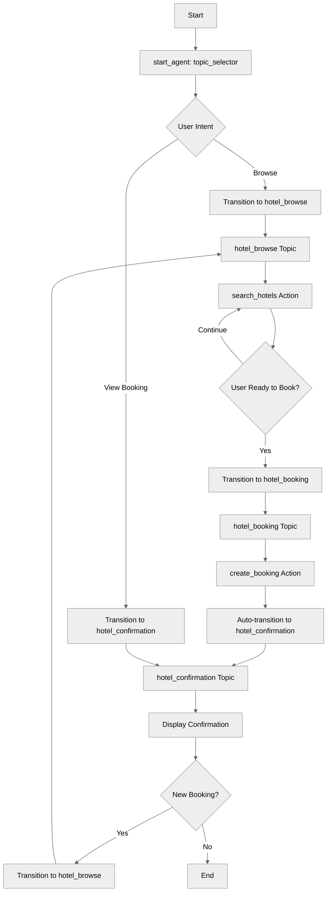

# MultiTopicNavigation

## Overview

This recipe demonstrates how to build agents with **multiple topics** and navigate between them. Topics allow you to organize complex agents into specialized conversation modes, each handling a specific phase or capability of the interaction.

## Agent Flow



## Key Concepts

- **Multiple topic blocks**: Defining several topics in one agent
- **Topic transitions**: Moving between topics with `@utils.transition to @topic.name`
- **Transition after action**: Using `transition to` in action blocks
- **Topic specialization**: Each topic handles a specific responsibility
- **State sharing**: Variables are global across all topics
- **Conditional transitions**: Using `available when` on transition actions

## How It Works

### Multi-Topic Architecture

Instead of one topic handling everything, create specialized topics:

```agentscript
start_agent topic_selector:
   description: "Welcome users and determine their hotel service needs"

   reasoning:
      instructions:|
         Select the tool that best matches the user's message and conversation history. If it's unclear, make your best guess.
         Route to the matching topic immediately based on the user's message.
      actions:
         browse_hotels: @utils.transition to @topic.hotel_browse
            description: "Browse and search for available hotels"

         hotel_booking: @utils.transition to @topic.hotel_booking
            description: "Book a hotel"

         view_booking: @utils.transition to @topic.hotel_confirmation
            description: "View existing booking confirmations"
            available when @variables.booking_confirmed == True

topic hotel_browse:
   description: "Browse available hotels and view information"

topic hotel_booking:
   description: "Book hotel"

topic hotel_confirmation:
   description: "Confirm booking and provide details"
```

### Topic Transitions with @utils.transition

Move between topics using `@utils.transition to @topic.name`:

```agentscript
reasoning:
   actions:
      browse_hotels: @utils.transition to @topic.hotel_browse
         description: "Browse and search for available hotels"
```

### Conditional Transition Availability

Use `available when` to control when transitions are possible:

```agentscript
actions:
   view_booking: @utils.transition to @topic.hotel_confirmation
      description: "View existing booking confirmations"
      available when @variables.booking_confirmed == True
```

### Automatic Transition After Action

Transition after an action completes using `transition to`:

```agentscript
actions:
   create_booking: @actions.create_booking
      with hotel_name=...
      with check_in=...
      with check_out=...
      set @variables.booking_id = @outputs.booking_id
      set @variables.booking_confirmed = @outputs.success
      transition to @topic.hotel_confirmation
```

## Key Code Snippets

### Complete Topic: Hotel Browse

```agentscript
topic hotel_browse:
   description: "Browse available hotels and view information"

   actions:
      search_hotels:
         description: "Search for available hotels"
         inputs:
            location: string
               description: "City or location to search for hotels in"
            check_in: string
               description: "Check-in date in ISO format (YYYY-MM-DD)"
            check_out: string
               description: "Check-out date in ISO format (YYYY-MM-DD)"
         outputs:
            hotels: list[object]
               description: "List of available hotel objects with name, price, rating, and amenities information"
               complex_data_type_name: "lightning__recordInfoType" # This is the name of the complex data type that is used to store the hotel objects
         target: "flow://SearchHotels"

   reasoning:
      instructions:->
         | Help users find the perfect hotel.

           Ensure you know:
           - desired hotel location
           - check-in date
           - check-out date

           Once you have this information, look for available hotels using {!@actions.search_hotels}.

           Show the results to the user and ask which hotel they would like to book.

      actions:
         search_hotels: @actions.search_hotels
            with location=...
            with check_in=...
            with check_out=...
```

### Complete Topic: Hotel Booking

```agentscript
topic hotel_booking:
   description: "Book hotel"

   actions:
      create_booking:
         description: "Creates a hotel reservation"
         inputs:
            hotel_name: string
               description: "Name of the hotel to book"
            check_in: string
               description: "Check-in date in ISO format (YYYY-MM-DD)"
            check_out: string
               description: "Check-out date in ISO format (YYYY-MM-DD)"
         outputs:
            booking_id: string
               description: "Unique booking confirmation identifier"
            success: boolean
               description: "Indicates whether the booking was created successfully"
         target: "flow://CreateBooking"

   reasoning:
      instructions:->
         | First, if the hotel name, check-in date, or check-out date are not yet saved, use {!@actions.collect_booking_info} to save them from the conversation.

           Then confirm the booking details with the user before creating the reservation.

           Show:
           - Hotel: {!@variables.hotel_name}
           - Check-in: {!@variables.check_in_date}
           - Check-out: {!@variables.check_out_date}

           Ask the user to confirm these details are correct.
           Once the user confirms, complete the booking using {!@actions.create_booking}.

      actions:
         collect_booking_info: @utils.setVariables
            description: "Save the hotel name and travel dates from the conversation"
            with hotel_name=...
            with check_in_date=...
            with check_out_date=...

         create_booking: @actions.create_booking
            with hotel_name=@variables.hotel_name
            with check_in=@variables.check_in_date
            with check_out=@variables.check_out_date
            set @variables.booking_id = @outputs.booking_id
            set @variables.booking_confirmed = @outputs.success
            transition to @topic.hotel_confirmation
```

### Complete Topic: Hotel Confirmation

```agentscript
topic hotel_confirmation:
   description: "Confirm booking and provide details"

   reasoning:
      instructions:->
         | Confirm the booking and provide its details to the user.

           Confirmation details:
           - Booking ID: {!@variables.booking_id}
           - Hotel: {!@variables.hotel_name}
           - Check-in: {!@variables.check_in_date}
           - Check-out: {!@variables.check_out_date}

           Ask if they need anything else.
           If they want to make another booking, use {!@actions.start_new_booking} action.

      actions:
         start_new_booking: @utils.transition to @topic.hotel_browse
            description: "Start a new hotel search and booking"
```

## Try It Out

### Example: Complete Booking Flow

**start_agent routes to hotel_browse**

```text
Agent: Welcome to our hotel booking service! I can help you browse hotels, make bookings, or answer questions.

User: I need a hotel in San Francisco for March 15-17

[Agent calls search_hotels action with: check_in_date="2026-03-15", check_out_date="2026-03-17", location:"San Francisco"]

Agent: I found several hotels in San Francisco for March 15-17:
       1. Grand Plaza
       2. Seaside Resort

       Which one interests you?

User: I'll take the Grand Plaza

Agent: Excellent choice! Let me help you book the Grand Plaza Hotel.
```

**[Agent calls search_hotels action → transitions to hotel_booking]**

```text
Agent: I'm ready to complete your booking at Grand Plaza Hotel.
       - Check-in: March 15
       - Check-out: March 17

       Please confirm these details are correct.

User: Yes, that's correct

[Agent calls create_booking action]
[Stores: hotel_name="Grand Plaza Hotel", booking_id="BK789456"]
[Auto-transitions to hotel_confirmation]
```

**[Now in hotel_confirmation topic]**

```text
Agent: Your booking is confirmed! 🎉

       Confirmation details:
       - Booking ID: BK789456
       - Hotel: Grand Plaza Hotel
       - Check-in: March 15
       - Check-out: March 17

       You'll receive a confirmation email shortly.
       Would you like to make another booking?

User: No, that's all. Thanks!

Agent: You're welcome! Have a wonderful stay!
```

## Multi-Topic Design Patterns

### Linear Workflow

```text
browse → booking → confirmation
```

Good for: Checkout processes, onboarding, step-by-step wizards

### Hub-and-Spoke

```text
main_menu → { product_info, order_status, support }
         ↓
      main_menu (return)
```

Good for: Customer service, multi-purpose assistants

### Bidirectional Flow

```text
browse ↔ booking ↔ confirmation
```

Good for: Exploratory interfaces, comparison shopping

## Best Practices

### Topic Naming

**Good:** `hotel_browse`, `payment_processing`, `account_settings`

**Poor:** `topic1`, `main`, `do_stuff`

### Transition Descriptions

**Good:**

```agentscript
start_new_booking: @utils.transition to @topic.hotel_browse
   description: "Start a new hotel search and booking"
```

**Poor:**

```agentscript
go_next: @utils.transition to @topic.next
   description: "Go next"
```

## What's Next

- **TopicDelegation**: Learn about delegation (consulting other topics)
- **MultiTopicOrchestration**: Handle complex workflows with 4+ topics
- **SystemInstructionOverrides**: Customize behavior per topic
- **DynamicActionRouting**: Control action availability

## Testing

### Test Case 1: Happy Path

- Start in browse → search → select → book → confirm
- Verify all transitions work

### Test Case 2: State Persistence

- Set check_in_date in browse
- Transition to booking
- Verify date still accessible

### Test Case 3: Multiple Bookings

- Complete one booking
- Use start_new_booking
- Complete second booking
