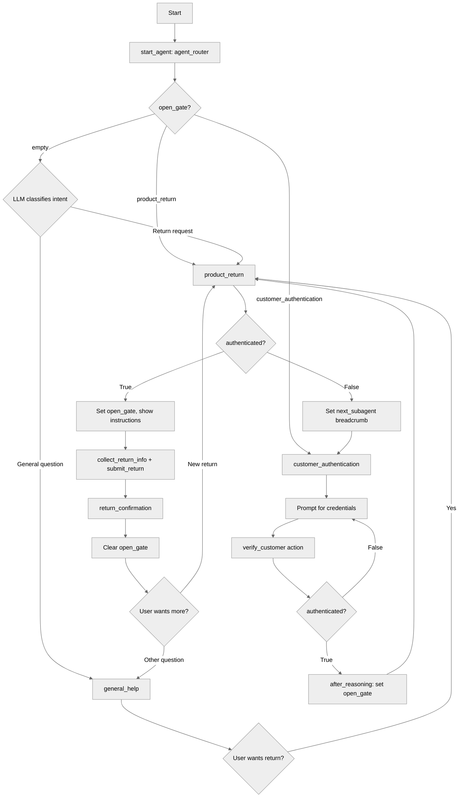

# OpenGateRouter

## Overview

This recipe demonstrates **deterministic gate-based routing** — a pattern where variables control transitions instead of relying on LLM intent classification. When an agent needs to pause a workflow for a prerequisite (like authentication) and then guarantee a return to the original workflow, the Open Gate pattern uses breadcrumb variables to make routing predictable and reliable.

## Agent Flow



## Key Concepts

- **Deterministic routing via `instructions:->`**: Conditional `transition to` at the top of a procedure fires before the LLM reasons, creating guaranteed routing
- **Breadcrumb variables**: `open_gate` tracks where to route; `next_subagent` tracks where to return after a gate completes
- **Gate subagent**: A middleware subagent that enforces a prerequisite (auth) and automatically resumes the original workflow
- **EXIT_PROTOCOL**: Clearing `open_gate` when a workflow finishes so the router returns to normal LLM-based classification

## How It Works

### The Router

The `start_agent` checks `open_gate` at the top of its instructions. If set, it transitions immediately — no LLM classification needed:

```agentscript
start_agent agent_router:
	reasoning:
		instructions:->
			if @variables.open_gate == "product_return":
				transition to @subagent.product_return
			if @variables.open_gate == "customer_authentication":
				transition to @subagent.customer_authentication

			| Select the tool that best matches the user's message.
```

When `open_gate` is empty, the conditions are false and the LLM sees the instruction text for normal routing.

### The Protected Subagent

`product_return` checks authentication at the top. If not authenticated, it stores a breadcrumb and redirects:

```agentscript
subagent product_return:
	reasoning:
		instructions:->
			if @variables.authenticated == False:
				set @variables.next_subagent = "product_return"
				transition to @subagent.customer_authentication

			set @variables.open_gate = "product_return"
			| Hello {!@variables.customer_name}! I can help you process a product return.
```

### The Authentication Gate

After verification succeeds, `after_reasoning` reads the breadcrumb and transitions back:

```agentscript
subagent customer_authentication:
	reasoning:
		instructions:->
			set @variables.open_gate = "customer_authentication"
			if @variables.authenticated == False:
				| Please provide your account number and verification code.

	after_reasoning:
		if @variables.authenticated == True and @variables.next_subagent == "product_return":
			set @variables.open_gate = "product_return"
			transition to @subagent.product_return
```

### The EXIT_PROTOCOL

When the workflow completes, clear `open_gate` so the router goes back to LLM classification:

```agentscript
subagent return_confirmation:
	reasoning:
		instructions:->
			set @variables.open_gate = ""
			| Your return has been processed successfully!
```

Without this, the router would keep routing to `product_return` forever.

## Key Code Snippets

### Gate Variables

```agentscript
variables:
	open_gate: mutable string = ""
		description: "When set, the router transitions directly to this subagent."

	next_subagent: mutable string = ""
		description: "Breadcrumb: which subagent to resume after gate completion"
```

### Action with Output Capture

```agentscript
verify_customer: @actions.check_authentication
	with account_number=...
	with verification_code=...
	set @variables.authenticated = @outputs.is_authenticated
	set @variables.customer_id = @outputs.customer_id
	set @variables.customer_name = @outputs.customer_name
```

### Guarded Action Availability

```agentscript
submit_return: @actions.process_return
	available when @variables.order_id and @variables.return_reason
	with customer_id=@variables.customer_id
	with order_id=@variables.order_id
	with reason=@variables.return_reason
	set @variables.return_confirmation = @outputs.confirmation_number
	transition to @subagent.return_confirmation
```

## Try It Out

### Example: Full Round-Trip Through Authentication Gate

```text
Agent: Welcome to Customer Support! I can help you with product returns and other inquiries.

User: I need to return a TV I bought last week

[Router: open_gate="" → LLM routes to product_return]
[product_return: authenticated=False → sets next_subagent="product_return" → transitions to auth]

Agent: To access your account, I need to verify your identity. Please provide your account number and the verification code sent to your registered phone or email.

User: My account is AC-5678 and the code is 991234

[check_authentication → authenticated=True, customer_id="CUST-001234", customer_name="Alex Johnson"]
[after_reasoning: sets open_gate="product_return" → transitions to product_return]

Agent: Hello Alex Johnson! I can help you process a product return. Please provide your order ID and the reason for the return.

User: Order ORD-44521, the screen has dead pixels

[collect_return_info → order_id="ORD-44521", return_reason="screen has dead pixels"]
[process_return → return_confirmation="RTN-2024-78432"]
[transitions to return_confirmation → open_gate cleared]

Agent: Your return has been processed successfully!
       Confirmation Number: RTN-2024-78432
       Order: ORD-44521
       Reason: screen has dead pixels
       You will receive an email with return shipping instructions.
       Is there anything else I can help you with?
```

### Variable State Throughout the Flow

| Step                           | open_gate                   | next_subagent      | authenticated |
| ------------------------------ | --------------------------- | ------------------ | ------------- |
| User sends "return a TV"       | `""`                        | `""`               | `False`       |
| product_return → auth redirect | `""`                        | `"product_return"` | `False`       |
| Inside authentication gate     | `"customer_authentication"` | `"product_return"` | `False`       |
| Auth succeeds, returning       | `"product_return"`          | `"product_return"` | `True`        |
| Back in product_return         | `"product_return"`          | `"product_return"` | `True`        |
| Return confirmed, gate cleared | `""`                        | `"product_return"` | `True`        |

## Best Practices

- **Use Open Gate** for guaranteed return paths (auth, payment, confirmation steps). Use LLM routing for initial intent classification. Combine both as shown here.
- **Single `open_gate` variable** keeps routing centralized. Don't create one variable per subagent.
- **Clear `open_gate` early** — at the start of the terminal subagent, not the end. Forgetting to clear creates an infinite routing loop.
- **Extend by adding conditions** — for each new protected subagent, add a gate check in the router and a condition in the auth gate's `after_reasoning`.

## What's Next

- **MultiSubagentNavigation**: Basic LLM-driven routing between subagents
- **BidirectionalNavigation**: Immediate return transitions without gate variables
- **SafetyAndGuardrails**: Multi-stage validation gates for data integrity

## Testing

### Stub Flow Behavior

The included flows return hardcoded values regardless of input:

| Flow                          | Always Returns                                                                       |
| ----------------------------- | ------------------------------------------------------------------------------------ |
| `CheckCustomerAuthentication` | `is_authenticated=true`, `customer_id="CUST-001234"`, `customer_name="Alex Johnson"` |
| `ProcessProductReturn`        | `confirmation_number="RTN-2024-78432"`, `success=true`                               |

Any account number and verification code will succeed. Use the values above when verifying agent responses.

### Test 1: Unauthenticated User Requests a Return

Verifies the auth gate intercepts and the breadcrumb is set.

```text
User: I want to return a defective laptop

Agent: To access your account, I need to verify your identity. Please provide your account number and the verification code sent to your registered phone or email.
```

**Expected state**: `next_subagent="product_return"`, `open_gate="customer_authentication"`, `authenticated=False`

### Test 2: Authentication Completes and Returns to Caller

Verifies the round-trip: auth succeeds → transitions back to product_return → greets by name.

```text
User: I want to return a defective laptop

Agent: To access your account, I need to verify your identity. Please provide your account number and the verification code sent to your registered phone or email.

User: Account AC-5678, code 991234

Agent: Hello Alex Johnson! I can help you process a product return. Please provide your order ID and the reason for the return.
```

**Expected state**: `authenticated=True`, `open_gate="product_return"`, `customer_name="Alex Johnson"`, `customer_id="CUST-001234"`

### Test 3: Already Authenticated User Skips Gate

Verifies that a pre-authenticated user goes straight to the return workflow with no auth prompt.

```text
[Pre-condition: User already authenticated in a previous turn]

User: I need to return something

Agent: Hello Alex Johnson! I can help you process a product return. Please provide your order ID and the reason for the return.
```

**Expected state**: No transition to `customer_authentication`. `open_gate="product_return"`. Agent uses `customer_name` from the previous authentication.

### Test 4: EXIT_PROTOCOL — Gate Clears After Completion

Verifies that after a return is processed, the next message uses normal LLM routing (not the gate).

```text
[Pre-condition: User just completed Test 2, then provided order details]

User: Order ORD-44521, the screen has dead pixels

Agent: Your return has been processed successfully!
       Confirmation Number: RTN-2024-78432
       Order: ORD-44521
       Reason: screen has dead pixels
       You will receive an email with return shipping instructions.
       Is there anything else I can help you with?

User: What is your shipping policy?

Agent: I can help with general questions about order status, shipping policies, return and refund policies, and product information. What would you like to know?
```

**Expected state**: `open_gate=""` after confirmation. Second message routed to `general_help` via LLM classification.

### Test 5: General Help — No Gate Triggered

Verifies that non-protected subagents work normally without gate interference.

```text
Agent: Welcome to Customer Support! I can help you with product returns and other inquiries.

User: What is your return policy?

Agent: I can help with general questions about order status, shipping policies, return and refund policies, and product information. What would you like to know?
```

**Expected state**: `open_gate=""` throughout. No auth check triggered.
