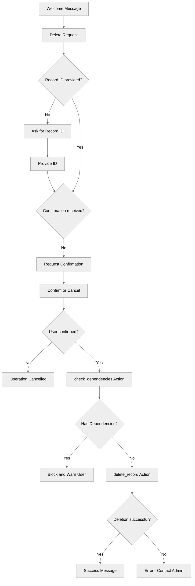

# SafetyAndGuardrails

## Overview

Learn essential **safety patterns** for production agents. This recipe demonstrates multi-stage validation, explicit confirmations, dependency checking, and permissions for record deletion operations.

> [!IMPORTANT]
> This recipe doesn't grant permissions that let the service agent user remove the records. It is your responsibility to configure those permissions otherwise the delete operation will fail.

## Agent Flow



## Key Concepts

- **Multi-stage validation**: Check prerequisites at multiple points before executing destructive actions
- **Explicit confirmation**: Require user approval before proceeding with deletions
- **Dependency checking**: Verify no dependent records exist before allowing deletion
- **Sequential gates**: Use conditional logic to enforce step-by-step validation
- **Clear warnings**: Inform users of consequences when dependencies are found

## How It Works

### Multi-Stage Validation in Instructions

The agent enforces a strict sequence of validation steps. Each stage must complete before the next can begin. This prevents accidental deletions by ensuring the user explicitly provides and confirms the record to delete.

```agentscript
instructions:->
   # Stage 1: Collect record ID
   if @variables.record_id == "":
      | Ask for the record ID to delete. Use {!@actions.set_record_id} to save the ID.

   # Stage 2: Request confirmation
   if @variables.record_id != "" and @variables.user_confirmed_deletion == False:
      | Ask for the user's confirmation to delete the record. Use {!@actions.set_user_confirmation} to save the answer.

   # Stage 3: Check dependencies and proceed
   | If the confirmation is received ({!@variables.user_confirmed_deletion}), check the dependencies using {!@actions.check_dependencies}.
   | If dependencies are checked and if there are no dependencies, delete the record using {!@actions.delete_record}.
```

### Explicit Confirmation Pattern

The agent accepts natural language confirmations (e.g., "confirmed", "yes", "proceed") rather than requiring exact phrases. This makes the interaction more user-friendly while still ensuring explicit approval.

```agentscript
instructions:->
   if @variables.user_confirmed_deletion == False:
      | Ask for the user's confirmation to delete the record.
      | Use {!@actions.set_user_confirmation} to set the confirmation received
      | If the confirmation is received, check the dependencies using {!@actions.check_dependencies}.
```

### Dynamic Action Availability with Conditions

Actions are dynamically made available thanks to `available when` conditions. This helps to prevent undesired action calls by the agent.

```agentscript
actions:
   check_dependencies: @actions.check_dependencies
      available when @variables.delete_state == "check_dependencies" and @variables.user_confirmed_deletion == True
      with record_id = @variables.record_id
      set @variables.dependency_count = @outputs.count
      set @variables.delete_state = "check_dependencies_ran"
```

### Action Bindings with Variable Mapping

Action outputs are mapped to variables to track the state of the deletion process (`delete_state`). This allows the agent to make decisions based on the results of previous actions.

```agentscript
actions:
   check_dependencies: @actions.check_dependencies
      available when @variables.delete_state == "check_dependencies" and @variables.user_confirmed_deletion == True
      with record_id = @variables.record_id
      set @variables.dependency_count = @outputs.count
      set @variables.delete_state = "check_dependencies_ran"

   delete_record: @actions.delete_record
      available when @variables.delete_state == "check_dependencies_ran" and @variables.dependency_count == 0
      with record_id = @variables.record_id
      set @variables.delete_succeeded = @outputs.success
      set @variables.delete_state = "delete_ran"
```

## Key Code Snippets

### Complete Variables

```agentscript
variables:
   record_id: mutable string = ""
      description: "Record ID to delete"

   user_confirmed_deletion: mutable boolean = False
      description: "Whether user confirmed deletion"

   dependency_count: mutable number = 0
      description: "Number of dependent records"

   delete_succeeded: mutable boolean = False
      description: "Flag that indicates whether the deletion was successful"

   delete_state: mutable string = "check_dependencies"
      description: "Flag that indicates the state of the deletion process"
```

### Complete Action Definitions

```agentscript
actions:
   check_dependencies:
      description: "Checks if record has dependencies"
      inputs:
         record_id: string
      outputs:
         count: number
      target: "flow://CheckDependencies"

   delete_record:
      description: "Deletes a record permanently"
      inputs:
         record_id: string
      outputs:
         success: boolean
      target: "flow://DeleteRecord"
```

## Try It Out

### Example Interaction: Safe Deletion Flow

The agent implements a multi-step safety flow for record deletion:

```text
Agent: I can help with data management. Deletions require confirmation.

User: Delete the record

Agent: Please provide the record ID you want to delete.

User: 001al000021W3HPAA0

Agent: Are you sure you want to delete the record with ID 001al000021W3HPAA0? Please confirm to proceed.

User: confirmed

Agent: The record with ID 001al000021W3HPAA0 was deleted successfully.
```

**Behind the Scenes:**

1. The agent first collects the **record_id** using `set_record_id`
2. Then requests explicit **confirmation** using `set_user_confirmation`
3. After confirmation, runs `check_dependencies` to verify no dependent records
4. Finally executes `delete_record` and reports success

### Example Interaction: Blocked Deletion (Dependencies Found)

When the record has dependent records, the agent blocks the deletion:

```text
Agent: I can help with data management. Deletions require confirmation.

User: Delete the record

Agent: Please provide the record ID you want to delete.

User: 001al000021W3HPAA0

Agent: Are you sure you want to delete the record? Please confirm to proceed.

User: confirmed

Agent: Warning: 3 dependent records found. This affects data integrity and workflows. You cannot delete this record. Please contact the system administrator for further assistance.
```

## What's Next

- **ErrorHandling**: Learn more validation and error handling patterns
- **DynamicActionRouting**: Combine safety with conditional action availability
- **CustomerServiceAgent**: See safety patterns applied in a complete production agent

## Testing

### Test Case 1: Missing Record ID

- Input: "Delete the record" without providing ID
- Expected: Agent asks for the record ID before proceeding

### Test Case 2: Successful Deletion (No Dependencies)

- Input: Provide a valid record ID and confirm deletion
- Expected: Agent deletes the record and confirms success

### Test Case 3: Blocked Deletion (Dependencies Found)

- Input: Provide a record ID that has dependent records and confirm
- Expected: Agent warns about dependencies and blocks the deletion

### Test Case 4: Unconfirmed Deletion

- Input: Provide a record ID but decline confirmation
- Expected: Agent does not proceed with deletion
