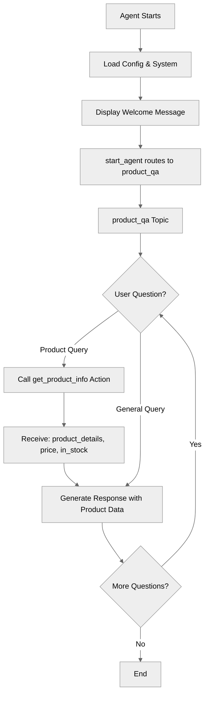

# SimpleQA

## Overview

This recipe demonstrates how to build a focused **question-and-answer agent**. It shows the pattern for single-topic agents that handle one specific type of interaction - in this case, answering product questions with the ability to look up real product information.

## Agent Flow



## Key Concepts

- **Single-topic agent pattern**: When one topic is sufficient for your use case
- **Focused agent design**: Building agents with a clear, limited scope
- **System vs. reasoning instructions**: Separating personality from task-specific guidance
- **Action integration**: Using external tools to fetch real data
- **start_agent routing**: Entry point that transitions to main topic

## How It Works

### Single-Topic Pattern

Unlike complex agents with multiple topics, many use cases work perfectly with just one topic:

```agentscript
start_agent topic_selector:
   description: "Welcome users and begin answering their product questions"

   reasoning:
      instructions:|
         Select the tool that best matches the user's message and conversation history. If it's unclear, make your best guess.
      actions:
         start_qa: @utils.transition to @topic.product_qa
            description: "Begin product question and answer session"

topic product_qa:
   description: "Answers questions about products, features, pricing, and availability"
```

This pattern works well when:

- The agent has one clear purpose
- All conversations follow a similar structure
- You don't need to transition between different modes

### System Instructions (Personality)

```agentscript
system:
   messages:
      welcome: "Hi! I'm here to answer your questions about our products and services. What would you like to know?"
      error: "I apologize, but I encountered an issue. Please try asking your question again."

   instructions: "You are a knowledgeable product specialist who helps customers understand products and services. Be clear, concise, and helpful. If you don't know something, admit it honestly."
```

System instructions define:

- **Who** the agent is (personality, role)
- **How** it should communicate (tone, style)
- **General principles** it should follow

### Reasoning Instructions (Task-Specific)

```agentscript
reasoning:
   instructions:->
      | Answer the user's questions about products and services clearly and accurately.
        When the user asks about a specific product, use {!@actions.get_product_info}
        to look up current information.

        When answering:
        - Be specific and provide helpful details
        - If the question is unclear, ask for clarification
        - Stay focused on product-related topics
        - Use {!@actions.get_product_info} to get accurate, up-to-date information

        Topics you can help with:
        - Product features and specifications
        - Pricing and packages
        - Availability and delivery
        - Comparisons between products
```

### Action for Data Lookup

```agentscript
actions:
   get_product_info:
      description: "Look up detailed information about a specific product"
      inputs:
         product_name: string
            description: "Name of the product to look up information for"
      outputs:
         product_details: string
            description: "Detailed product information including features, specifications, and description"
         price: object
            description: "Current price of the product"
            complex_data_type_name: "lightning__currencyType"
         in_stock: boolean
            description: "Indicates whether the product is currently in stock and available"
      target: "flow://GetProductInfo"
```

## Key Code Snippets

### Complete Topic Structure

```agentscript
topic product_qa:
   description: "Answers questions about products, features, pricing, and availability"

   actions:
      get_product_info:
         description: "Look up detailed information about a specific product"
         inputs:
            product_name: string
               description: "Name of the product to look up information for"
         outputs:
            product_details: string
               description: "Detailed product information including features, specifications, and description"
            price: object
               description: "Current price of the product"
               complex_data_type_name: "lightning__currencyType"
            in_stock: boolean
               description: "Indicates whether the product is currently in stock and available"
         target: "flow://GetProductInfo"

   reasoning:
      instructions:->
         | Answer the user's questions about products and services clearly and accurately.
           When the user asks about a specific product, use {!@actions.get_product_info}
           to look up current information.

           When answering:
           - Be specific and provide helpful details
           - If the question is unclear, ask for clarification
           - Stay focused on product-related topics
           - Use {!@actions.get_product_info} to get accurate, up-to-date information

           Topics you can help with:
           - Product features and specifications
           - Pricing and packages
           - Availability and delivery
           - Comparisons between products

      actions:
         get_product_info: @actions.get_product_info
            with product_name=...
```

### Making Action Available to LLM

```agentscript
reasoning:
   actions:
      get_product_info: @actions.get_product_info
         with product_name=...
```

The `...` means the LLM will extract the product name from the user's question.

## Try It Out

### Example Interaction 1: Product Query

```text
Agent: Hi! I'm here to answer your questions about our products and services. What would you like to know?

User: What features does Product Laptop X200 include?

[Agent calls get_product_info with product_name="Product X"]
[Returns: product_details="...", price=1200, in_stock=true]

Agent: Product X includes several great features:
       - Feature A: [description]
       - Feature B: [description]
       - Feature C: [description]

       It's currently priced at $1200 and is in stock. Would you like to know more about any specific feature?
```

### Example Interaction 2: Pricing Question

```text
User: How much does the wireless mouse cost?

[Agent calls get_product_info with product_name="Product Y"]
[Returns: price=25, in_stock=true]

Agent: Product Y is priced at $25 and is currently in stock.
       Would you like to know about its features or compare it to other products?
```

### Example Interaction 3: Availability Check

```text
User: Is the 4K Monitor available?

[Agent calls get_product_info with product_name="4K Monitor"]
[Returns: in_stock=false]

Agent: I'm sorry, the 4K Monitor is currently out of stock.
       Would you like me to let you know when it's available, or can I suggest some similar products?
```

## Design Tips

### Writing Effective Instructions

**Good instructions are:**

- **Specific**: "Use {!@actions.get_product_info} to look up current information"
- **Actionable**: Clear guidance on when to use tools
- **Structured**: Use bullet points and sections

**Poor instructions:**

- Too vague: "Be helpful"
- Missing tool guidance: Doesn't explain when to call actions

### Single-Topic vs. Multi-Topic

Use single-topic when:

- The agent has one clear job
- Conversations don't need different "modes"
- All interactions follow similar patterns

Use multi-topic when:

- Different phases require different capabilities
- You need to hand off between specialized behaviors
- Complex workflows with distinct stages

## What's Next

This agent answers questions and can look up real product data. To add more capabilities:

- **VariableManagement**: Store user preferences or conversation state
- **MultiTopicNavigation**: Route to different specialists (sales, support, etc.)
- **ActionCallbacks**: Chain actions for complex lookups
- **TemplateExpressions**: Build dynamic responses with product data

## Testing

### Test Case 1: Product Info Lookup

- Ask about a specific product
- Verify get_product_info is called
- Check response includes details, price, availability

### Test Case 2: Unclear Question

- Ask "How much does it cost?" (no product specified)
- Verify agent asks for clarification

### Test Case 3: Out of Scope

- Ask about unrelated topic
- Verify agent stays focused on products
