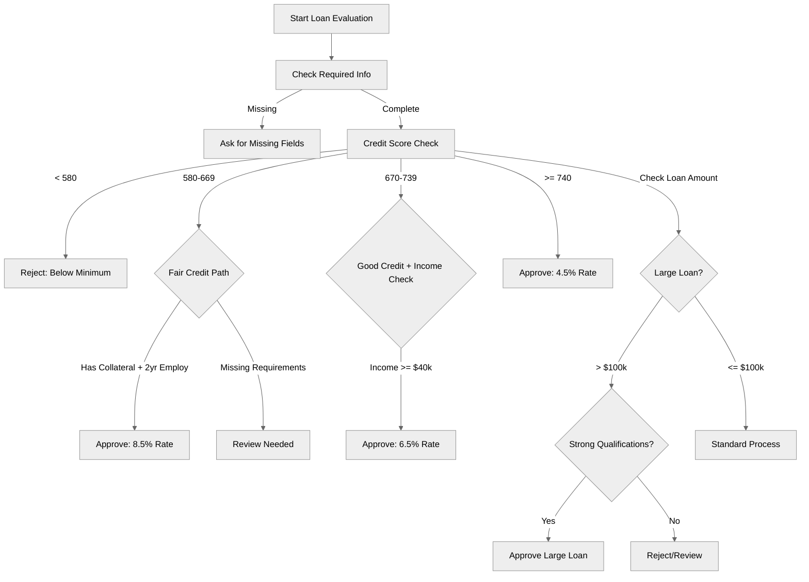

# ConditionalLogicPatterns

## Overview

Master **if/else control flow** and complex conditional logic for building decision-making agents.

## Agent Flow



## Key Concepts

- **if/else statements**: Basic conditionals
- **Comparison operators**: `==`, `!=`, `>`, `<`, `>=`, `<=`
- **Logical operators**: `and`, `or`, `not`
- **Nested conditions**: Complex decision trees
- **Multiple conditions**: Combining criteria

## How It Works

### Basic If

```agentscript
if @variables.credit_score < 580:
   set @variables.approval_status = "rejected"
```

### If-Else

```agentscript
if @variables.credit_score >= 700:
   set @variables.interest_rate = 4.5
else:
   set @variables.interest_rate = 8.5
```

### Multiple Conditions with `and`

```agentscript
if @variables.credit_score >= 700 and @variables.annual_income >= 50000:
   set @variables.approved = True
```

### Multiple Conditions with `or`

```agentscript
if @variables.credit_score >= 740 or @variables.has_collateral:
   set @variables.approved = True
```

### Nested Conditions

```agentscript
if @variables.loan_amount > 100000:
   if @variables.credit_score >= 720:
      if @variables.employment_years >= 3:
         set @variables.approved = True
```

### Not Operator

```agentscript
if not @variables.has_collateral and @variables.credit_score < 700:
   | Warning: Higher risk application
```

## Comparison Operators

```agentscript
== # Equal to
!= # Not equal to
>  # Greater than
<  # Less than
>= # Greater than or equal
<= # Less than or equal
```

## Best Practices

✅ **Simple first** - Check simple conditions before complex ones
✅ **Guard clauses** - Return early for edge cases
✅ **Readable logic** - Use clear variable names  
✅ **Avoid deep nesting** - Max 2-3 levels

## What's Next

- **DynamicActionRouting**: Use conditions with `available when`
- **ErrorHandling**: Validate with conditionals
- **ReasoningInstructions**: Build dynamic logic

## Testing

Test all branches:

- True path
- False path
- Edge cases (==, >, <)
- Combined conditions
