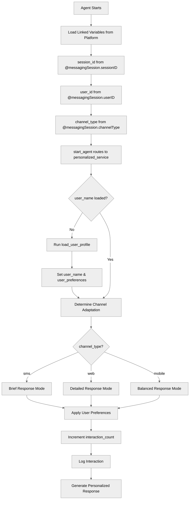

# ContextHandling

## Overview

Learn to work with **linked variables** that pull data from platform context like session info and user data. This recipe shows how to use context for personalization and adapt agent behavior based on channel type.

## Agent Flow



## Key Concepts

- **Linked variables**: Read-only data from platform context
- **`source` attribute**: Specifies where context data comes from
- **Session context**: Session IDs, user IDs, channel types
- **Mutable derived state**: Store computed values from context
- **Channel adaptation**: Different behavior per channel
- **Personalization**: Use context for tailored experiences

## How It Works

### Linked Variables

Define read-only variables that pull from platform context:

```agentscript
variables:
   session_id: linked string
      description: "Unique session identifier"
      source: @messagingSession.sessionID

   user_id: linked string
      description: "Authenticated user ID"
      source: @messagingSession.userID

   channel_type: linked string
      description: "Communication channel (web, mobile, sms)"
      source: @messagingSession.channelType
```

These are automatically populated from the platform and cannot be modified by the agent.

### Mutable Variables for Derived Data

Combine linked context with mutable variables for computed data:

```agentscript
variables:
   # Linked from platform
   user_id: linked string
      description: "Authenticated user ID"
      source: @messagingSession.userID

   # Mutable - derived from user_id
   user_name: mutable string = ""
      description: "User's display name (fetched using user_id)"

   user_preferences: mutable object = {}
      description: "User preferences loaded from user_id"

   interaction_count: mutable number = 0
      description: "Number of interactions in this session"
```

### Loading User Data from Context

Use the linked `user_id` to fetch additional user data:

```agentscript
reasoning:
   instructions:->
      # Load user profile if not already loaded
      if @variables.user_id and not @variables.user_name:
         run @actions.load_user_profile
            with user_id=@variables.user_id
            set @variables.user_name = @outputs.name
            set @variables.user_preferences = @outputs.preferences
```

### Channel-Based Adaptation

Adapt agent behavior based on communication channel:

```agentscript
instructions:->
   # Adapt behavior based on channel
   if @variables.channel_type == "sms":
      | Keep responses brief - user is on SMS.
        Use short, direct answers.

   if @variables.channel_type == "web":
      | User is on web - can provide detailed responses.
        Use rich formatting and examples.

   if @variables.channel_type == "mobile":
      | User is on mobile app.
        Balance detail with readability.
```

## Key Code Snippets

### Complete Variables Block

```agentscript
variables:
   # Linked variables from messaging session context
   session_id: linked string
      description: "Unique session identifier"
      source: @messagingSession.sessionID

   user_id: linked string
      description: "Authenticated user ID"
      source: @messagingSession.userID

   channel_type: linked string
      description: "Communication channel (web, mobile, sms)"
      source: @messagingSession.channelType

   # Mutable variables derived from context
   user_name: mutable string = ""
      description: "User's display name (fetched using user_id)"

   user_preferences: mutable object = {}
      description: "User preferences loaded from user_id"

   session_start_time: mutable string = ""
      description: "When this session started"

   interaction_count: mutable number = 0
      description: "Number of interactions in this session"
```

### Complete Topic with Context Usage

```agentscript
topic personalized_service:
   description: "Provides personalized service using context data"

   actions:
      load_user_profile:
         description: "Loads user profile using user ID"
         inputs:
            user_id: string
               description: "The unique identifier of the user whose profile to load"
         outputs:
            name: string
               description: "The user's display name or full name"
            preferences: object
               description: "User preferences object containing settings"
         target: "flow://LoadUserProfile"

      log_interaction:
         description: "Logs interaction for analytics"
         inputs:
            session_id: string
               description: "The unique session identifier"
            user_id: string
               description: "The unique identifier of the user"
            channel: string
               description: "The communication channel used"
         outputs:
            success: boolean
               description: "Indicates whether the interaction was logged"
         target: "flow://LogInteraction"

   reasoning:
      instructions:->
         # Load user profile if not already loaded
         if @variables.user_id and not @variables.user_name:
            run @actions.load_user_profile
               with user_id=@variables.user_id
               set @variables.user_name = @outputs.name
               set @variables.user_preferences = @outputs.preferences

         # Use context for personalization
         | Personalized Service
           Session ID: {!@variables.session_id}

         if @variables.user_name:
            | User: {!@variables.user_name}
         else:
            | User: {!@variables.user_id}

         | Channel: {!@variables.channel_type}
           Interactions: {!@variables.interaction_count}

         # Adapt behavior based on channel
         if @variables.channel_type == "sms":
            | Keep responses brief - user is on SMS.
              Use short, direct answers.

         if @variables.channel_type == "web":
            | User is on web - can provide detailed responses.
              Use rich formatting and examples.

         if @variables.channel_type == "mobile":
            | User is on mobile app.
              Balance detail with readability.

         # Track session activity
         set @variables.interaction_count = @variables.interaction_count + 1

         | Provide helpful, personalized assistance.
           Session context: {!@variables.session_id}
           Log the interaction using {!@actions.log_interaction}.

      actions:
         log_interaction: @actions.log_interaction
            with session_id=@variables.session_id
            with user_id=@variables.user_id
            with channel=@variables.channel_type
```

## Common Context Sources

| Source                          | Description                              |
| ------------------------------- | ---------------------------------------- |
| `@messagingSession.sessionID`   | Unique session identifier                |
| `@messagingSession.userID`      | Authenticated user ID                    |
| `@messagingSession.channelType` | Communication channel (web, mobile, sms) |

## Try It Out

### Example: Web User

```text
[Context: channel_type="web", user_id="USER-123"]

[Agent loads user profile:]
  - load_user_profile(user_id="USER-123")
  - Returns: name="Jane Smith", preferences={...}

Agent: Hello Jane! Welcome back.

       Personalized Service
       Session ID: SES-789
       User: Jane Smith
       Channel: web

       I can provide detailed responses with rich formatting.
       How can I help you today?
```

### Example: SMS User

```text
[Context: channel_type="sms", user_id="USER-456"]

Agent: Hi John!

       (SMS mode - keeping it brief)

       How can I help?
```

### Example: Using Preferences

```text
[Context: user_preferences.language="es"]

Agent: ¡Hola! Veo que prefieres español.
       ¿Cómo puedo ayudarte hoy?
```

## Best Practices

✅ **Use for personalization** - Tailor experiences to users

✅ **Combine with mutable state** - Store derived data in mutable variables

✅ **Respect privacy** - Only use necessary context

✅ **Handle missing data** - Not all context is always available

✅ **Adapt to channel** - Different experiences for different channels

❌ **Don't try to modify linked variables** - They are read-only

❌ **Don't assume context exists** - Check before using

## Linked vs Mutable Variables

| Aspect            | Linked            | Mutable       |
| ----------------- | ----------------- | ------------- |
| **Source**        | Platform context  | Agent-defined |
| **Modifiable**    | No                | Yes           |
| **Default value** | From source       | Specified     |
| **Use case**      | Session/user info | Agent state   |

## What's Next

- **VariableManagement**: Deep dive into mutable variables
- **AfterReasoning**: Load context in lifecycle events
- **TemplateExpressions**: Use context in dynamic templates
- **AdvancedReasoningPatterns**: Combine context with complex logic

## Testing

Test with different contexts:

### Test Case 1: Web Channel

- Set channel_type = "web"
- Verify detailed response mode
- Check rich formatting guidance

### Test Case 2: SMS Channel

- Set channel_type = "sms"
- Verify brief response mode
- Check concise guidance

### Test Case 3: User Profile Loading

- Provide user_id
- Verify profile loaded once
- Check personalization applied

### Test Case 4: Missing Context

- Test with missing user_id
- Verify graceful fallback
- Check default behavior
