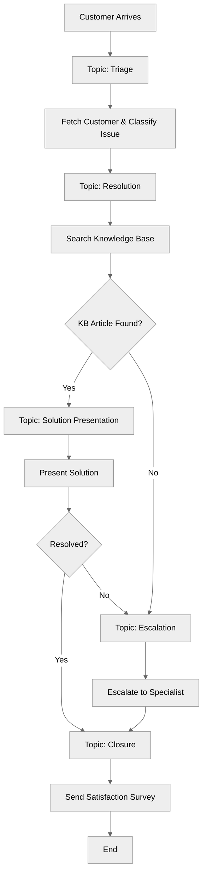

# CustomerServiceAgent

## Overview

A **complete real-world customer service agent** demonstrating a production-ready implementation. This comprehensive example combines issue classification, knowledge base search, case management, escalation patterns, and customer satisfaction surveys.

## Agent Flow



## Key Concepts

- **Issue Classification**: Automatically categorize customer issues and assign priority
- **Knowledge Base Integration**: Dynamic search for solutions based on issue description
- **Case Management**: Create and update support cases throughout the lifecycle
- **Escalation Patterns**: Seamlessly transfer complex issues to human specialists
- **Customer Satisfaction**: Integrated feedback collection upon closure

## How It Works

### Topic: Triage

The entry point for the conversation. It identifies the customer and classifies their issue.

```agentscript
topic triage:
   actions:
      fetch_customer:
         description: "Fetch customer information"
         # ...
      classify_issue:
         description: "Classify customer issue type"
         # ...

   reasoning:
      actions:
         # Classify the issue
         classify_customer_issue: @actions.classify_issue
            available when @variables.issue_description and not @variables.issue_type
            # ...
            transition to @topic.resolution
```

### Topic: Resolution

Attempts to find a solution using the Knowledge Base and initiates case tracking.

```agentscript
topic resolution:
   actions:
      search_knowledge_base:
         description: "Search knowledge base for solutions"
         # ...
      create_case:
         description: "Create support case"
         # ...

   reasoning:
      actions:
         # Search knowledge base
         find_solution: @actions.search_knowledge_base
            available when @variables.issue_type and not @variables.kb_article_found
            # ...

         # If KB solution found, present it
         present_solution: @utils.transition to @topic.solution_presentation
            available when @variables.kb_article_found

         # If no KB solution, escalate
         escalate_to_specialist: @utils.transition to @topic.escalation
            available when not @variables.kb_article_found
```

### Topic: Solution Presentation

Presents the found Knowledge Base article to the user and asks for confirmation.

```agentscript
topic solution_presentation:
   reasoning:
      instructions:->
         | I found a solution for your {!@variables.issue_type} issue!
           {!@variables.kb_article_content}
           Does this resolve your issue?

      actions:
         mark_resolved: @actions.update_case
            # ...
            transition to @topic.closure

         need_more_help: @utils.transition to @topic.escalation
```

### Topic: Escalation

Handles scenarios where the bot cannot resolve the issue or the user requests a human.

```agentscript
topic escalation:
   reasoning:
      instructions:->
         | This issue requires specialist attention.
         if @variables.issue_priority == "high":
            | Due to the high priority, I'm escalating this immediately.

      actions:
         escalate_issue: @actions.escalate_case
            with specialist_team=@variables.issue_type
            # ...
            transition to @topic.closure
```

## Key Code Snippets

### Variables for Complete Workflow

```agentscript
variables:
   # Customer information
   customer_id: mutable string = ""
      description: "Unique identifier for the customer"
   customer_name: mutable string = ""
      description: "Full name of the customer"
   customer_email: mutable string = ""
      description: "Email address of the customer"
   customer_tier: mutable string = "standard"
      description: "Customer loyalty tier (standard, premium, enterprise)"

   # Issue tracking
   issue_type: mutable string = ""
      description: "Category of the customer's issue (e.g., billing, technical)"
   issue_description: mutable string = ""
      description: "Detailed description of the issue provided by the customer"
   issue_priority: mutable string = "medium"
      description: "Priority level of the issue (low, medium, high, urgent)"
   issue_resolved: mutable boolean = False
      description: "Flag indicating if the issue has been resolved"

   # Case management
   case_id: mutable string = ""
      description: "Salesforce Case ID associated with the interaction"
   case_status: mutable string = "new"
      description: "Current status of the case (new, in_progress, resolved, escalated, closed)"

   # Knowledge base
   kb_article_found: mutable boolean = False
      description: "Flag indicating if a relevant KB article was found"
   kb_article_content: mutable string = ""
      description: "Content of the found KB article"

   # Escalation
   requires_escalation: mutable boolean = False
      description: "Flag indicating if the issue needs escalation to a human agent"
   escalation_reason: mutable string = ""
      description: "Reason for escalation"

   # Resolution tracking
   resolution_steps: mutable object = {}
      description: "List of steps taken to resolve the issue"
   customer_satisfied: mutable boolean = False
      description: "Flag indicating customer satisfaction with the resolution"
```

## Try It Out

### Example: Successful KB Resolution

```text
Agent: Welcome to Customer Service! Please describe the issue you're experiencing.

User: I can't reset my password.

[Agent classifies issue as "Account Access"]
[Agent searches KB and finds article]
[Agent creates Case]

Agent: I found a solution for your Account Access issue!
       [KB Article Content: Go to settings > security > reset password...]
       Does this resolve your issue?

User: Yes, thanks.

[Agent updates Case to "Resolved"]

Agent: ✅ Great! Your issue has been resolved.
       Case ID: 500xx000000abc1
       I'm sending a satisfaction survey to your email.
```

### Example: Escalation Flow

```text
Agent: Welcome to Customer Service! Please describe the issue you're experiencing.

User: I have a complex billing error that needs a manager.

[Agent classifies issue as "Billing", Priority "High"]
[Agent searches KB... No direct solution found or User rejects KB]

Agent: This issue requires specialist attention.
       Due to the high priority, I'm escalating this immediately.
       Creating escalation...

[Agent escalates case to "Billing" team]

Agent: Your case (500xx000000abc2) has been escalated to our specialist team.
       They will contact you within 4 hours.
```

## Features Demonstrated

1.  **Context Engineering**: Hydrating customer data (`before_reasoning`) before interaction.
2.  **Chaining Actions**: Combining KB search and Case creation in a single logical step.
3.  **Conditional Transitions**: Routing between topics based on variables (`kb_article_found`, `issue_resolved`).
4.  **Variable Descriptions**: providing semantic meaning to variables for better planner performance.

## Best Practices Demonstrated

✅ **Context Engineering** - Hydrating data before instructions run.
✅ **Topic Separation** - Distinct topics for Triage, Resolution, and Escalation.
✅ **Variable Descriptions** - Clear descriptions helping the LLM understand variable purpose.
✅ **Deterministic Transitions** - Explicit `@utils.transition` calls for state management.
