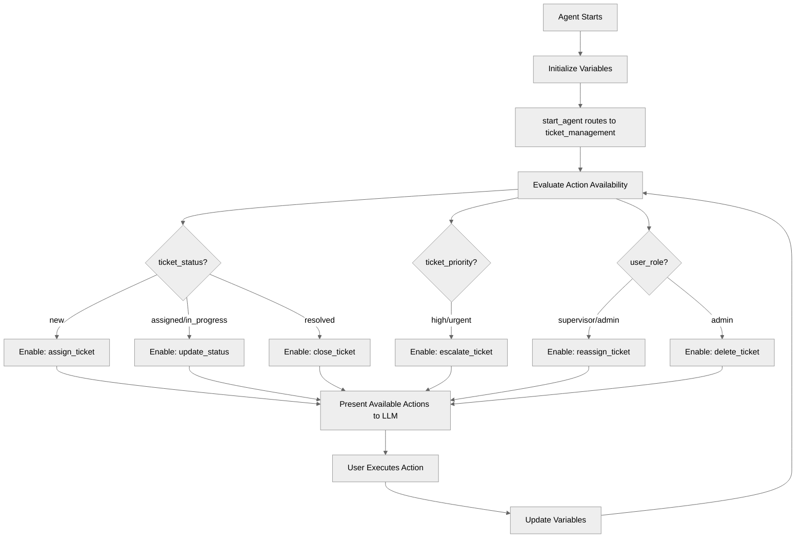

# DynamicActionRouting

## Overview

Learn how to control **which actions are available** based on context using `available when`. This pattern makes agents safer and more intelligent by only showing relevant actions to the LLM based on ticket status, priority, and user role.

## Agent Flow



## Key Concepts

- **`available when` clause**: Conditional action visibility
- **Status-based routing**: Different actions for different statuses
- **Role-based access**: Filter actions by user role
- **Priority-based actions**: Enable escalation for high-priority items
- **Smart action filtering**: LLM only sees relevant actions

## How It Works

### The `available when` Clause

```agentscript
actions:
   assign_ticket: @actions.assign_ticket
      available when @variables.ticket_status == "new"
      with ticket_id = @variables.ticket_id
      with name = ...
```

The action only appears to the LLM when the condition is true.

### Status-Based Routing

```agentscript
actions:
   # Only for new tickets
   assign_ticket: @actions.assign_ticket
      available when @variables.ticket_status == "new"

   # Only for assigned or in_progress tickets
   update_status: @actions.update_status
      available when @variables.ticket_status == "assigned" or @variables.ticket_status == "in_progress"

   # Only for resolved tickets
   close_ticket: @actions.close_ticket
      available when @variables.ticket_status == "resolved"
```

### Role-Based Access

```agentscript
actions:
   # Supervisor or Admin only
   reassign_ticket: @actions.reassign_ticket
      available when @variables.user_role == "supervisor" or @variables.user_role == "admin"

   # Admin only
   delete_ticket: @actions.delete_ticket
      available when @variables.user_role == "admin"
```

### Priority-Based Actions

```agentscript
actions:
   escalate_ticket: @actions.escalate_ticket
      available when @variables.ticket_priority == "high" or @variables.ticket_priority == "urgent"
```

## Key Code Snippets

### Complete Reasoning Actions with Conditions

```agentscript
reasoning:
   instructions: ->
      | Ticket Management

      if @variables.ticket_number:
         | Ticket: {!@variables.ticket_number}
      else:
         | Ticket: None
      if @variables.ticket_status:
         | Status: {!@variables.ticket_status}
      else:
         | Status: N/A
      if @variables.ticket_priority:
         | Priority: {!@variables.ticket_priority}
      else:
         | Priority: N/A

      | Your role: {!@variables.user_role}

      | Available actions depend on:
        - Ticket status
        - Priority level
        - Your role/permissions
        - Current assignment

   actions:
      view_ticket: @actions.view_ticket
         with ticket_number = ...
         set @variables.ticket_id = @outputs.ticket_info.data.Id

      add_comment: @actions.add_comment
         with ticket_id = @variables.ticket_id
         with comment = ...

      assign_ticket: @actions.assign_ticket
         available when @variables.ticket_status == "new"
         with ticket_id = @variables.ticket_id
         with name = ...

      update_status: @actions.update_status
         available when @variables.ticket_status == "assigned" or @variables.ticket_status == "in_progress"
         with ticket_id = @variables.ticket_id
         with new_status = ...

      close_ticket: @actions.close_ticket
         available when @variables.ticket_status == "resolved"
         with ticket_id = @variables.ticket_id

      escalate_ticket: @actions.escalate_ticket
         available when @variables.ticket_priority == "high" or @variables.ticket_priority == "urgent"
         with ticket_id = @variables.ticket_id
         with reason = ...

      reassign_ticket: @actions.reassign_ticket
         available when @variables.user_role == "supervisor" or @variables.user_role == "admin"
         with ticket_id = @variables.ticket_id
         with new_agent = ...

      delete_ticket: @actions.delete_ticket
         available when @variables.user_role == "admin"
         with ticket_id = @variables.ticket_id
```

### Variables for Routing

```agentscript
variables:
   ticket_id: mutable string = ""
      description: "Current support ticket/case ID"
   ticket_number: mutable string = ""
      description: "Current support ticket number"
   ticket_status: mutable string = ""
      description: "Status: new, assigned, in_progress, resolved, closed"
   ticket_priority: mutable string = ""
      description: "Priority: low, medium, high, urgent"
   user_role: mutable string = "agent"
      description: "User role: agent, supervisor, admin"
```

## Try It Out

### Example: Status-Based Actions

```text
[ticket_status = "new"]

Agent: Ticket #12345 is currently new.

       Available actions:
       - View ticket details
       - Add comment
       - Assign ticket ← Available because status is "new"

[User assigns ticket → status changes to "assigned"]

Agent: Ticket assigned to Sarah.

       Available actions:
       - View ticket details
       - Add comment
       - Update status ← Now available because status is "assigned"

       (assign_ticket is now hidden)
```

### Example: Role-Based Actions

```text
[user_role = "agent", ticket_status = "resolved"]

Agent: Available actions:
       - Close ticket
       - Add comment

       (reassign and delete are hidden - agent role)

---

[user_role = "admin", ticket_status = "resolved"]

Agent: Available actions:
       - Close ticket
       - Add comment
       - Reassign ticket ← Available for admin
       - Delete ticket ← Available for admin
```

### Example: Priority-Based Actions

```text
[ticket_priority = "low"]

Agent: No escalation option available for low priority.

---

[ticket_priority = "urgent"]

Agent: Available actions:
       - Escalate ticket ← Available for high/urgent priority
```

## Condition Patterns

### Single Condition

```agentscript
available when @variables.status == "new"
```

### OR Conditions

```agentscript
available when @variables.status == "assigned" or @variables.status == "in_progress"
```

### AND Conditions

```agentscript
available when @variables.is_admin and @variables.status == "resolved"
```

### NOT Conditions

```agentscript
available when @variables.role != "guest"
```

## Best Practices

✅ **Clear conditions** - Make logic obvious and readable

✅ **Fail-safe defaults** - Always have basic actions available

✅ **Document requirements** - Explain why actions are restricted

✅ **Test all paths** - Verify actions appear/disappear correctly

❌ **Don't hide critical actions** - Keep essential functions accessible

❌ **Don't over-complicate** - Keep conditions simple

## What's Next

- **ErrorHandling**: Combine with validation patterns
- **SafetyAndGuardrails**: Use for safety-critical operations
- **CustomerServiceAgent**: See routing in a complete agent

## Testing

### Test Case 1: New Ticket

- ticket_status = "new"
- Verify: assign_ticket available
- Verify: update_status NOT available

### Test Case 2: Assigned Ticket

- ticket_status = "assigned"
- Verify: update_status available
- Verify: assign_ticket NOT available

### Test Case 3: Role Filtering

- user_role = "agent"
- Verify: delete_ticket NOT available
- Change to user_role = "admin"
- Verify: delete_ticket now available

### Test Case 4: Priority Escalation

- ticket_priority = "low"
- Verify: escalate_ticket NOT available
- Change to ticket_priority = "urgent"
- Verify: escalate_ticket now available
