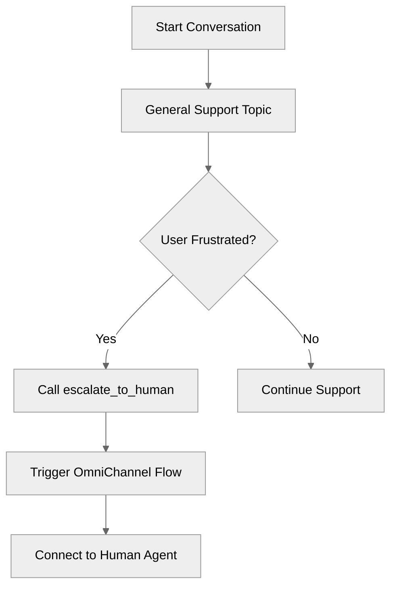

# EscalationPatterns

## Overview

Learn how to implement **human handoff** (escalation) in your agent. This pattern is critical for production agents to ensure users can always reach a human when needed.

## Agent Flow



## Key Concepts

- **Connections Block**: Defines the routing configuration (`outbound_route_type`, `outbound_route_name`)
- **@utils.escalate**: The utility function that triggers the handoff
- **Conditional Availability**: Triggering escalation based on sentiment or retry counts

## How It Works

### 1. Configure Connections

The `connections` block tells the agent where to route the chat when escalation occurs.

### 2. Define the Action

Add the escalation action to your topic's `reasoning.actions` block.

## Key Code Snippets

### Connections Configuration

```agentscript
connections:
   messaging:
      escalation_message: "Connecting you with a human agent..."
      outbound_route_type: "OmniChannelFlow"
      outbound_route_name: "AgentSupportFlow"
```

### Escalation Action

```agentscript
actions:
   escalate_to_human: @utils.escalate
      description: "Escalate to a human agent"
      available when @variables.user_sentiment == "frustrated"
```

## Try It Out

### Example Interaction

```text
Agent: Hi! I'm here to help. If you need a human at any time, just ask.

User: I am very frustrated with this service!

Agent: Connecting you with a human agent...
```

### Behind the Scenes

1. The agent analyzes the user's input and updates `@variables.user_sentiment` to "frustrated".
2. The `escalate_to_human` action becomes available.
3. The reasoning engine selects `escalate_to_human`.
4. The agent executes the handoff using the configuration in `connections`.

## What's Next

- **DynamicActionRouting**: Learn how to route based on complex conditions.
- **ErrorHandling**: Implement robust error handling patterns.
