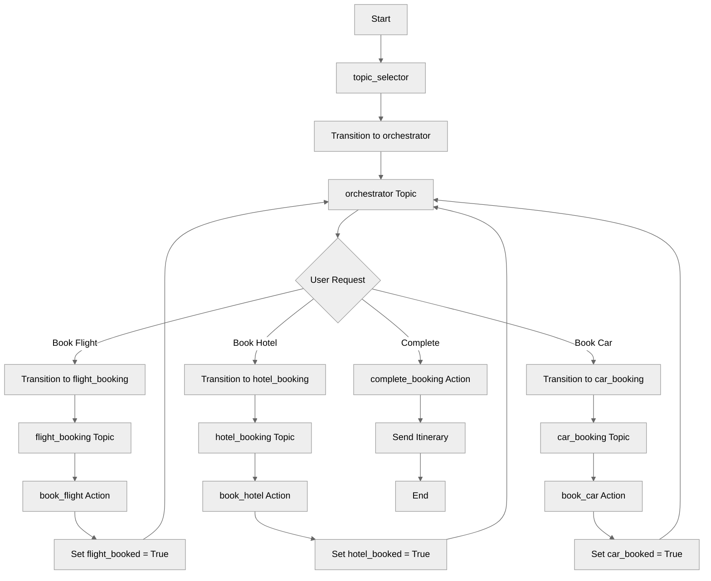

# MultiTopicOrchestration

## Overview

Master **complex multi-topic workflows** where an orchestrator topic coordinates multiple specialized topics. This travel booking example demonstrates building sophisticated agents with clear separation of concerns for flights, hotels, and car rentals.

## Agent Flow



## Key Concepts

- **Orchestrator pattern**: Central `orchestrator` topic as coordinator
- **Specialized topics**: Domain-specific topics for each service
- **State sharing**: Variables shared across all topics
- **Conditional completion**: Complete only when all services booked
- **Return transitions**: Each topic returns to orchestrator

## How It Works

### Orchestrator Topic

The central hub that manages navigation and tracks progress:

```agentscript
topic orchestrator:
   description: "Main orchestrator for travel booking workflow"

   reasoning:
      instructions:->
         | Welcome to Travel Booking! I can help you book:
           1. Flights ✈️ (Use start_flight_booking)
           2. Hotels 🏨 (Use start_hotel_booking)
           3. Car Rentals 🚗 (Use start_car_booking)

           Current Status:
           - Flight: {!@variables.flight_booked}
           - Hotel: {!@variables.hotel_booked}
           - Car: {!@variables.car_booked}

           If everything is booked, I can complete_booking.
           What would you like to book first?

      actions:
         start_flight_booking: @utils.transition to @topic.flight_booking

         start_hotel_booking: @utils.transition to @topic.hotel_booking

         start_car_booking: @utils.transition to @topic.car_booking

         complete_booking: @actions.send_itinerary
            available when @variables.flight_booked and @variables.hotel_booked and @variables.car_booked
            with email=@variables.traveler_email
            with flight_conf=@variables.flight_confirmation
            with hotel_conf=@variables.hotel_confirmation
            with car_conf=@variables.car_confirmation
            set @variables.booking_complete = @outputs.sent
```

### Specialized Topic: Flight Booking

```agentscript
topic flight_booking:
   description: "Handles flight booking workflow"

   reasoning:
      instructions:->
         | Let's book your flight! ✈️

         if not @variables.traveler_name:
            | First, what's your name?

         if @variables.travel_date:
            | Perfect! Let me book your flight.

      actions:
         book_flight_action: @actions.book_flight
            available when @variables.departure_city and @variables.destination_city and @variables.travel_date
            with departure=@variables.departure_city
            with destination=@variables.destination_city
            with travel_date=@variables.travel_date
            with traveler=@variables.traveler_name
            set @variables.flight_confirmation = @outputs.confirmation_number
            set @variables.flight_booked = @outputs.success
            # Return to orchestrator after booking
            transition to @topic.orchestrator
```

### Specialized Topic: Hotel Booking

```agentscript
topic hotel_booking:
   description: "Handles hotel booking workflow"

   reasoning:
      instructions:->
         | Let's book your hotel! 🏨

      actions:
         book_hotel_action: @actions.book_hotel
            available when @variables.hotel_city and @variables.checkin_date and @variables.checkout_date
            with city=@variables.hotel_city
            with checkin=@variables.checkin_date
            with checkout=@variables.checkout_date
            with guest_name=@variables.traveler_name
            set @variables.hotel_confirmation = @outputs.confirmation_number
            set @variables.hotel_booked = @outputs.success
            # Return to orchestrator
            transition to @topic.orchestrator
```

## Key Code Snippets

### Variables for State Tracking

```agentscript
variables:
   # User info
   traveler_name: mutable string = ""
   traveler_email: mutable string = ""

   # Flight booking
   departure_city: mutable string = ""
   destination_city: mutable string = ""
   travel_date: mutable string = ""
   flight_booked: mutable boolean = False
   flight_confirmation: mutable string = ""

   # Hotel booking
   hotel_city: mutable string = ""
   checkin_date: mutable string = ""
   checkout_date: mutable string = ""
   hotel_booked: mutable boolean = False
   hotel_confirmation: mutable string = ""

   # Car rental
   rental_city: mutable string = ""
   rental_start: mutable string = ""
   rental_end: mutable string = ""
   car_booked: mutable boolean = False
   car_confirmation: mutable string = ""

   # Overall status
   booking_complete: mutable boolean = False
```

### Conditional Complete Action

```agentscript
complete_booking: @actions.send_itinerary
   available when @variables.flight_booked and @variables.hotel_booked and @variables.car_booked
```

## Try It Out

### Example: Complete Travel Booking

```text
Agent: Welcome to Travel Booking! I can help you book flights, hotels, and car rentals.

User: Book a flight

[Transitions to flight_booking topic]

Agent: Let's book your flight! First, what's your name?

User: John Doe. I want to fly from NYC to London on 2025-06-01.

[Calls book_flight action]
[Sets flight_booked = True]
[Transitions back to orchestrator]

Agent: Welcome to Travel Booking!
       Current Status:
       - Flight: True
       - Hotel: False
       - Car: False

       What would you like to book next?

User: Hotel in London

[Transitions to hotel_booking topic]
...

[After all three are booked]

Agent: Current Status:
       - Flight: True
       - Hotel: True
       - Car: True

       If everything is booked, I can complete_booking.

User: Yes, complete it.

[Calls complete_booking action]

Agent: Itinerary sent!
```

## Orchestration Patterns

### Hub-and-Spoke

```text
             flight_booking
                  ↗
orchestrator → hotel_booking
                  ↘
             car_booking
```

All specialized topics return to the central orchestrator.

### Conditional Completion

The complete action only becomes available when all services are booked:

```agentscript
available when @variables.flight_booked and @variables.hotel_booked and @variables.car_booked
```

## Best Practices

✅ **Clear orchestrator** - Single entry point for coordination

✅ **Specialized topics** - Each handles one domain

✅ **Shared state** - Variables flow between topics

✅ **Return transitions** - Always return to orchestrator

✅ **Progress tracking** - Show users what's complete

❌ **Don't skip orchestrator** - Keep flow centralized

❌ **Don't deep nest** - Keep topic hierarchy flat

## What's Next

- **TopicDelegation**: Learn consultation patterns
- **MultiStepWorkflows**: Combine with action chaining
- **CustomerServiceAgent**: See orchestration in a complete agent

## Testing

### Test Case 1: Sequential Booking

- Book flight → return → book hotel → return → book car
- Verify state persists across topics
- Confirm complete_booking available after all three

### Test Case 2: Data Flow

- Set values in specialized topics
- Verify shared variables update correctly

### Test Case 3: Partial Booking

- Book only flight and hotel
- Verify complete_booking NOT available
- Book car
- Verify complete_booking now available
