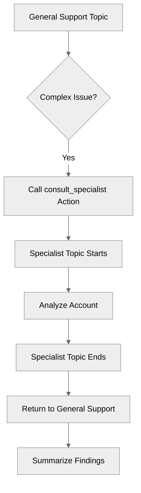

# TrueDelegation

## Overview

Learn how to use **true delegation**, where one topic calls another topic as if it were a tool or sub-routine.

## Agent Flow



## Key Concepts

- **Delegation vs. Transition**:
    - **Transition** (`@utils.transition to`): One-way handoff. The original topic ends.
    - **Delegation** (`@topic.name`): Sub-routine call. The original topic waits, and control returns when the delegated topic finishes.

## How It Works

### Defining the Delegation Action

In your `reasoning.actions` block, define an action that points to another topic using the `@topic.*` syntax.

### Flow of Control

1. **Main Topic** calls `consult_specialist`.
2. **Main Topic** pauses execution.
3. **Specialist Topic** starts, runs its instructions and actions.
4. **Specialist Topic** finishes (reaches end of instructions or explicit end).
5. **Main Topic** resumes execution immediately after the delegation call.

## Key Code Snippets

### Delegation Action

```agentscript
actions:
   consult_specialist: @topic.specialist_topic
      description: "Consult the specialist for complex questions"
```

## Try It Out

### Example Interaction

```text
Agent: Hi! I can help you with account issues by consulting our specialist.

User: I have a complex billing problem.

Agent: I'll consult our specialist for this.

(Internal): Specialist topic runs...

Agent: Analysis complete. The specialist found a discrepancy in your last invoice.
```

## What's Next

- **MultiTopicOrchestration**: Orchestrate multiple topics effectively.
- **ComplexStateManagement**: Manage state across topic boundaries.
